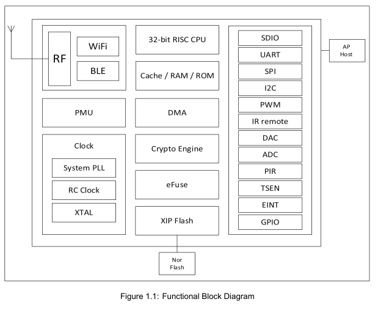
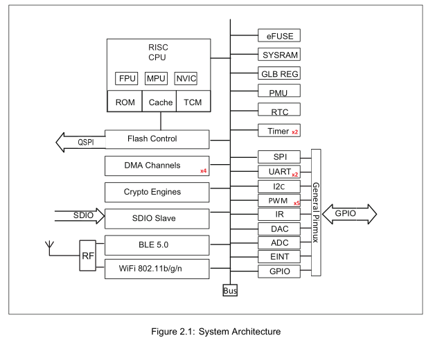

 BL602/BL604 Chip Data Manual 

 From SZDOIT

## 1 Overview

BL602/BL604 is Wi-Fi + BLE combo chipset for ultra-low-cost and low-power application.

Wireless subsystem contains 2.4G radio, Wi-Fi 802.11b/g/n and Bluetooth LE 5.0 baseband/MAC designs. Micro-controller subsystem contains a low-power 32-bit RISC CPU, high-speed cache and memories. Power Management Unit controls low-power modes. Moreover, variety of security features are supported.

Peripheral interfaces include SDIO, SPI, UART, I2C, IR remote, PWM, ADC, DAC, PIR, and GPIOs.

### 1.1 Wireless

• 2.4 GHz RF transceiver

• Wi-Fi 802.11 b/g/n

• Bluetooth® Low Energy 5.0

BLE 5.0 Channel Selection#2 is supported

2M PHY / Coded PHY / ADV extension is not supported

• Wi-Fi 20MHz bandwidth

• Wi-Fi Security WPS / WEP / WPA / WPA2 Personal / WPA2 Enterprise / WPA3

• STA, SoftAP and sniffer modes

• Multi-cloud connectivity

• Wi-Fi fast connection with BLE assistance

• Wi-Fi and BLE coexistence

• Integrated balun, PA/LNA

### 1.2 MCU Subsystem

• 32-bit RISC CPU with FPU (floating point unit)

• Level-1 cache

• One RTC timer update to one year

• Two 32b general purpose timers

• Four DMA channels

• DFS (dynamic frequency scaling) from 1MHz to 192MHz

• JTAG development support

• XIP QSPI Flash with hardware encryption support

### 1.3 Memory

• 276KB RAM

• 128KB ROM

• 1Kb eFuse

• Embedded Flash (Optional)

### 1.4 Security

• Secure boot

• Secure debug ports

• QSPI Flash On-The-Fly AES Decryption (OTFAD) - AES-128, CTR mode

• AES 128/192/256 bits

• SHA-1/224/256

• TRNG (True Random Number Generator)

• PKA (Public Key Accelerator)

### 1.5 Peripheral

• One SDIO 2.0 slave

• One SPI master/slave

• Two UART

• One I2C master/slave

• Five PWM channels

• 10-bit general DAC

• 12-bit general ADC

• Two general analog comparators (ACOMP)

• PIR (Passive Infra-Red) detection

• IR remote HW accelerator

• 16 or 23 GPIOs

### 1.6 Power Management

• Off

• Hibernate (flexible modes)

• Power Down Sleep (flexible modes)

• Active

### 1.7 Clock

• Support XTAL 24/32/38.4/40MHz

• Internal RC 32KHz oscillator

• Internal RC 32MHz oscillator

• Internal System PLL

## 2 Functional Description

BL602/BL604 main functions described as follows：

2.1 CPU
BL602/BL604 32-bit RISC CPU contains FPU (floating-point unit) for 32-bit single-precision arithmetic, three-stage pipelined(IF,EXE,WB),compressed16and32-bitinstructionset, standardJTAGdebuggerportincluding4hardware-programmable breakpoints, interrupt controller including 64 interrupts and 16 interrupt levels/priorities for low latency interrupt processing. Up to 192MHz clock frequency, can be dynamically configured to change clock frequency, enter the power saving mode to achieve low power consumption.

Both WiFi/BLE stack and application run on single 32-bit RISC CPU for simple and ultra-low power applications. CPU
performance ~1.46 DMIPS/MHz. ~3.1 CoreMark/MHz.

### 2.2 Cache

BL602/BL604 cache improves CPU performance to access external memory. Cache memories can be partially or fully configured as TCM (tightly coupled memory).

### 2.3 Memory

BL602/BL604 memories include: on-chip zero-delay SRAM memories, read-only memories, write-once memories, embedded flash memory (optional).

### 2.4 DMA

BL602/BL604 DMA (direct memory access) controller has four dedicated channels that manage data transfer between peripherals and memories to improve cpu/bus efficiency. There are three main types of transfers including memory to memory, memory to peripheral, and peripheral to memory. DMA also supports LLI (link list item) that multiple transfers are pre-defined by a series of linked lists, then hardware automatically complete all transfers according to each LLI size and address. DMA supports peripheral UART, I2C, SPI, ADC and DAC.

### 2.5 Bus

BL602/BL604 bus fabric connection and memory-map summarized as follows: