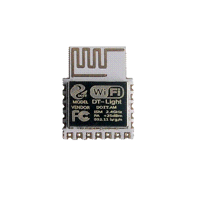
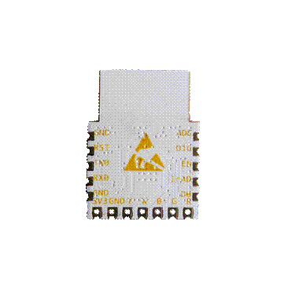

  DataSheet for DMP-Light Designed for Smart Bulb 

 from SZDOIT 

**Features**

  **Module specifications**

* Built-in ESP WiFi chip

* Support multi-channel LED control

* Built-in LED driving control algorithm, support dimming, color adjustment and rhythm control

* Supporting Local Area Network Priority Control

* Support cloud control

* Support IR control

* Support Google Assistant, Amazon Alexa,Tmal Genue, Xiaodu, Dingdong, Xiaomi,

* Support Android and iOS device control

  Wi-Fi specifications

* Support 802.11 b/g/n/e/i

* Support AP mode

* Support OTA 

* Support big batch manufacturing

 

**Module Information**

* Smart bulb control pins: 5

* Working temperature: -40℃-125℃

* Size: 15mm × 20mm

* Color : white

**Applications**

* Bulb  

* light belt

* Ceiling lamp

* Spotlight

* Other commercial and scene light

 

**Model**

| Name   | Antenna              |
| ------ | -------------------- |
| DMP-L1 | PCB antenna on board |

**Classical Application**

**

## 1.  Introduction

The core processor of  DMP-L1 module adopts industrial chip ESP8285. The chip integrates an enhanced version of the Tensilica's L106 Diamond Series 32-bit core processor in smaller size packages. ESP8285 has complete Wi-Fi network function and can be used independently from the controller. Its built-in cache memory greatly provides CPU performance.

- DMP-L1 module supports standard IEEE802.11 b/g/n/e/i protocol and complete TCP/IP protocol stack.

- DMP-L1 module uses built-in Flash, which can make the chip work at - 40 C - 125 C.

- DMP-L1 module has built-in LED control algorithm, which can make its external IO control LED driver.

- DMP-L1 module has built-in DoHome cloud service, and can use DoHome series APP to control LED.

- DMP-L1 module contains external infrared interface, which can support infrared remote control at the same time.

- DMP-L1 module has built-in factory test program, which can make the factory big batch production quickly.

 

Fig 1.1 Block for DMP-L1

The main parameters can be shown as follows.

Table 1.1 Parameters 

| Types                       | Items                                     | Parameters                    |
| --------------------------- | ----------------------------------------- | ----------------------------- |
| Wi-Fi                       | Frequency  scope                          | 2.4G~2.5G(2400M~2483.5M)      |
| Transmit  power             | 802.11b:  +20 dBm                         |                               |
| 802.11g:  +17 dBm           |                                           |                               |
| 802.11n:  +14 dBm           |                                           |                               |
| Receiving  sensitivity      | 802.11b:  -91 dbm (11Mbps)                |                               |
| 802.11g:  -75 dbm（54Mbps） |                                           |                               |
| 802.11n:  -72 dbm（MCS7）   |                                           |                               |
| Antenna                     | PCB  onboard antenna                      |                               |
| Hardware                    | CPU                                       | Tensilica  L106 32 bit MCU    |
| Perpherl                    | UART/SDIO/SPI/I2C/I2S/IR  control         |                               |
| GPIO/ADC/PWM/SPI/I2C/I2S    |                                           |                               |
| Working  voltage            | 2.5V  ~ 3.6V                              |                               |
| Working  current            | Average  current: 80 mA                   |                               |
| Working  temperature        | -40°C  ~125°C                             |                               |
| Environment  temperature    | -40°C  ~ 125°C                            |                               |
| Size                        | 16mm  x 24mm x 3mm                        |                               |
| Software                    | Wi-Fi mode                                | Station/SoftAP/SoftAP+Station |
| Security  mode              | WPA/WPA2                                  |                               |
| Encryption  type            | WEP/TKIP/AES                              |                               |
| Update  firmware            | UART  Download/OTA (by internet)          |                               |
| Software  develop           | Non-RTOS/RTOS/Arduino  IDE etc.           |                               |
| Network  protocol           | IPv4,  TCP/UDP/HTTP/FTP/MQTT              |                               |
| User  configuration         | AT+  command/cloud sever/ Android/iOS APP |                               |

## 2. Interface Definition

 

Fig 2.1 Pins definition for DMP-L1

Pins definitions are listed as follows.

Table 2.1  Pins definition

| Num                              | Pin name | type  | Function Illustration                                        |
| -------------------------------- | -------- | ----- | ------------------------------------------------------------ |
| 1                                | R        | O     | Default is red LED control pin, PWM output, IO12             |
| 2                                | G        | O     | Default is green LED control pin, PWM output,  IO14          |
| 3                                | B        | O     | Default is blue LED control pin, PWM output,  IO5            |
| 4                                | W        | O     | Default is white LED control pin, PWM output,  IO4           |
| 5                                | Y        | O     | Default warm white LED control pin, PWM  output, IO13        |
| **6**                            | **GND**  | **P** | **GND**                                                      |
| **7**                            | **VCC**  | **P** | **Power:** **3.3V/200mA**                                    |
| 8,12                             | GND      | P     | GND                                                          |
| 9                                | RX0      | I/O   | GPIO3; used for built in  Flash  as UART Rx                  |
| 10                               | TX0      | I/O   | GPIO1; used  for built in Flash  as UART Tx                  |
| 11                               | RST      | I     | Reset   (effective when low level), has a pull-up resistance inside |
| 13                               | ADC      | I/O   | Analog interface with voltage range: 0-1V                    |
| 14                               | D16      | I/O   | GPIO16; wake up from deep sleep                              |
| 15                               | EN       | I     | Enable, high level: effective, with a  pull-up resistance inside |
| 16 | IRAD     | I     | IR  input, see the appendix  |
| 17                               | D0       | I/O   | GPIO0; SPI_CS2;                                              |

 

Shape and Size:

  

Fig 2.2 Shape and Size for DMP-L1

Fig 2.3 Size for DMP-L1

 

Table 2.2 Size for DMP-L1

 

| Length | Width | Height | PAD  (two sides) | PAD (bottom) |
| ------ | ----- | ------ | ---------------- | ------------ |
| 20mm   | 15mm  | 2.3mm  | 0.85 mm x 1mm    | 1mm*1.5mm    |

 

Fig. 2.3 Layout for DMP-L1

## 3. Examples

The minimum system is from DMP-L1 as follows (R/G/B/W is  PWM control)

 

DMP-L1 is supported as DoHome  APP by scan the following QR code, and also can download the APP associated with iOS and Android by searching “DoHome”at the App stores.

Fig. 3.1 DoHome APP QR code

Now, DMP-L1 can be controlled by many smart voice box, such as, Amazon Alexa, Google Assistant, Tmall Genue, JD Dingdong, Xiaomi, Xiaodu, and so on, which is also can be seen at the app help.

 

## 4. Electronical Characteristics

 

Table 4.1 Electronics

| Parameters                                    | Condition            | Min      | Classical    | Max      | Unite       |      |
| --------------------------------------------- | -------------------- | -------- | ------------ | -------- | ----------- | ---- |
| Store  Temperature                            | -                    | -40      | Normal       | 125      | ℃           |      |
| Sold  Temperature                             | IPC/JEDEC  J-STD-020 | -        | -            | 260      | ℃           |      |
| Working  Voltage                              | -                    | 2.5      | 3.3          | 3.6      | V           |      |
| I/O                                           | VIL/VIH              | -        | -0.3/0.75VIO | -        | 0.25VIO/3.6 | V    |
| VOL/VOH                                       | -                    | N/0.8VIO | -            | 0.1VIO/N |             |      |
| IMAX                                          | -                    | -        | -            | 12       | mA          |      |
| Electrostatic  release quantity (Human model) | TAMB=25℃             | -        | -            | 2        | KV          |      |
| Electrostatic  release quantity (Human model) | TAMB=25℃             | -        | -            | 0.5      | KV          |      |

 

## 5. Power Consumption

Table 5.1 Power Consumption

| Parameters                             | Min  | Classical | Max  | Unite |
| -------------------------------------- | ---- | --------- | ---- | ----- |
| Tx802.11b, CCK 11Mbps,  POUT=+17dBm    | -    | 170       | -    | mA    |
| Tx802.11g, OFDM 54 Mbps,  POUT =+15dBm | -    | 140       | -    | mA    |
| Tx802.11n,MCS7,POUT =+13dBm            | -    | 120       | -    | mA    |
| Rx 802.11b，1024 Bytes,  -80dBm        | -    | 50        | -    | mA    |
| Rx 802.11g，1024 Bytes,  -70dBm        | -    | 56        | -    | mA    |
| Rx 802.11n，1024 Bytes,  -65dBm        | -    | 56        | -    | mA    |
| Modem-sleep①                           | -    | 15        | -    | mA    |
| Light-sleep②                           | -    | 0.9       | -    | mA    |
| Deep-sleep③                            | -    | 20        | -    | μA    |
| close                                  | -    | 0.5       | -    | μA    |

 

**Note**

①: Modem-Sleep mode can be used for the case that CPU is always working, e.g., PWM or I2S etc. If WiFi is connected and no data is to transmitted, in this case, WiFi modem can be closed to save power energy. For example, if at DTIM3 status, keep asleep at 300ms, Then, the module can wake up to receive the Beacon package within 3ms and the current being 15mA.

②: Light-Sleep mode can used for the case that CUP can stop the application temporally, e.g., Wi-Fi Switch . If Wi-Fi is connected and there is no data packet to transmitted, by the 802.11 standard (e.g., U-APSD), module can close Wi-Fi Modem and stop CPU to save power. For example, at DTIM3, keep up sleeping at 300ms, it would receive the Beacon package from AP after each 3ms, then the whole average current is about 0.9mA.

③ Deep-Sleep mode is applied to the case that Wi-Fi is not necessary to connect all the time, just send a data packet after a long time (e.g., transmit one temperate data each 100s) . it just need 0.3s-1s to connect AP after each 300s, and the whole average current is much smaller 1mA.

## 6. Wi-Fi RF Characteristics

The data in the following Table is gotten when voltage is 3.3V and1.1V in the indoor temperature environment. 

 

Table 6.1 Wi-Fi RF Characteristics

| Parameters                                    | Min  | Classical | Max  | Unite |
| --------------------------------------------- | ---- | --------- | ---- | ----- |
| Input  frequencey                             | 2412 | -         | 2484 | MHz   |
| Input  impedance                              | -    | 50        | -    | Ω     |
| Input  reflection                             | -    | -         | -10  | dB    |
| At 72.2Mbps,  output power consumption for PA | 15.5 | 16.5      | 17.5 | dBm   |
| At  11b mode, output power consumption for PA | 19.5 | 20.5      | 21.5 | dBm   |
| Sensibility                                   | -    | -         | -    | -     |
| DSSS,  1Mbps                                  | -    | -98       | -    | dBm   |
| CCK11,  Mbps                                  | -    | -91       | -    | dBm   |
| 6Mbps(1/2  BPSK)                              | -    | -93       | -    | dBm   |
| 54Mbps(3/4  64-QAM)                           | -    | -75       | -    | dBm   |
| HT20,  MCS7(65 Mbps, 72.2 Mbps)               | -    | -72       | -    | dBm   |
| Adjacent  Inhibition                          |      |           |      |       |
| OFDM,  6Mbps                                  | -    | 37        | -    | dB    |
| OFDM,  54Mbps                                 | -    | 21        | -    | dB    |
| HT20,  MCS0                                   | -    | 37        | -    | dB    |
| HT20,  MCS7                                   | -    | 20        | -    | dB    |

 

## 7. The Recommended Sold Temperature Curve

 

Fig. 7.1 Temperature Curve when Sold

  

## Appendix 1: 9W bulb referenced circuit

**
**

## Appendix 2：IR Code Table

Code library corresponding to the default program

 

## Contact

- Email: yichoneyi@163.com
- WhatsApp: 008618676662425
- WeChat: itchenve
- Skype: yichone