<center><font size=10> 4 instructions for motor &&16 steering gear control kit </center></font>
<center> From SZDOIT</center>

## 1. Profile

The control suite uses Arduino UNO R3  as the control board. The drive extension board is developed by our company independently using TB6612 four-way drive and PCA9685 as the 16-way steering gear control.

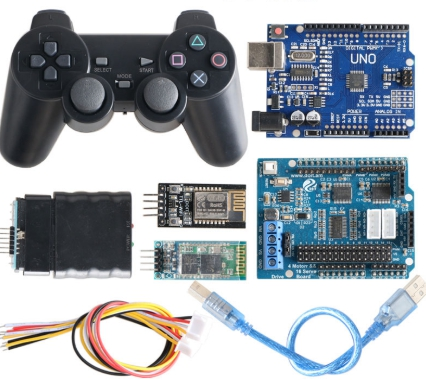 

## 2. Characteristics

（1）Arduino UNO I/O pins are all extracted;

（2）The maximum power input voltage is 15V/DC;

（3）Reserve bluetooth &WIFI module socket;

（4）Reserve PS2 handle socket;

（5）Four-channel DC motor drive, single-channel maximum drive current 1.2a average /3.2A peak;

（6）The 16-way steering gear drives the pin, and the power supply can be switched through the jumper cap external/internal power supply;

## 3. Wiring instructions

Special attention:

（1）No more than 15V power on the VM

（2）When 1 power is shared, the jumper caps on (VM and VIN) and (VS and +5V) are plugged in, and the power is connected to the VM

（3）When powering the steering gear on VS, the jumper cap on (VS and +5V) must be removed, otherwise the board will burn out

（4）When using the handle, WiFi or Bluetooth, just plug in the corresponding pin

### 3.1 Bluetooth wiring instructions

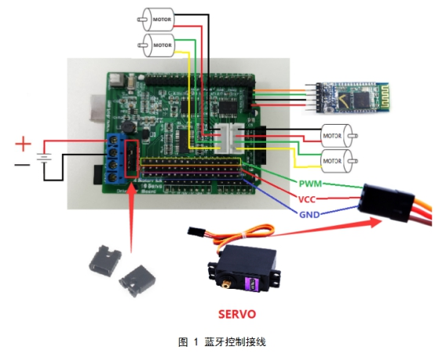 

### 3.2 WiFi wiring instructions

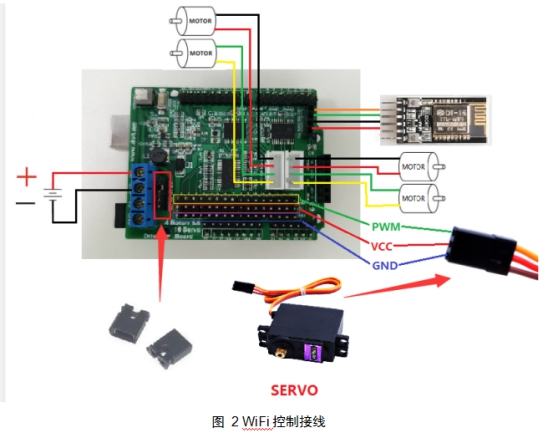 

 

### 3.2 PS2 handle wiring instructions

 

 

## 4. The source code

WiFi and bluetooth Shared a program, warm prompt: download the program, to take down WiFi/bluetooth module, because WiFi/bluetooth module takes up the board serial lead to bat program download is not successful, and download the program before the program using the library files to download down, and then received the libraries under the arduino IDE installation directory folder, library file download address:https://github.com/SmartArduino/Arduino-Third-party-Libraries

### 4.1 WiFi/ Bluetooth programs

```
#include <Wire.h>
#include "Adafruit_PWMServoDriver.h"
#include<stdio.h>
#include<stdbool.h>
#include <Servo.h> 
#define PWMD 3 //D电机转速
#define DIRD 2 //D电机转向
#define PWMC 5 //C电机转速
#define DIRC 4 //C电机转向
#define PWMB 6 //B电机转速
#define DIRB 7 //B电机转向
#define PWMA 9 //A电机转速
#define DIRA 8 //A电机转向
//控制电机运动    宏定义
#define MOTOR_GO_FORWARD  {digitalWrite(DIRA,HIGH);analogWrite(PWMA,200);digitalWrite(DIRB,LOW);analogWrite(PWMB,200);digitalWrite(DIRC,HIGH);analogWrite(PWMC,200);digitalWrite(DIRD,LOW);analogWrite(PWMD,200);} //车体前进                              
#define MOTOR_GO_BACK   {digitalWrite(DIRA,LOW);analogWrite(PWMA,200);digitalWrite(DIRB,HIGH);analogWrite(PWMB,200);digitalWrite(DIRC,LOW);analogWrite(PWMC,200);digitalWrite(DIRD,HIGH);analogWrite(PWMD,200);}   //车体后退
#define MOTOR_GO_LEFT   {digitalWrite(DIRD,LOW);analogWrite(PWMD,255);digitalWrite(DIRB,LOW);analogWrite(PWMB,255);digitalWrite(DIRA,LOW);analogWrite(PWMA,255);digitalWrite(DIRC,LOW);analogWrite(PWMC,255);}  //车体左转
#define MOTOR_GO_RIGHT    {digitalWrite(DIRA,HIGH);analogWrite(PWMA,255);digitalWrite(DIRC,HIGH);analogWrite(PWMC,255);digitalWrite(DIRD,HIGH);analogWrite(PWMD,255);digitalWrite(DIRB,HIGH);analogWrite(PWMB,255);}  //车体右转
#define MOTOR_GO_STOP   {digitalWrite(DIRA,LOW);analogWrite(PWMA,0);digitalWrite(DIRB,LOW);analogWrite(PWMB,0);digitalWrite(DIRC,HIGH);analogWrite(PWMC,0);digitalWrite(DIRD,LOW);analogWrite(PWMD,0);}       //车体静止
#define MAX_PACKETSIZE 32  //串口接收缓冲区
char buffUART[MAX_PACKETSIZE];
unsigned int buffUARTIndex = 0;
unsigned long preUARTTick = 0;
// called this way, it uses the default address 0x40
Adafruit_PWMServoDriver pwm = Adafruit_PWMServoDriver();
//脉宽范围定义
#define SERVOMIN 125//最小脉宽
#define SERVOMAX 625//最大脉宽
#define SERVOMID 375//中间脉宽
//角度范围小于180的单独定义
#define SERVOMIN_3 125
#define SERVOMAX_3 625
#define SERVOMIN_12 125
#define SERVOMAX_12 625
#define SERVOMIN_7 125
#define SERVOMAX_7 625

//数组声明
int Flag[16]={0,0,0,0,0,0,0,0,0,0,0,0,0,0,0,0};
//每个舵机变量声明
uint16_t pulselen_0=SERVOMID;
float pulselen_1=SERVOMID;
float pulselen_2=SERVOMID;
uint16_t pulselen_3=SERVOMID;
uint16_t pulselen_4=SERVOMID;
uint16_t pulselen_5=SERVOMID;
uint16_t pulselen_6=SERVOMID;
uint16_t pulselen_7=SERVOMID;
uint16_t pulselen_8=SERVOMID;
//角度增量声明
uint16_t angle=0;
float angle1=0,n=2;

uint16_t pulse_limit(uint16_t angle)
{
  if(angle < 125)
  {
    angle =125;
  }
  if(angle >= 535)
  {
    angle = 535;
  }
  else{
    return angle;
  }
  return angle;
}

enum DN
{ 
  GO_ADVANCE, 
  GO_LEFT, 
  GO_RIGHT,
  GO_BACK,
  STOP_STOP,
  DEF
}Drive_Num=DEF;
//电机控制标志量
bool flag1=false;
bool stopFlag = true;
bool JogFlag = false;
uint16_t JogTimeCnt = 0;
uint32_t JogTime=0;


//小车电机控制
void CAR_Control()
{
	switch (Drive_Num) 
    {
      case GO_ADVANCE:MOTOR_GO_FORWARD;JogFlag = true;JogTimeCnt = 1;JogTime=millis();break;
      case GO_LEFT: MOTOR_GO_LEFT;JogFlag = true;JogTimeCnt = 1;JogTime=millis();break;
      case GO_RIGHT:MOTOR_GO_RIGHT;JogFlag = true;JogTimeCnt = 1;JogTime=millis();break;
      case GO_BACK:MOTOR_GO_BACK;JogFlag = true;JogTimeCnt = 1;JogTime=millis();break;
      case STOP_STOP: MOTOR_GO_STOP;JogTime = 0;JogFlag=false;stopFlag=true;break;
      default:break;
    }
    Drive_Num=DEF;
    //小车保持姿态210ms
    if(millis()-JogTime>=210)
    {
      JogTime=millis();
      if(JogFlag == true) 
      {
        stopFlag = false;
        if(JogTimeCnt <= 0) 
        {
          JogFlag = false; stopFlag = true;
        }
        JogTimeCnt--;
      }
      if(stopFlag == true) 
      {
        JogTimeCnt=0;
        MOTOR_GO_STOP;
      }
    }
}

//舵机驱动板调用函数
void setServoPulse(uint8_t n, double pulse) {
  double pulselength;
  
  pulselength = 1000000; // 1,000,000 us per second
  pulselength /= 60; // 60 Hz
  Serial.print(pulselength); Serial.println(" us per period"); 
  pulselength /= 4096; // 12 bits of resolution
  Serial.print(pulselength); Serial.println(" us per bit"); 
  pulse *= 1000;
  pulse /= pulselength;
  Serial.println(pulse);
  pwm.setPWM(n, 0, pulse);
}


void Servo1(uint16_t pulselen,int i)//舵机正转
{
  angle=pulselen-1;
    for(;pulselen>angle;pulselen=pulselen-1){
    pwm.setPWM(i,0,pulselen);
    }
}
void Servo0(uint16_t pulselen,int i)//舵机反转
{
  angle=pulselen+1;
    for(;pulselen<angle;pulselen=pulselen+1){
    pwm.setPWM(i,0,pulselen);
    }
}
void Servo1_12(float pulselen,int i)//舵机1和舵机2
{
  angle1=pulselen-0.5;
    for(;pulselen>angle1;pulselen=pulselen-0.5){
    pwm.setPWM(i,0,pulselen);
 
    }

}
void Servo0_12(float pulselen,int i)
{
  angle1=pulselen+0.5;
 
    for(;pulselen<angle1;pulselen=pulselen+0.5){
    pwm.setPWM(i,0,pulselen);
    }

}

//标志位初始化
void Init()
{
  Flag[0]=0;  
  Flag[1]=0; 
  Flag[2]=0; 
  Flag[3]=0; 
  Flag[4]=0;
  Flag[5]=0;
  Flag[6]=0;  
  Flag[7]=0; 
  Flag[8]=0; 
  Flag[9]=0; 
  Flag[10]=0;
  Flag[11]=0;
  Flag[12]=0;
  Flag[13]=0;
  Flag[14]=0;
  Flag[15]=0;
}
//串口接收
void UART_Control(){
if(Serial.available()){ 
  char Uart_Date = Serial.read();
  
	if(buffUARTIndex > 0 && (millis() - preUARTTick >= 100))//超过100ms没接到数据，则认为已经接收到完整指令
	{ //data ready
		buffUART[buffUARTIndex] = 0x00;
		/*if((buffUART[0]=='C') && (buffUART[1]=='M') && (buffUART[2]=='D')) //若发送指令非法，则忽略
	    {
	    	;
	    }
		else Uart_Date=buffUART[0];
    	buffUARTIndex = 0;*/
    }
    switch (Uart_Date)    //串口控制指令
	{
      case'a':Flag[0]=true;Serial.print(Uart_Date);break;
      case'A':Flag[1]=true;Serial.print(Uart_Date);break;
      case'b':Flag[2]=true;Serial.print(Uart_Date);break;
      case'B':Flag[3]=true;Serial.print(Uart_Date);break;
      case'c':Flag[4]=true;Serial.print(Uart_Date);break;
      case'C':Flag[5]=true;Serial.print(Uart_Date);break;
      case'd':Flag[6]=true;Serial.print(Uart_Date);break;
      case'D':Flag[7]=true;Serial.print(Uart_Date);break;
      case'e':Flag[8]=true;Serial.print(Uart_Date);break;
      case'E':Flag[9]=true;Serial.print(Uart_Date);break;
      case'f':Flag[10]=true;Serial.print(Uart_Date);break;
      case'F':Flag[11]=true;Serial.print(Uart_Date);break;
      case'g':Flag[12]=true;Serial.print(Uart_Date);break;  
      case'G':Flag[13]=true;Serial.print(Uart_Date);break;
      case'h':Flag[14]=true;Serial.print(Uart_Date);break;  
      case'H':Flag[15]=true;Serial.print(Uart_Date);break;
      //case '2': Drive_Num=GO_ADVANCE;Serial.print(Uart_Date);break;
      case '6': Drive_Num=GO_LEFT; Serial.print(Uart_Date);break;
      case '4': Drive_Num=GO_RIGHT;Serial.print(Uart_Date); break;
      //case '1': Drive_Num=GO_BACK; Serial.print(Uart_Date);break;
      default:Serial.print(Uart_Date);break;
	}
     }
}

//初始化

void setup() {
Serial.begin(9600);
Serial.println("16 channel Servo test!");
pwm.begin();
pwm.setPWMFreq(60); // Analog servos run at ~60 Hz updates
pwm.setPWM(0, 0, SERVOMID);
pwm.setPWM(1, 0, SERVOMID);
pwm.setPWM(2, 0, SERVOMID);
pwm.setPWM(3, 0, SERVOMID);
pwm.setPWM(4, 0, SERVOMID);
pwm.setPWM(5, 0, SERVOMID);
pwm.setPWM(6, 0, SERVOMID);
pwm.setPWM(7, 0, SERVOMID);//SERVOMIN_8
pinMode(DIRA,OUTPUT);
pinMode(PWMA,OUTPUT);  
pinMode(DIRB,OUTPUT);
pinMode(PWMB,OUTPUT); 
pinMode(DIRC,OUTPUT);
pinMode(PWMC,OUTPUT);
pinMode(DIRD,OUTPUT);
pinMode(PWMD,OUTPUT);
MOTOR_GO_STOP;
delay(10);
}

void loop() 
{
  Init();
  UART_Control();
  CAR_Control();
  
  if(Flag[0]==true&&pulselen_0<=SERVOMAX){
    
    Servo0(pulselen_0,0);
    pulselen_0=pulselen_0+n;
    pulselen_0 = pulse_limit(pulselen_0);
  }
  if(Flag[1]==true&&pulselen_0>=SERVOMIN){
     
    Servo1(pulselen_0,0);
    pulselen_0=pulselen_0-n;
    pulselen_0 = pulse_limit(pulselen_0);
  }
  if(Flag[2]==true&&pulselen_1<=SERVOMAX_12){
    
    Servo0(pulselen_1,1);
    Servo1(pulselen_2,2);
    pulselen_1=pulselen_1-n;
    pulselen_2=pulselen_2+n;
    pulselen_1 = pulse_limit(pulselen_1);
    pulselen_2 = pulse_limit(pulselen_2);
  }
  if(Flag[3]==true&&pulselen_1>=SERVOMIN_12){
     
    Servo0(pulselen_1,1);
    Servo1(pulselen_2,2);
    pulselen_1=pulselen_1-n;
    pulselen_2=pulselen_2+n;
    pulselen_1 = pulse_limit(pulselen_1);
    pulselen_2 = pulse_limit(pulselen_2);
  }
if(Flag[4]==true&&pulselen_3<=SERVOMAX_12){
    
    Servo1(pulselen_3,3);
    pulselen_3=pulselen_3+n;
    pulselen_3 = pulse_limit(pulselen_3);
  }
  if(Flag[5]==true&&pulselen_3>=SERVOMIN_12){
     
    Servo1(pulselen_3,3);
    pulselen_3=pulselen_3-n;
    pulselen_3 = pulse_limit(pulselen_3);
  }
  /****************************************/
  /**************Servo5********************/
  if(Flag[6]==true&&pulselen_4<=SERVOMAX){
    
    Servo0(pulselen_4,4);
    pulselen_4=pulselen_4+n;
    pulselen_4 = pulse_limit(pulselen_4);
  }
  if(Flag[7]==true&&pulselen_4>=SERVOMIN){
     
    Servo1(pulselen_4,4);
    pulselen_4=pulselen_4-n;
    pulselen_4 = pulse_limit(pulselen_4);
  }
  /*****************************************/
  /****************Servo6******************/
  if(Flag[8]==true&&pulselen_5<=SERVOMAX){

    Servo0(pulselen_5,5);
    pulselen_5=pulselen_5+n;
    pulselen_5 = pulse_limit(pulselen_5);
  }
  if(Flag[9]==true&&pulselen_5>=SERVOMIN){

    Servo1(pulselen_5,5);
    pulselen_5=pulselen_5-n;
    pulselen_5 = pulse_limit(pulselen_5);
  }
  /**************************************/
  /****************servo7****************/
  if(Flag[10]==true&&pulselen_6<=SERVOMAX){
    
    Servo0(pulselen_6,6);
    pulselen_6=pulselen_6+n;
    pulselen_6 = pulse_limit(pulselen_6);
  }
  if(Flag[11]==true&&pulselen_6>=SERVOMIN)
  { 
    Servo1(pulselen_6,6);
    pulselen_6=pulselen_6-n;
    pulselen_6 = pulse_limit(pulselen_6);
  }
  /**************************************/
  /***************Servo8*****************/
  if(Flag[12]==true&&pulselen_7<=SERVOMAX){

    Servo0(pulselen_7,7);
    pulselen_7=pulselen_7+n;
    pulselen_7 = pulse_limit(pulselen_7);
  }
  if(Flag[13]==true&&pulselen_7>=SERVOMIN){

    Servo1(pulselen_7,7);
    pulselen_7=pulselen_7-n;
    pulselen_7 = pulse_limit(pulselen_7);
  }
  /**************************************/
//  /***************Servo9*****************/
//  if(Flag[14]==true&&pulselen_8<=SERVOMAX){
//
//    Servo0(pulselen_8,8);
//    pulselen_8=pulselen_8+n;
//    pulselen_8 = pulse_limit(pulselen_8);
//  }
//  if(Flag[15]==true&&pulselen_8>=SERVOMIN){
//
//    Servo1(pulselen_8,8);
//    pulselen_8=pulselen_8-n;
//    pulselen_8 = pulse_limit(pulselen_8);
//  }
//  /***************************************/
}
```


### 4.2 Handle program

```
#include <Servo.h> 
#include <Wire.h>
#include <PS2X_lib.h>  //for v1.6
#include "Adafruit_PWMServoDriver.h"
// called this way, it uses the default address 0x40
Adafruit_PWMServoDriver pwm = Adafruit_PWMServoDriver();
// you can also call it with a different address you want
//Adafruit_PWMServoDriver pwm = Adafruit_PWMServoDriver(0x41);
// Depending on your servo make, the pulse width min and max may vary, you 
// want these to be as small/large as possible without hitting the hard stop
// for max range. You'll have to tweak them as necessary to match the servos you
// have!
//脉宽范围定义
#define SERVOMIN 125//最小脉宽
#define SERVOMAX 535//最大脉宽
#define SERVOMID 330//中间脉宽
//角度范围小于180的单独定义
#define SERVOMIN_3 125
#define SERVOMAX_3 535
#define SERVOMIN_12 125
#define SERVOMAX_12 535
#define SERVOMIN_7 125
#define SERVOMAX_7 535
int angle_step = 5;

uint16_t pulselen_0=SERVOMID;
float pulselen_1=SERVOMID;
float pulselen_2=SERVOMID;
uint16_t pulselen_3=SERVOMID;
uint16_t pulselen_4=SERVOMID;
uint16_t pulselen_5=SERVOMID;
uint16_t pulselen_6=SERVOMID;
uint16_t pulselen_7=SERVOMID;
uint16_t angle=0;
float angle1=0;
bool pt0=0;
bool pt1=0;
bool pt2=0;
bool pt3=0;
bool pt4=0;
bool pt5=0;
bool pt6=0;

// our servo # counter
//uint8_t servonum = 0;
// you can use this function if you'd like to set the pulse length in seconds
// e.g. setServoPulse(0, 0.001) is a ~1 millisecond pulse width. its not precise!
void setServoPulse(uint8_t n, double pulse) {
  double pulselength;
  //float pulselen;
  pulselength = 1000000; // 1,000,000 us per second
  pulselength /= 60; // 60 Hz
  Serial.print(pulselength); Serial.println(" us per period"); 
  pulselength /= 4096; // 12 bits of resolution
  Serial.print(pulselength); Serial.println(" us per bit"); 
  pulse *= 1000;
  pulse /= pulselength;
  Serial.println(pulse);
  pwm.setPWM(n, 0, pulse);
}
void Servo0(uint16_t pulselen,int i){

  angle=pulselen-1;
  for(;pulselen>angle;pulselen=pulselen-1){
    pwm.setPWM(i,0,pulselen);
  }
}
void Servo1(uint16_t pulselen,int i){

  angle=pulselen+1;
  for(;pulselen<angle;pulselen=pulselen+1){
    pwm.setPWM(i,0,pulselen);
  }
}
void Servo1_12(float pulselen,int i){
  angle1=pulselen+0.5;
    for(;pulselen<angle1;pulselen=pulselen+0.5){
    pwm.setPWM(i,0,pulselen);
 
    }

}
void Servo0_12(float pulselen,int i){
  angle1=pulselen-0.5;
 
    for(;pulselen>angle1;pulselen=pulselen-0.5){
    pwm.setPWM(i,0,pulselen);
    }

}
/******************************************************************
 * set pins connected to PS2 controller:
 *   - 1e column: original 
 *   - 2e colmun: Stef?
 * replace pin numbers by the ones you use
 ******************************************************************/
//PS2手柄引脚；
#define PS2_DAT        13  //14    
#define PS2_CMD        11  //15
#define PS2_SEL        10  //16
#define PS2_CLK        12  //17

// 电机控制引脚；
#define PWMD 3
#define DIRD 2
#define PWMC 5
#define DIRC 4
#define PWMB 6
#define DIRB 7
#define PWMA 9
#define DIRA 8
int speed1 = 100;
enum DN
{
  GO_FORWARD,
  GO_BACK,
  GO_LEFT,
  GO_RIGHT,
  GO_STOP,
  DEF
}Drive_Num = DEF;

/******************************************************************
 * select modes of PS2 controller:
 *   - pressures = analog reading of push-butttons 
 *   - rumble    = motor rumbling
 * uncomment 1 of the lines for each mode selection
 ******************************************************************/
#define pressures   true
//#define pressures   false
#define rumble      true
//#define rumble      false

PS2X ps2x; // create PS2 Controller Class

//right now, the library does NOT support hot pluggable controllers, meaning 
//you must always either restart your Arduino after you connect the controller, 
//or call config_gamepad(pins) again after connecting the controller.

int error = 0;
byte type = 0;
byte vibrate = 0;
void (* resetFunc) (void) =0;
 void setup(){
   pinMode(PWMA, OUTPUT);
   pinMode(DIRA, OUTPUT);
   pinMode(PWMB, OUTPUT);
   pinMode(DIRB, OUTPUT);
   pinMode(PWMC, OUTPUT);
   pinMode(DIRC, OUTPUT);
   pinMode(PWMD, OUTPUT);
   pinMode(DIRD, OUTPUT);
   Serial.begin(9600);
 //double val=ps2x.read_gamepad();
   delay(500) ; //added delay to give wireless ps2 module some time to startup, before configuring it
   //CHANGES for v1.6 HERE!!! **************PAY ATTENTION*************

  //setup pins and settings: GamePad(clock, command, attention, data, Pressures?, Rumble?) check for error
error = ps2x.config_gamepad(PS2_CLK, PS2_CMD, PS2_SEL, PS2_DAT, pressures, rumble);

  if(error == 0){
    Serial.print("Found Controller, configured successful ");
    Serial.print("pressures = ");
    if (pressures)
      Serial.println("true ");
    else
      Serial.println("false");
    Serial.print("rumble = ");
    if (rumble)
      Serial.println("true)");
    else
      Serial.println("false");
    Serial.println("Try out all the buttons, X will vibrate the controller, faster as you press harder;");
    Serial.println("holding L1 or R1 will print out the analog stick values.");
    Serial.println("Note: Go to www.billporter.info for updates and to report bugs.");
  }  
  else if(error == 1)
    Serial.println("No controller found, check wiring, see readme.txt to enable debug. visit www.billporter.info for troubleshooting tips");

  else if(error == 2)
    Serial.println("Controller found but not accepting commands. see readme.txt to enable debug. Visit www.billporter.info for troubleshooting tips");

  else if(error == 3)
    Serial.println("Controller refusing to enter Pressures mode, may not support it. ");

  type = ps2x.readType(); 
  switch(type) {
    case 0:
      Serial.println("Unknown Controller type found ");
      break;
    case 1:
      Serial.println("DualShock Controller found ");
      break;
    case 2:
      Serial.println("GuitarHero Controller found ");
      break;
    case 3:
      Serial.println("Wireless Sony DualShock Controller found ");
      break;
   }
      Serial.println("16 channel Servo test!");
  pwm.begin();
    pwm.setPWMFreq(60); 
   pwm.setPWM(0,0,SERVOMID);
   pwm.setPWM(1,0,SERVOMID);
   pwm.setPWM(3,0,SERVOMID);
   pwm.setPWM(2,0,SERVOMID);
   pwm.setPWM(4,0,SERVOMID);
   pwm.setPWM(5,0,SERVOMID);
   pwm.setPWM(6,0,SERVOMID);
   pwm.setPWM(7,0,SERVOMID);  
}
//定义小车运动方式

 void turnLeft(int speed1){//小车左转
   digitalWrite(DIRA,HIGH);
   digitalWrite(DIRB,LOW);
   digitalWrite(DIRC,HIGH);
   digitalWrite(DIRD,LOW);
   analogWrite(PWMA, speed1);
   analogWrite(PWMB, speed1);
   analogWrite(PWMC, speed1);
   analogWrite(PWMD, speed1);
}
 void turnRight(int speed1)//右转
{
   digitalWrite(DIRA,LOW);
   digitalWrite(DIRB,HIGH);
   digitalWrite(DIRC,LOW);
   digitalWrite(DIRD,HIGH);
   analogWrite(PWMA, speed1);
   analogWrite(PWMB, speed1);
   analogWrite(PWMC, speed1);
   analogWrite(PWMD, speed1);
}

 void forward(int speed1)//前进
{
   digitalWrite(DIRA,HIGH);
   digitalWrite(DIRB,HIGH);
   digitalWrite(DIRC,HIGH);
   digitalWrite(DIRD,HIGH);
   analogWrite(PWMA, speed1);
   analogWrite(PWMB, speed1);
   analogWrite(PWMC, speed1);
   analogWrite(PWMD, speed1);  
}

 void back(int speed1)//后退
{
   digitalWrite(DIRA,LOW);
   digitalWrite(DIRB,LOW);
   digitalWrite(DIRC,LOW);
   digitalWrite(DIRD,LOW);
   analogWrite(PWMA, speed1);
   analogWrite(PWMB, speed1);
   analogWrite(PWMC, speed1);
   analogWrite(PWMD, speed1);
}
void stop() // 停止；
 {
   digitalWrite(DIRA,LOW);
   digitalWrite(DIRB,LOW);
   digitalWrite(DIRC,LOW);
   digitalWrite(DIRD,LOW);
   analogWrite(PWMA, 0);
   analogWrite(PWMB, 0);
   analogWrite(PWMC, 0);
   analogWrite(PWMD, 0);
   delay(20);
}
void PS2()
{
  
   /* You must Read Gamepad to get new values and set vibration values
     ps2x.read_gamepad(small motor on/off, larger motor strenght from 0-255)
     if you don't enable the rumble, use ps2x.read_gamepad(); with no values
     You should call this at least once a second
   */  
  if(error == 1) //skip loop if no controller found
    return; 

  if(type == 2) {//Guitar Hero Controller
  return;
  }
  else  { //DualShock Controller
    ps2x.read_gamepad(false, vibrate); //read controller and set large motor to spin at 'vibrate' speed1
     vibrate = ps2x.Analog(PSAB_CROSS);  //this will set the large motor vibrate speed1 based on how hard you press the blue (X) button
    if (ps2x.NewButtonState()) {
     if(ps2x.Button(PSB_L2)){
        Serial.println("L2 pressed");
        pt0=0;
        pt1=0;
        pt2=0;
        pt3=0;
        pt4=0;
        pt5=1;
        pt6=0;
      }
      if(ps2x.Button(PSB_R2)){
        Serial.println("R2 pressed");
        pt0=0;
        pt1=0;
        pt2=0;
        pt3=0;
        pt4=0;
        pt5=0;
        pt6=1;
      }
      if(ps2x.Button(PSB_TRIANGLE)){
        Serial.println("Triangle pressed");
        pt0=0;
        pt1=0;
        pt2=1;
        pt3=0;
        pt4=0;
        pt5=0;
        pt6=0;
       }      
    }
    if(ps2x.ButtonPressed(PSB_CIRCLE)){               //will be TRUE if button was JUST pressed
      Serial.println("Circle just pressed");
        pt0=0;
        pt1=0;
        pt2=0;
        pt3=1;
        pt4=0;
        pt5=0;
        pt6=0;
    }
    if(ps2x.NewButtonState(PSB_CROSS)){      //will be TRUE if button was JUST pressed OR released
      Serial.println("X just changed");
      pt0=0;
        pt1=0;
        pt2=0;
        pt3=0;
        pt4=1;
        pt5=0;
        pt6=0;
    }
    if(ps2x.ButtonReleased(PSB_SQUARE)){              //will be TRUE if button was JUST released
      Serial.println("Square just released");
        pt0=0;
        pt1=1;
        pt2=0;
        pt3=0;
        pt4=0;
        pt5=0;
        pt6=0;
    }
 //start 开始运行，电机初PWM为100；
    if(ps2x.Button(PSB_START))  {
       Serial.println("Start is being held");
        pt0=1;
        pt1=0;
        pt2=0;
        pt3=0;
        pt4=0;
        pt5=0;
        pt6=0;
                 
    }
// 电机正转；
    if(ps2x.Button(PSB_PAD_UP)){
      Serial.println("Up held this hard: ");
     Drive_Num = GO_FORWARD;
    }

// 电机反转；
    else if(ps2x.Button(PSB_PAD_DOWN)){
      Serial.print("Down held this hard: ");
      Drive_Num = GO_BACK; 
    }

 //左转；   
    else if(ps2x.Button(PSB_PAD_LEFT)){
       Serial.println("turn left ");
       Drive_Num = GO_LEFT;        
    }

//右转；
   else if(ps2x.Button(PSB_PAD_RIGHT)){
    Serial.println("turn right");
    speed1=50;
    Drive_Num = GO_RIGHT;
   }
// Stop
   else{
    Drive_Num = GO_STOP;
   }
   delay(20);

  }   
   if(ps2x.Button(PSB_L1)||ps2x.Button(PSB_R1)){
       int LY=ps2x.Analog(PSS_LY);
       int LX=ps2x.Analog(PSS_LX);
       int RY=ps2x.Analog(PSS_RY);
       int RX=ps2x.Analog(PSS_RX);    
      if(pt0){
       if((RY<100)&&(pulselen_0>=SERVOMIN)){//
       Servo0(pulselen_0,0);
       pulselen_0=pulselen_0-angle_step;

     }
       else if((RY>=150)&&(pulselen_0<=SERVOMAX)){//
       Servo1(pulselen_0,0);
       pulselen_0=pulselen_0+angle_step;
      }
     } 
      if(pt1){
       if((RY<100)&&(pulselen_1>=SERVOMIN_12)){//
        Servo0(pulselen_1,1);
        Servo1(pulselen_2,2);
        pulselen_1=pulselen_1-angle_step;
        pulselen_2=pulselen_2+angle_step;
     }
       else if((RY>=150)&&(pulselen_1<=SERVOMAX_12)){//
        Servo1(pulselen_1,1);
        Servo1(pulselen_2,2);
        pulselen_1=pulselen_1+angle_step;
        pulselen_2=pulselen_2-angle_step;
     }
    }  
     if(pt2){
       if((RY<100)&&(pulselen_3>=SERVOMIN_3)){//
       Servo0(pulselen_3,3);
       pulselen_3=pulselen_3-angle_step;

     }
       else if((RY>=150)&&(pulselen_3<=SERVOMAX_3)){//
       Servo1(pulselen_3,3);
       pulselen_3=pulselen_3+angle_step;
     }
    }
      if(pt3){
       if((RY<100)&&(pulselen_4>=SERVOMIN)){//
       Servo0(pulselen_4,4);
       pulselen_4=pulselen_4-angle_step;

     }
       else if((RY>=150)&&(pulselen_4<=SERVOMAX)){//
       Servo1(pulselen_4,4);
       pulselen_4=pulselen_4+angle_step;
      }
     }
       if(pt4){
       if((RY<100)&&(pulselen_5>=SERVOMIN)){//
       Servo0(pulselen_5,5);
       pulselen_5=pulselen_5-angle_step;

     }
       else if((RY>=150)&&(pulselen_5<=SERVOMAX)){//
       Servo1(pulselen_5,5);
       pulselen_5=pulselen_5+angle_step;

     }
   }
      if(pt5){
       if((RY<100)&&(pulselen_6>=SERVOMIN)){//
       Servo0(pulselen_6,6);
       pulselen_6=pulselen_6-angle_step;

     }
       else if((RY>=150)&&(pulselen_6<=SERVOMAX)){//
       Servo1(pulselen_6,6);
       pulselen_6=pulselen_6+angle_step;

     }
     }
     if(pt6){
       if((RY<100)&&(pulselen_7>=SERVOMIN_7)){//
       Servo0(pulselen_7,7);
       pulselen_7=pulselen_7-angle_step;

     }
       else if((RY>=150)&&(pulselen_7<=SERVOMAX_7)){//
       Servo1(pulselen_7,7);
       pulselen_7=pulselen_7+angle_step;
     }
    }
  }

  delay(5);
}
void Control()
{
  switch(Drive_Num)
  {
    case GO_FORWARD: forward(speed1);   break;
    case GO_BACK:    back(speed1);      break;
    case GO_LEFT:    turnLeft(speed1);  break;
    case GO_RIGHT:   turnRight(speed1); break;
    case GO_STOP:    stop();           break;
  }
}
void loop()
{
  PS2();
  Control();
}  
```


## 5.Directions for Use

### 5.1 Download the program

The specific steps are as follows. If the steps are completed, jump to the next step on your own:

（1）Download and install Arduino IDE software, arduino official website：https://www.arduino.cc/，Installation process by itself Baidu

（2）Install the CH340 driver

Download the corresponding driver according to their own system：https://gitnova.com/#/GeneralSource/drivers

 

 

（3）Library File

Open the library file download address in section 4：https://github.com/SmartArduino/Arduino-Third-party-Libraries，Download the two library files


Then unzip it into the Libraries file connection

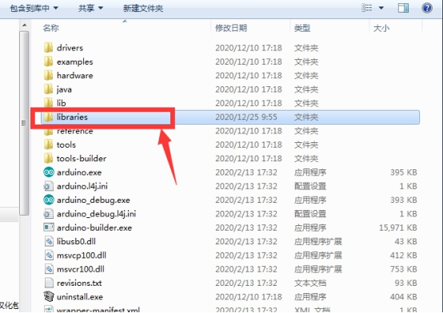 

 

 

（4）Open the program

Download from the Github repository：https://github.com/SmartArduino/Arduino-Code，You can also create a new folder and copy the source code from the previous section

 

 

（5）Select board model

 

 

（6）Select port number

Premise: use USB cable to connect the control panel and USB

Note: When there are multiple serial ports, be sure to select the port number for the applicable board

 

（7）compiler

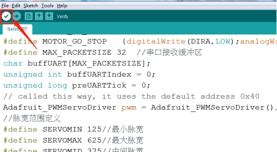 

 

Compile successfully. If not, modify according to error message

 

（8）Download

If the previous compilation is successful, download error, first check the board model, port number is not right, and then download, if can't download， restart the software to try again

 

 

### 5.2 Control specification

After downloading the program, follow the wiring instructions

Note: When using WiFi/ Bluetooth control, first install the mobile app (Android phone only).：https://github.com/SmartArduino/SmartArduino.github.io/blob/master/docs/Robot/Controller/app/base.apk

#### 5.2.1Bluetooth control instructions

Power on and develop mobile APP

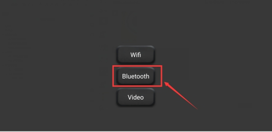 

 

 

 

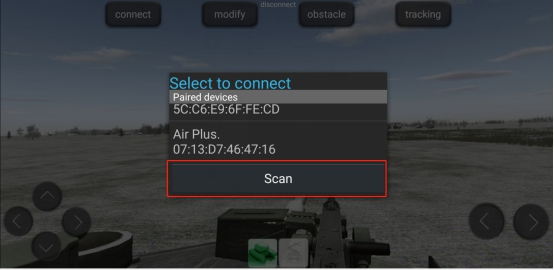 

Note: The bluetooth name in the figure is just an example. Choose the corresponding name according to your bluetooth

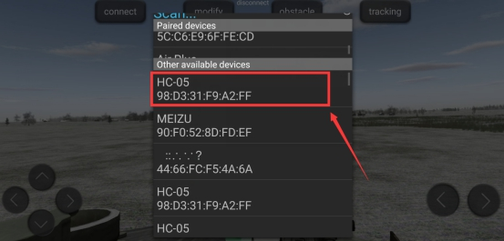 

 

 

The middle letter becomes Ed to indicate that the Bluetooth connection is successful

 

Click these four buttons to control the car front and back left and right movement. If it is McNamum wheel, add the two buttons at the bottom right corner to control the car left drift and right drift respectively

 

Control steering gear movement:

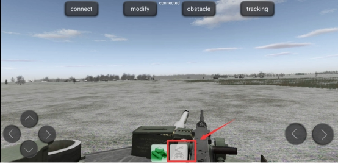 

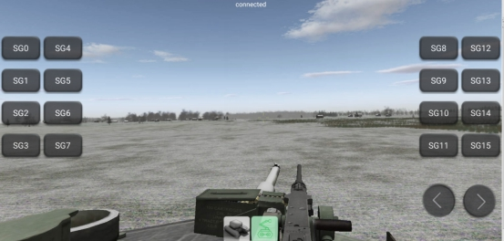 

First select the control route, and then click the bottom right two buttons to control the steering gear left and right turn

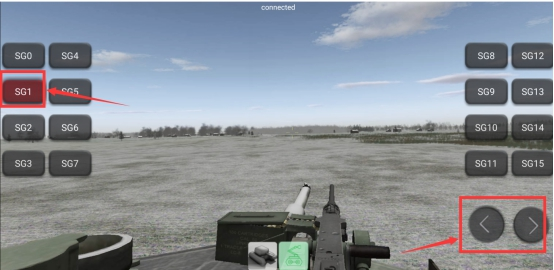 

Note: the road number SG0~SG15 here corresponds to the control pin number 0~15 on the board

 

Video tutorial：https://github.com/SmartArduino/zhdocs/blob/master/zhControlPanel/4%26%2616ControlKit/Bluetooth.rar

#### 5.2.2 WiFi control instructions

Tips: Bluetooth and WiFi control, except the connection mode is different, control mode is the same。

Open the mobile phone WLAN, find the hot spot named Doit_WiFI_XXXX and connect it (XXXX is the MAC address of the module, please note that there are multiple devices using it at the same time). A selection box will pop up when you connect 5s, and then select "使用".

 

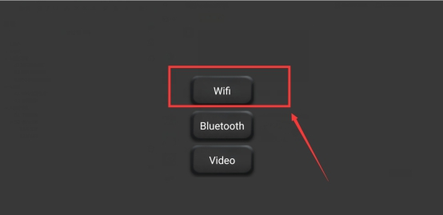 

 

After entering, check whether the letter in the middle of the interface has changed into Ed form. If not, check whether the hot spot is connected

 

 

The control of motor and steering gear is the same as that of Bluetooth in the previous section.

#### 5.2.3 Handle control instructions

Note: First plug the receiver into the board before powering on. If it is plugged into the handle receiver, press the reset button on the board, otherwise the board cannot check the receiver and cannot control it

(1) Plug in the receiver and power on; Turn on the power switch of the handle. When the indicator light on the handle and the indicator light on the receiver do not flash, the handle is connected and ready to be controlled

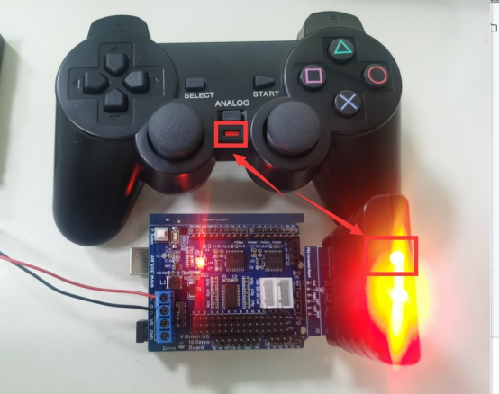 

（2）Press PSB_PAD_UP and PSB_PAD_DOWN and PSB_PAD_LEFT and PSB_PAD_RIGHT to control the car's front and back movement

（3）Control steering gear: select the control number first, then press PSB_R1 and shake PSB_R3 at the same time, turn left upward and turn right downward (the steering gear should be connected to 0~6 interfaces on the board).

 

 

The control number on the handle corresponds to the control interface on the board

| Handle keys (control number) | Control panel |
| ---------------------------- | ------------- |
| PSB_START                    | 0             |
| PSB_SQUARE                   | 1             |
| PSB_TRIANGLE                 | 2             |
| PSB_CIRCLE                   | 3             |
| PSB_CROSS                    | 4             |
| PSB_L2                       | 5             |
| PSB_R2                       | 6             |

 

## 6. Q&A

（1）What is the maximum voltage the board can withstand?

A：15V, as the motor driver chip is TB6612, its maximum withstand voltage is 15V

（2）If you power the steering gear separately, can you use only one power source?

A：No, because the instantaneous current is  large during the steering gear starting process, the working voltage is unstable and the control board cannot work normally, so a power supply should be added to the VM to supply power to the control board.

（3）Can the jumper cap on (VS and +5V) not be removed when powering the steering gear separately?

A：No, this will cause the 5V power supply on the board and the external power supply in series, which will seriously burn the chip

（4）Plug in the Bluetooth /WiFi module, why can't you download the program?

A：Since the Bluetooth /WiFi module will occupy the download port on the board, be sure to remove the Bluetooth /WiFi module when downloading programs

（5）After the handle is plugged in, the indicator light is always on, but there is no response during the control. What is the reason?

A：1）The PS2 library used in the program does not support hot plugging. After plugging in the receiver, press the reset button on the board

​      2）The handle is powered by a 3V (2 connected to 1.5V) battery, so the voltage is too low to work

​      3）Check whether the program has been downloaded successfully (verified by Arduino IDE serial port monitor)

（6）When do you need to power the steering gear separately?

A：1）The power supply of steering gear used is higher than 5V

​	  2）When you have to control multiple steering engines at the same time

（7）When using PS2 handle control, the car can be controlled, but the steering gear cannot be controlled. Why?

A：Check the wiring of the bottom steering gear, and then see if the handle is operating correctly

## Contact Us

- E-mails: [yichone@doit.am](mailto:yichone@doit.am), [yichoneyi@163.com](mailto:yichoneyi@163.com)
- Skype: yichone
- WhatsApp:+86-18676662425
- Wechat: 18676662425