<center><font size=10> Arduino WiFi Extension Board data Manual </center></font>
<center> From SZDOIT</center>

## 1. Product Introduction

ESP8266 serial port WiFi extension board is an ultra-low-power UARt-wifi module developed by Shenzhen Sibo Zhaolian Technology Co., LTD., based on Lexin ESP8266. It is compatible with Arduino UNO, Mega and other standard mainboards, which can be easily re-developed and accelerate product prototype design.


### 1.1 Features

- The WiFi adopts the industrial-grade chip ESP8266, and the module is ESP-12E with a metal shield, with strong anti-jamming capability.

- The standard pins are compatible with Arduino Uno, Mega2560 and other main control boards. Voltage conversion chip is used to connect the Arduino and Uno, making 3.3V and 5V compatible.

- The serial port is controlled by dual-channel dial-code switch, so that the extension board can be used as both Arduino Uno extension board and ESP8266 extension board.

- Real serial WiFi, Arduino program does not need any configuration;

- Configure WiFi parameters and serial port parameters based on WebServer;

- Can be used as a separate development board for ESP8266, download the official AT directive firmware, NodeMCU open source firmware, etc.

- It can be used as an independent Arduino Uno extension board with all the pins drawn out.

- More Doit serial port WiFi module extension board, driver board information, you can refer to： [http://www.doit.am](http://www.doit.am/)，[https://szdoit.taobao.com](https://szdoit.taobao.com/)/。

###  1.2 Technical specifications

- Support wireless 802.11b /g/ N standard;
- Support STA/AP working mode;
- Built-in TCP/IP protocol stack, you can configure a socket;
- Support standard TCP/UDP Server and Client;
- Serial port Baud rate support： 1200/2400/4800/9600/19200/38400/57600/74800/ 115200 bps；
- Serial port data bits：5/6/7/8位；
- Serial port parity: none;
- Serial port stop bit: 1/2 bit;
- Pin spacing for standard Arduino UNO and Mega;
- Raises the Arduino Pin 2/3/4/5/6/7/8/9/10/11/12/13;
- Raises the ESP8266 GPIO 0/2/4/5/9/10/12/13/14/15/16/ADC/EN/UART TX/UART RX；
- RESET；
- KEY reuse configuration function;
- Arduino and ESP8266 serial port extension switch are realized with two dial-code switches.
- WiFi working current: continuous sending: ≈70mA (200mA MAX), Standby: <200uA;
- Wireless transmission rate: 110-460800Bps;
- Operating temperature: -40℃ ~ +125℃
- Module weight: about 20g

### 1.3 Mechanical dimensions


### 1.4 The interface definition

The extension board provides interface pins as shown in THE PCB view. Each pin function is printed on the circuit board. The specific definition is as follows:

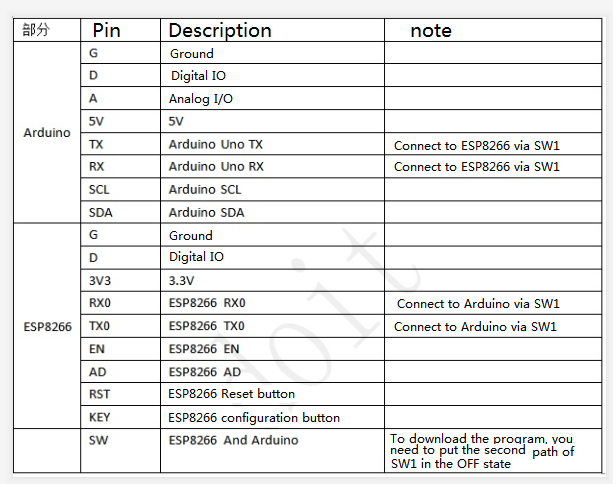

### 1.5 Meaning of indicator light

The ESP8266 serial WiFi extension has two LED indicators. Red is the power indicator normally bright LED. Blue is the multi-function indicator light, which has the following specific meanings:


## 2. How to Use

This section USES two cases to quickly configure ESP8266 serial port WiFi to achieve the serial port passthrough function.

### 2.1 Go into configuration mode

The expansion board is set to configuration mode when it leaves the factory. It must be set before passthrough can be used. In addition, if the expansion board is already configured to work in pass-through mode, the module can be reset by pressing the KEY button for more than one second to enter configuration mode.

1. Module power on, module WiFi signal in configuration mode：“DoitWiFi_Config”。passward：“12345678”


2. Enter the WiFi add-on address 192.168.4.1 in the browser to open the configuration page. As shown in the figure below.

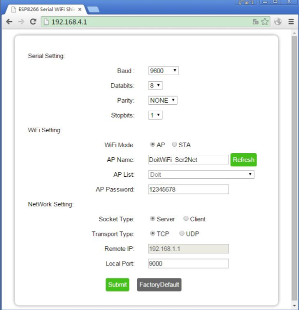

The built-in WebServer of WiFi extension board supports configuration of serial port parameters, WiFi working mode of ESP8266 (AP, STA), network parameter setting, etc. Supports automatic or manual scanning of AP lists.

3. No changes are required here. Just click the "Submit" button to Submit. Prompt successful.

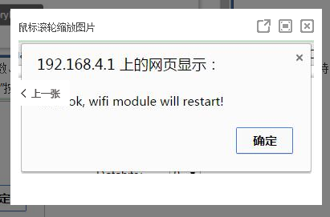

After submission, the module will automatically restart and enter AP mode, with serial port parameters set as 9600, n, 8,1. WiFi working mode is hotspot (AP), SSID is "DoitWiFi_Ser2Net", password is "12345678". Set up TCP Server, listening port 9000. This is the factory default configuration for WiFi module. If "FactorDefault" is used, these parameters are also configured.

### 2.1 Arduino data goes to WiFi

After completing the steps in the previous section, follow the simple steps below to implement data passthrough.

The steps are as follows:

- Insert the WiFi extension board into the extension slot of the Arduino motherboard. Dial 1 and 2 of the dial code switch to the OFF position to disconnect the serial port connection between the WiFi extension board and the Arduino.
- Download the following code into the Arduino. This code initializes the serial port of Arduino to 9600, n, 8,1.

```
void setup()  
{
	Serial.begin(9600);  
}
void loop()
{
    delay(1000);
    Serial.println("hello ESP8266 WiFi");
}
```

- Dial the dial-code switch 1/2 to the ON position. Connect the WiFi extension board to the Arduino serial port. Access to electricity.
- The laptop searches for and connects to the WiFi extension board for the WiFi signal: "DoitWiFi_Ser2Net", password: "12345678".

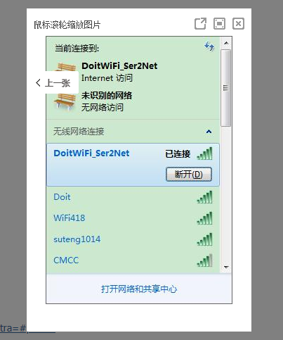

- Run the TCP UDP debugging tool on your computer.

  Recommended use: TCP UDP Debugger,Download address： http://bbs.doit.am/forum.php?mod=viewthread&tid=174&page=1&extra=#pid206 Run the software, establish a TCP client connection, DestIP address is 192.168.4.1, Port is 9000. The LocalPort LocalPort is set to Auto.


After the connection, you can see the data sent by Arduino every 1 second, realizing the transmission of serial port data to network data.


### 2.2 Connect to remote server

This example USES Doit's public network TCP tool to test the ability of the WiFi extension board to communicate with the remote server.

- Get a temporary IP and port from Doit's TCP server. The IP obtained here is "115.29.109.104" and the port is "6533".


More information on TCP public network testing tools is available： http://bbs.doit.am/forum.php?mod=viewthread&tid=12&extra=page%3D1

- WiFi extension board enters configuration mode. After the WiFi extension board is powered on, long press the KEY button for more than one second. "DoitWiFi_Config" connection. The password is: 12345678. Enter "192.168.4.1" in the browser, enter the WebServer configuration WiFi extension board to work in node Mode (STA Mode), and make it connect to the wireless router with Internet access, "WiFi Mode" and select "STA". Here the wireless router is: "MIFI_A6_cd1c". The password is "MIFI66666666".

- When the WebServer loads the page, it automatically refreshes the current list of AP searches for ESP8266. Show in the AP List. When you select "STA," the Refresh button enables you to Refresh the scan results.


* Configure the network parameters of the WiFi expansion board

  Socket Type：“Client”。

　　Transport Type：“TCP”。

　　Remote IP:“115.28.109.104”。

　　Remote Port：“6533”。


- The "Submit" submission takes effect.

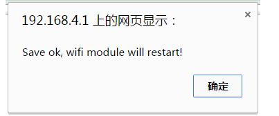

- Run the TCP UDP debugging tool on a computer with Internet access. Recommended use: TCP UDP Debugger, download address：http://bbs.doit.am/forum.php?mod=viewthread&tid=174&page=1&extra=#pid206
- Run the software to establish a TCP client connection, DestIP address is "115.29.109.104", Port is "6533". The LocalPort LocalPort is set to Auto.

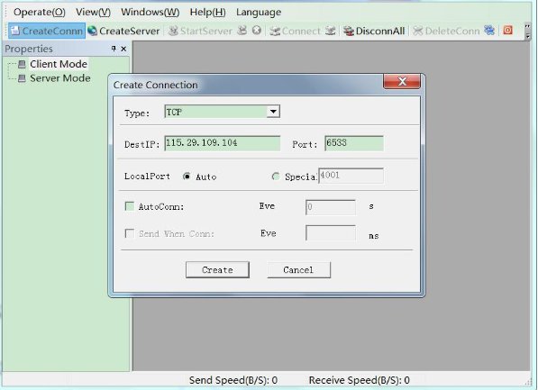

- You can see the data that the Arduino sends in the TCP debugging tool. The arduino data is sent to a remote TCP server.


## 3. Work mode switch

The workflow of the ESP8266 serial WiFi extension board is shown in the figure below.

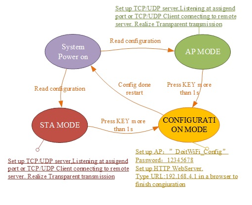

## 4. Serial port parameter setting

The serial port configuration parameters of THE ESP8266 serial port WiFi extension board are shown in the table below.


## 5. WiFi mode Settings

- The WiFi mode of the ESP8266 serial port WiFi extension can be configured as AP or STA mode.
- In the WebServer, if you select the "AP" mode, the "Refresh" button and the "AP List" will be disabled. At this point, you can configure the SSID and password in AP mode.

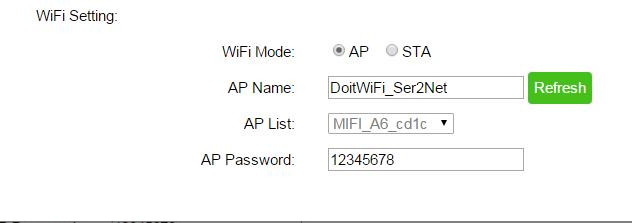

If you select the "STA" mode, the "Refresh" button and the "AP List" will be enabled. The Refresh button allows you to manually scan the hot SSID, and the scan results will automatically appear in the AP List drop-down box.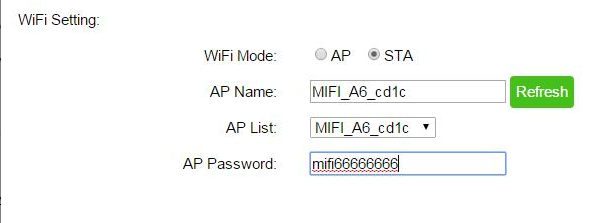

## 6. Network Settings

- Network Settings can be set to either Server or Client mode. The WiFi extension module supports only one Socket.
- When set to "Server", the "Remote IP" input box is disabled. In "Local Port", you need to fill in the listening Port.

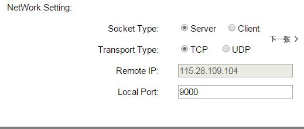

When set to "Client," the "Remote IP" input box is enabled. Remote IP and connection ports.


The network protocol can be either TCP or UDP as needed.

## 7. Factory Data Reset

Click "FactoryDefault" in Webserver to restore factory Settings (long press the Key button in STA mode is just like configuration mode). Factory Settings are shown in the table below

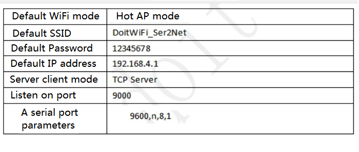

## Contact Us

- E-mails: [yichone@doit.am](mailto:yichone@doit.am), [yichoneyi@163.com](mailto:yichoneyi@163.com)
- Skype: yichone
- WhatsApp:+86-18676662425
- Wechat: 18676662425