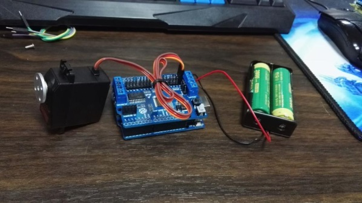
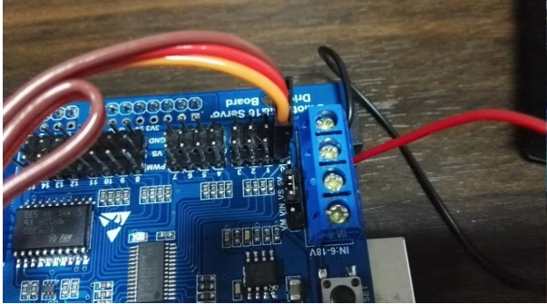
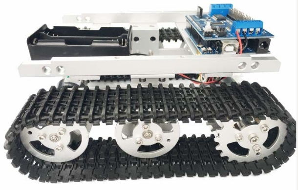
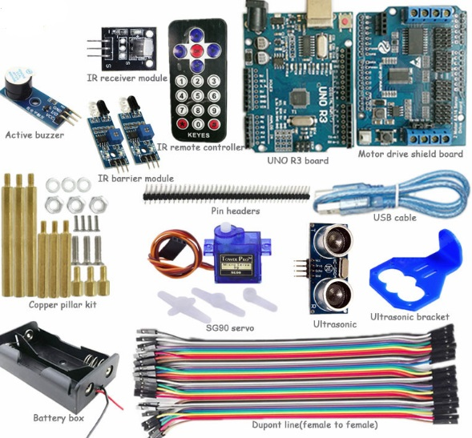
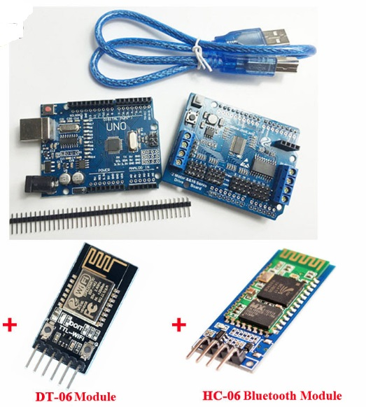

<center> <font size=10> User Manual for Motor Shield of Arduino UNO </font></center>

<center> from SZDOIT </center>


## Introduction

2-way Motor && 16-way Servo Drive Shield is a compatible with Arduino UNO R3 and ESPduino development board. This module can be inserted directly into the Arduino UNO and/or ESPduino. But if using ESPduino, you can develop quickly and conveniently a tank/car chassis controlled by WiFi. More details, please see [the link]([https://www.vvdoit.com/szdoit-2-channel-motor-%EF%BC%86-16-channel-servo-controller-expansion-board-servos-motors-control-module-drive-board-for-arduino-p2591823.html](https://www.vvdoit.com/szdoit-2-channel-motor-＆-16-channel-servo-controller-expansion-board-servos-motors-control-module-drive-board-for-arduino-p2591823.html)).

This driver shield can control 2-way DC motor (4.5~18v) and 16-way servo (5-18V),  which is very suitable for the control of mobile robot with robotic arm. This board is designed by using L293DD, which can drive directly 2-way DC motor or 1-way stepping motor. Its max current can be 1.2A.

16-way servo is controlled by IIC interface on the board.
The IO interfaces is used as the control interface for Arduino UNO and ESPduino. Thus, just the four ports D6, D7, D8, and D9( as for ESPduino, it is D12, D13, D14, D15) is defined as PWMB ( speed for motor B), DIRB (the turn direction for motor B)PWMA(speed for motor A), andDIRA ( the turn direction for motor B). The humanized design is used the power switch, which can make one on/off the power conveniently.

The board can directly be used to control the intelligent robot by Bluetooth (pre-server) and/or WiFi. More details, please visit:
 www.vvdoit.com

## Specifications

* POWER:
* Power for motor(VM): 4.5V～36V, can power separately;
* Power for servo(VS): 5～18V, can power separately;
* How to use power connection: very important!
  * If short VM and VIN, only can control the motor with 6-18V;
  * If short VS and VIN, that it's meaningless;
  * If short VM and VIN, and short VS and 5V, then CAN control the 2-way motor (with 6-18V) and 16-way 5V servo at the same time.

* Working Current Io：≤1.2A;
* Max power consumption:4W（T=90℃）;
* Input for control signal: High level: 2.3V≤VIH≤VIN; low level: -0.3V≤VIL≤1.5V
* Working temperature: -25℃～＋125℃;
* Driven mode: double big power H bridge driver;
* Weight: about 46g


## DataSheet

Manual: [download](https://github.com/SmartArduino/ESPboard/blob/master/DataSheetforMotorServo.pdf)

## Servo Test

### Experimental materials

One espdueno board, one Arduino 2 Motor &amp; &amp; 16 servo drive shield expansion board, one battery box, two 3.7V dry batteries and one steering gear;

### Hardware connection

Plug the expansion board into the espdueno board correspondingly, install the positive and negative poles of the battery box power supply of the two batteries to connect the VS and GND of the expansion board respectively (two interfaces on the right side), use a short-circuit block (the jumper cap is inserted on the VIN and vs close to the power supply of the expansion board (the middle two of the four pins)), and the rudder line is correspondingly inserted into the 16 channel rudder pin of the expansion board (the yellow line is the signal line, connected with PWM, the red line connected with VS, and the green line) Color line connected to GND);





### Experimental principle

Through the chip integrated on the expansion board, PWM wave is output to control the forward and reverse of the steering gear, so as to realize the control of the steering gear;

### Source code

[Download](https://github.com/SmartArduino/Arduino-Third-party-Libraries) the PS2X_lib and adafruit_pwmservodriver.h functions before running the program

```

#include <Servo.h> 
#include <Wire.h>
#include <PS2X_lib.h>  //for v1.6
#include "Adafruit_PWMServoDriver.h"
// called this way, it uses the default address 0x40
Adafruit_PWMServoDriver pwm = Adafruit_PWMServoDriver();
// you can also call it with a different address you want
//Adafruit_PWMServoDriver pwm = Adafruit_PWMServoDriver(0x41);
// Depending on your servo make, the pulse width min and max may vary, you 
// want these to be as small/large as possible without hitting the hard stop
// for max range. You'll have to tweak them as necessary to match the servos you
// have!
#define SERVOMIN 125
#define SERVOMAX 625
#define SERVOMID 375
#define SERVOMIN_3 240
#define SERVOMAX_3 510
#define SERVOMIN_12 300
#define SERVOMAX_12 450
#define SERVOMIN_7 280
#define SERVOMAX_7 470
uint16_t pulselen_0=SERVOMID;
float pulselen_1=SERVOMID;
float pulselen_2=SERVOMID;
uint16_t pulselen_3=SERVOMID;
uint16_t pulselen_4=SERVOMID;
uint16_t pulselen_5=SERVOMID;
uint16_t pulselen_6=SERVOMID;
uint16_t pulselen_7=SERVOMID;
uint16_t angle=0;
float angle1=0;
bool pt0=0;
bool pt1=0;
bool pt2=0;
bool pt3=0;
bool pt4=0;
bool pt5=0;
bool pt6=0;
// our servo # counter
//uint8_t servonum = 0;
// you can use this function if you'd like to set the pulse length in seconds
// e.g. setServoPulse(0, 0.001) is a ~1 millisecond pulse width. its not precise!
void setServoPulse(uint8_t n, double pulse) {
  double pulselength;
  //float pulselen;
  pulselength = 1000000; // 1,000,000 us per second
  pulselength /= 60; // 60 Hz
  Serial.print(pulselength); Serial.println(" us per period"); 
  pulselength /= 4096; // 12 bits of resolution
  Serial.print(pulselength); Serial.println(" us per bit"); 
  pulse *= 1000;
  pulse /= pulselength;
  Serial.println(pulse);
  pwm.setPWM(n, 0, pulse);
}
void Servo0(uint16_t pulselen,int i){

  angle=pulselen-1;
  for(;pulselen>angle;pulselen=pulselen-1){
    pwm.setPWM(i,0,pulselen);
  }
}
void Servo1(uint16_t pulselen,int i){

  angle=pulselen+1;
  for(;pulselen<angle;pulselen=pulselen+1){
    pwm.setPWM(i,0,pulselen);
  }
}
void Servo1_12(float pulselen,int i){
  angle1=pulselen+0.5;
    for(;pulselen<angle1;pulselen=pulselen+0.5){
    pwm.setPWM(i,0,pulselen);
 
    }

}
void Servo0_12(float pulselen,int i){
  angle1=pulselen-0.5;
 
    for(;pulselen>angle1;pulselen=pulselen-0.5){
    pwm.setPWM(i,0,pulselen);
    }

}
/******************************************************************
 * set pins connected to PS2 controller:
 *   - 1e column: original 
 *   - 2e colmun: Stef?
 * replace pin numbers by the ones you use
 ******************************************************************/
//PS2手柄引脚；
#define PS2_DAT        13  //14    
#define PS2_CMD        11  //15
#define PS2_SEL        10  //16
#define PS2_CLK        12  //17

// 电机控制引脚；
#define DIRA 8
#define DIRB 7

//PWM控制引脚；
#define PWMA  9
#define PWMB  6

enum DN
{
  GO_FORWARD,
  GO_BACK,
  GO_LEFT,
  GO_RIGHT,
  GO_STOP,
  DEF
}Drive_Num = DEF;

static int speed =100;

/******************************************************************
 * select modes of PS2 controller:
 *   - pressures = analog reading of push-butttons 
 *   - rumble    = motor rumbling
 * uncomment 1 of the lines for each mode selection
 ******************************************************************/
#define pressures   true
//#define pressures   false
#define rumble      true
//#define rumble      false

PS2X ps2x; // create PS2 Controller Class

//right now, the library does NOT support hot pluggable controllers, meaning 
//you must always either restart your Arduino after you connect the controller, 
//or call config_gamepad(pins) again after connecting the controller.

int error = 0;
byte type = 0;
byte vibrate = 0;
void (* resetFunc) (void) =0;
 void setup(){
   pinMode(DIRA, OUTPUT);
   pinMode(DIRB, OUTPUT);
   pinMode(PWMA, OUTPUT);
   pinMode(PWMB, OUTPUT);
   Serial.begin(115200);
 //double val=ps2x.read_gamepad();
   delay(500) ; //added delay to give wireless ps2 module some time to startup, before configuring it
   //CHANGES for v1.6 HERE!!! **************PAY ATTENTION*************

  //setup pins and settings: GamePad(clock, command, attention, data, Pressures?, Rumble?) check for error
error = ps2x.config_gamepad(PS2_CLK, PS2_CMD, PS2_SEL, PS2_DAT, true, true);
//error = ps2x.config_gamepad(13, 11, 10, 12, true, true);

  if(error == 0){
    Serial.println(F("Found Controller, configured successful "));
    Serial.println(F("pressures = "));
    if (pressures)
      Serial.println(F("true "));
    else
      Serial.println(F("false"));
    Serial.println(F("rumble = "));
    if (rumble)
      Serial.println(F("true)"));
    else
      Serial.println(F("false"));
    Serial.println(F("Try out all the buttons, X will vibrate the controller, faster as you press harder;"));
    Serial.println(F("holding L1 or R1 will print out the analog stick values."));
    Serial.println(F("Note: Go to www.billporter.info for updates and to report bugs."));
  }  
  else if(error == 1)
  {
    Serial.println(F("No controller found, check wiring, see readme.txt to enable debug. visit www.billporter.info for troubleshooting tips"));
    resetFunc();
  }
    

  else if(error == 2)
    Serial.println(F("Controller found but not accepting commands. see readme.txt to enable debug. Visit www.billporter.info for troubleshooting tips"));

  else if(error == 3)
    Serial.println(F("Controller refusing to enter Pressures mode, may not support it. "));

  type = ps2x.readType(); 
  switch(type) {
    case 0:
      Serial.println(F("Unknown Controller type found "));
      break;
    case 1:
      Serial.println(F("DualShock Controller found "));
      break;
    case 2:
      Serial.println(F("GuitarHero Controller found "));
      break;
    case 3:
      Serial.println(F("Wireless Sony DualShock Controller found "));
      break;
   }
      Serial.println(F("16 channel Servo test!"));
  pwm.begin();
    pwm.setPWMFreq(60); 
   pwm.setPWM(0,0,SERVOMID);
   pwm.setPWM(1,0,SERVOMID);
   pwm.setPWM(3,0,SERVOMID);
   pwm.setPWM(2,0,SERVOMID);
   pwm.setPWM(4,0,SERVOMID);
   pwm.setPWM(5,0,SERVOMID);
   pwm.setPWM(6,0,SERVOMID);
   pwm.setPWM(7,0,SERVOMID);  
}
//定义小车运动方式

 void left(int speed)//左转
{
   digitalWrite(DIRA,HIGH);
   digitalWrite(DIRB,HIGH);
   analogWrite(PWMA, 200);
   analogWrite(PWMB, 200);
}
 void right(int speed)//右转
{
   digitalWrite(DIRA,LOW);
   digitalWrite(DIRB,LOW);
   analogWrite(PWMA, speed);
   analogWrite(PWMB, speed);
}

 void forward(int speed)//前进
{
   digitalWrite(DIRA,LOW);
   digitalWrite(DIRB,HIGH);
   analogWrite(PWMA, speed);
   analogWrite(PWMB, speed);  
}

 void back(int speed)//后退
{
   digitalWrite(DIRA,HIGH);
   digitalWrite(DIRB,LOW);
   analogWrite(PWMA, speed);
   analogWrite(PWMB, speed);
}
void stop() // 停止；
 {
  digitalWrite(DIRA,LOW);
  digitalWrite(DIRB,LOW);
  analogWrite(PWMA, 0);
  analogWrite(PWMB, 0);
  delay(20);
}
void PS2()
{
  
   /* You must Read Gamepad to get new values and set vibration values
     ps2x.read_gamepad(small motor on/off, larger motor strenght from 0-255)
     if you don't enable the rumble, use ps2x.read_gamepad(); with no values
     You should call this at least once a second
   */  
  if(error == 1) //skip loop if no controller found
    return; 

  if(type == 2) {//Guitar Hero Controller
  return;
  }
  else  { //DualShock Controller
    ps2x.read_gamepad(false, vibrate); //read controller and set large motor to spin at 'vibrate' speed
     vibrate = ps2x.Analog(PSAB_CROSS);  //this will set the large motor vibrate speed based on how hard you press the blue (X) button
    if (ps2x.NewButtonState()) {        //will be TRUE if any button changes state (on to off, or off to on)
     if(ps2x.Button(PSB_L2)){
        Serial.println(F("L2 pressed"));
        pt0=0;
        pt1=0;
        pt2=0;
        pt3=0;
        pt4=0;
        pt5=1;
        pt6=0;
      }
      if(ps2x.Button(PSB_R2)){
        Serial.println(F("R2 pressed"));
        pt0=0;
        pt1=0;
        pt2=0;
        pt3=0;
        pt4=0;
        pt5=0;
        pt6=1;
      }
      if(ps2x.Button(PSB_TRIANGLE)){
        Serial.println(F("Triangle pressed"));
        pt0=0;
        pt1=0;
        pt2=1;
        pt3=0;
        pt4=0;
        pt5=0;
        pt6=0;
       }      
    }
    if(ps2x.ButtonPressed(PSB_CIRCLE)){               //will be TRUE if button was JUST pressed
      Serial.println(F("Circle just pressed"));
        pt0=0;
        pt1=0;
        pt2=0;
        pt3=1;
        pt4=0;
        pt5=0;
        pt6=0;
    }
    if(ps2x.NewButtonState(PSB_CROSS)){      //will be TRUE if button was JUST pressed OR released
      Serial.println(F("X just changed"));
      pt0=0;
        pt1=0;
        pt2=0;
        pt3=0;
        pt4=1;
        pt5=0;
        pt6=0;
    }
    if(ps2x.ButtonReleased(PSB_SQUARE)){              //will be TRUE if button was JUST released
      Serial.println(F("Square just released"));
        pt0=0;
        pt1=1;
        pt2=0;
        pt3=0;
        pt4=0;
        pt5=0;
        pt6=0;
    }
 //start 开始运行，电机初PWM为100；
    if(ps2x.Button(PSB_START))  {
       Serial.println(F("Start is being held"));
        pt0=1;
        pt1=0;
        pt2=0;
        pt3=0;
        pt4=0;
        pt5=0;
        pt6=0;
                 
    }
// 电机正转；
    if(ps2x.Button(PSB_PAD_UP)){
      Serial.println(F("Up held this hard: "));
      Drive_Num =  GO_FORWARD;
    }

// 电机反转；
    else if(ps2x.Button(PSB_PAD_DOWN)){
      Serial.println(F("Down held this hard: "));
      Drive_Num =  GO_BACK; 
    }

 //左转；   
    else if(ps2x.Button(PSB_PAD_LEFT)){
       Drive_Num =  GO_LEFT;     
    }

//右转；
   else if(ps2x.Button(PSB_PAD_RIGHT)){
    Serial.println(F("turn right"));
    Drive_Num = GO_RIGHT;
   }
// Stop
   else{
    Drive_Num = GO_STOP;
   }
   delay(20);

  }   
  if(ps2x.Button(PSB_L1)||ps2x.Button(PSB_R1)){
       int LY=ps2x.Analog(PSS_LY);
       int LX=ps2x.Analog(PSS_LX);
       int RY=ps2x.Analog(PSS_RY);
       int RX=ps2x.Analog(PSS_RX);
       Serial.print(F("RY = "));
       Serial.print(RY);
       Serial.print(F("\t"));
       Serial.print(F("LY = "));
       Serial.println(LY);
      if(pt0){
       if((RY<100)&&(pulselen_0>=SERVOMIN)){//
       Servo0(pulselen_0,0);
       pulselen_0=pulselen_0-10;

     }
       else if((RY>=150)&&(pulselen_0<=SERVOMAX)){//
       Servo1(pulselen_0,0);
       pulselen_0=pulselen_0+10;

     }
     else{
       pwm.setPWM(0,0,pulselen_0);

     }
     } 
      if(pt1){
       if((RY<100)&&(pulselen_1>=SERVOMIN)){//
       Servo0_12(pulselen_1,1);
       pulselen_1=pulselen_1-6;

     }
       else if((RY>=150)&&(pulselen_1<=SERVOMAX)){//
       Servo1_12(pulselen_1,1);
       pulselen_1=pulselen_1+6;

     }
     else{
       pwm.setPWM(1,0,pulselen_1);

     }
      } 
      if(pt2){
       if((RY<100)&&(pulselen_2<=SERVOMAX)){//
       Servo1_12(pulselen_2,2);
       pulselen_2=pulselen_2+6;

     }
     else if((RY>=150)&&(pulselen_2>=SERVOMIN))
     {//
       Servo0_12(pulselen_2,2);
       pulselen_2=pulselen_2-6;
     }
     else
     {
       pwm.setPWM(2,0,pulselen_2);    
     }
      } 
     if(pt3){
       if((RY<100)&&(pulselen_3>=SERVOMIN)){//
       Servo0(pulselen_3,3);
       pulselen_3=pulselen_3-6;

     }
       else if((RY>=150)&&(pulselen_3<=SERVOMAX)){//
       Servo1(pulselen_3,3);
       pulselen_3=pulselen_3+6;

     }
     else{
       pwm.setPWM(3,0,pulselen_3);
       
     }
    }
      if(pt4){
       if((RY<100)&&(pulselen_4>=SERVOMIN)){//
       Servo0(pulselen_4,4);
       pulselen_4=pulselen_4-6;

     }
       else if((RY>=150)&&(pulselen_4<=SERVOMAX)){//
       Servo1(pulselen_4,4);
       pulselen_4=pulselen_4+6;

     }
     else{
       pwm.setPWM(4,0,pulselen_4);

     }
     }
       if(pt5){
       if((RY<100)&&(pulselen_5>=SERVOMIN)){//
       Servo0(pulselen_5,5);
       pulselen_5=pulselen_5-6;

     }
       else if((RY>=150)&&(pulselen_5<=SERVOMAX)){//
       Servo1(pulselen_5,5);
       pulselen_5=pulselen_5+6;

     }
     else{
       pwm.setPWM(5,0,pulselen_5);
     }
   }
      if(pt6){
       if((RY<100)&&(pulselen_6>=SERVOMIN)){//
       Servo0(pulselen_6,6);
       pulselen_6=pulselen_6-6;

     }
       else if((RY>=150)&&(pulselen_6<=SERVOMAX)){//
       Servo1(pulselen_6,6);
       pulselen_6=pulselen_6+6;
     }
     else{
       pwm.setPWM(6,0,pulselen_6);
     }
     }
   }
  delay(5);
}
void Control()
{
  switch(Drive_Num)
  {
    case GO_FORWARD: forward(speed); break;
    case GO_BACK:    back(speed);    break;
    case GO_LEFT:    left(speed);    break;
    case GO_RIGHT:   right(speed);   break;
    case GO_STOP:    stop();         break;
  }
}
void loop()
{
  PS2();
  Control();
}  
```

## Reminder

- If short VM and VIN, only can control the motor with 6-18V;
- If short VS and VIN, that it's meaningless;
- If short VM and VIN, and short VS and 5V, then CAN control the 2-way motor (with 6-18V) and 16-way 5V servo at the same time.

## Applications

* with ESPduino board


* with Arduino board


* with DT-06 wifi board


## Notation

  Since the different generation batch, we now have the following different model about this shield. But the only difference is marked in the following picture, i.e., some pins location are different. 


## Contact Us

- E-mails: [yichone@doit.am](mailto:yichone@doit.am), [yichoneyi@163.com](mailto:yichoneyi@163.com)
- Skype: yichone
- WhatsApp:+86-18676662425
- Wechat: 18676662425