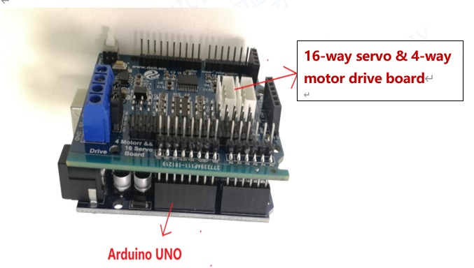
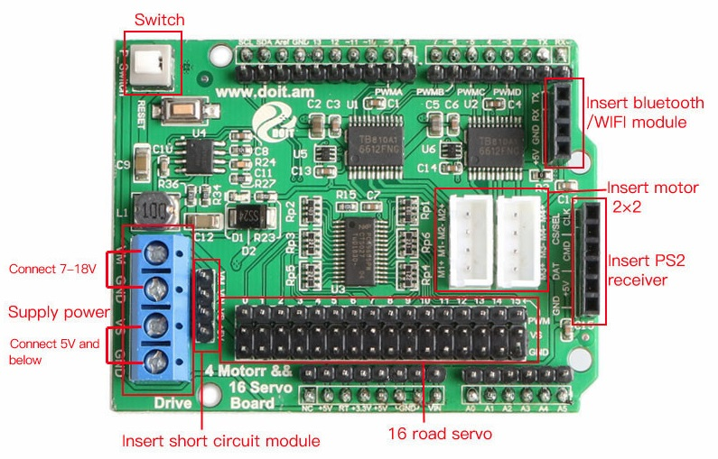
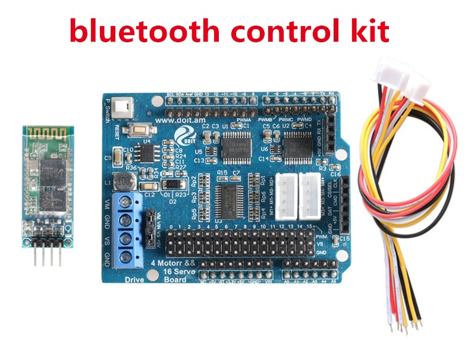
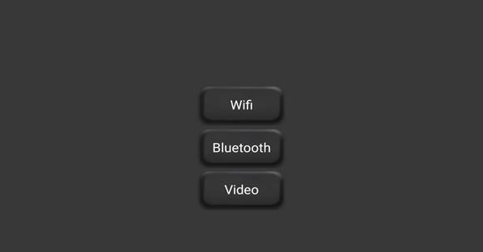
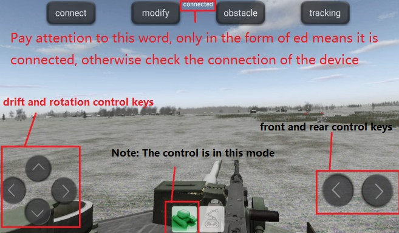

<center> <font size=10> User Manual for 4-Motors & 16-Servos </font></center>

<center> from SZDOIT </center>

# Introduction

This controller kit can be used to control car chassis and Robot/Controller, after you download the app (see the download link in the last). 



**Note that, if you want to control the car, please select the car icon; if you want to control the Robot/Controller arm, please choose the Robot/Controller arm in the app.**

## **Features:**

- Simultaneously drive 2 or 4--channel DC motors and 16-channel servos;
- Compatible with Arduino development board,it can be used directly by stacking;
- Support WiFi DT-06, Bluetooth HC-05, and communication methods such as handles;
- WiFi version and Bluetooth version require mobile phone installation APP, currently only supports Android system;
- It is a Best choice for developing Robot/Controlleric arms, Robot/Controllers, smart cars, and balance cars;
- According to the actual measurement, this development board can drive a load of about 3-5kg.

## **Module pin description and schematic:**

- 16-way steering gear & 4-way motor drive board, using TB6612 four-way drive, PCA9685 for 16-way servo control.

- Bring out the Arduino UNO I/O pin;

- The maximum input voltage of the power supply is 15V/DC;

- Reserve Bluetooth & WIFI module sockets;

- Reserve PS2 handle socket;

- Four-way DC motor drive, single-channel maximum drive current 1.2A average / 3.2A peak;

- 6-way servo drive pin, power supply can be switched by external/internal power supply of jumper cap;

  



## **Product technical specifications:**

**Power input:**

- Motor power supply (VM): 4.5V ~ 36V, can be powered separately;
- Servo power supply (VIN): 5 ~ 18V, can be powered separately;

**Single power supply use:**

- Open circuit VM and VIN, (separately control the motor, 6 ~ 36V);
- Open circuit VS and VIN, separately control the servo (6 ~ 18V);
- Short-circuit VM and VIN while shorting VS and 5V. Simultaneous control of motor (6 ~ 18V) and 16 5V servo
- Schematics for this motor shield: [check](https://github.com/SmartArduino/DOITWiKi/blob/master/DC%20motor%20drive.pdf)

# Arduino WiFi/Bluetooth controller kit

If this motor shield is used with Arduino and WiFi board (e.g., DT-06), then, you can use your phone via wifi to control the car chassis. 



**The referred source code for two motor** (for Arduino)

```
//材料：UNO+Doit电机驱动板+蓝牙模块

/****************************IO引脚定义*****************************/
//电机引脚
#define PWMA 9 //A电机转速
#define DIRA 8 //A电机转向
#define PWMB 6 //B电机转速
#define DIRB 7 //B电机转向
//控制电机运动    宏定义
#define MOTOR_GO_FORWARD  {digitalWrite(DIRA,LOW);analogWrite(PWMA,150);digitalWrite(DIRB,HIGH);analogWrite(PWMB,150);} //车体前进	                            
#define MOTOR_GO_BACK	  {digitalWrite(DIRA,HIGH);analogWrite(PWMA,150);digitalWrite(DIRB,LOW);analogWrite(PWMB,150);}   //车体后退
#define MOTOR_GO_LEFT	  {digitalWrite(DIRA,HIGH);analogWrite(PWMA,150);digitalWrite(DIRB,HIGH);analogWrite(PWMB,150);}  //车体左转
#define MOTOR_GO_RIGHT	  {digitalWrite(DIRA,LOW);analogWrite(PWMA,150);digitalWrite(DIRB,LOW);analogWrite(PWMB,150);}  //车体右转
#define MOTOR_GO_STOP	  {digitalWrite(DIRA,LOW);analogWrite(PWMA,0);digitalWrite(DIRB,LOW);analogWrite(PWMB,0);}       //车体静止
//串口接收处理
#define MAX_PACKETSIZE 32  //串口接收缓冲区
char buffUART[MAX_PACKETSIZE];
unsigned int buffUARTIndex = 0;
unsigned long preUARTTick = 0;
//小车转向
enum DN
{ 
	GO_ADVANCE, 
	GO_LEFT, 
	GO_RIGHT,
	GO_BACK,
	STOP_STOP,
	DEF
}Drive_Num=DEF;

//电机控制标志量
bool flag1=false;
bool stopFlag = true;
bool JogFlag = false;
uint16_t JogTimeCnt = 0;
uint32_t JogTime=0;


//小车电机控制
void CAR_Control()
{
	switch (Drive_Num) 
    {
      case GO_ADVANCE:MOTOR_GO_FORWARD;JogFlag = true;JogTimeCnt = 1;JogTime=millis();break;
      case GO_LEFT: MOTOR_GO_LEFT;JogFlag = true;JogTimeCnt = 1;JogTime=millis();break;
      case GO_RIGHT:MOTOR_GO_RIGHT;JogFlag = true;JogTimeCnt = 1;JogTime=millis();break;
      case GO_BACK:MOTOR_GO_BACK;JogFlag = true;JogTimeCnt = 1;JogTime=millis();break;
      case STOP_STOP: MOTOR_GO_STOP;JogTime = 0;JogFlag=false;stopFlag=true;break;
      default:break;
    }
    Drive_Num=DEF;
    //小车保持姿态210ms
    if(millis()-JogTime>=210)
    {
      JogTime=millis();
      if(JogFlag == true) 
      {
        stopFlag = false;
        if(JogTime <= 0) 
        {
          JogFlag = false; stopFlag = true;
        }
        JogTime--;
      }
      if(stopFlag == true) 
      {
        JogTimeCnt=0;
        MOTOR_GO_STOP;
      }
    }
}
//串口数据接收处理
void UART_Control()
{
	char Uart_Date=0;
	if(Serial.available()) //串口收到数据
	{
          Uart_Date = Serial.read();
	}
	if(buffUARTIndex > 0 && (millis() - preUARTTick >= 100))//超过100ms没接到数据，则认为已经接收到完整指令
	{ //data ready
		buffUART[buffUARTIndex] = 0x00;
		if((buffUART[0]=='C') && (buffUART[1]=='M') && (buffUART[2]=='D')) //若发送指令非法，则忽略
	    {
	    	;
	    }
		else Uart_Date=buffUART[0];
    	buffUARTIndex = 0;
       }
       switch (Uart_Date)    //串口控制指令
	{
		case '2': Drive_Num=GO_ADVANCE;break;
		case '4': Drive_Num=GO_LEFT; break;
		case '6': Drive_Num=GO_RIGHT; break;
		case '8': Drive_Num=GO_BACK; break;
		case '5': Drive_Num=STOP_STOP;break;
		default:break;
	}
      
}
//IO初始化
void IO_init()
{
	pinMode(PWMA, OUTPUT);
	pinMode(DIRA, OUTPUT);
	pinMode(PWMB, OUTPUT);
	pinMode(DIRB, OUTPUT);
	MOTOR_GO_STOP;
}
/////////////////////初始化////////////////////////////////////////////
void setup()
{
	Serial.begin(9600);
	IO_init();
}

void loop()
{
	UART_Control();//串口接收处理
	CAR_Control();//小车控制
}


```

# Arduino Bluetooth controller kit

If this motor shield is used with Arduino and Bluetooth board (e.g., HC-06), then, you can use your phone via bluetooth to control the car chassis. 


**The referred source code**

```
//材料：UNO+Doit电机驱动板+蓝牙模块

/****************************IO引脚定义*****************************/
//电机引脚
#define PWMA 9 //A电机转速
#define DIRA 8 //A电机转向
#define PWMB 6 //B电机转速
#define DIRB 7 //B电机转向
//控制电机运动    宏定义
#define MOTOR_GO_FORWARD  {digitalWrite(DIRA,LOW);analogWrite(PWMA,150);digitalWrite(DIRB,HIGH);analogWrite(PWMB,150);} //车体前进	                            
#define MOTOR_GO_BACK	  {digitalWrite(DIRA,HIGH);analogWrite(PWMA,150);digitalWrite(DIRB,LOW);analogWrite(PWMB,150);}   //车体后退
#define MOTOR_GO_LEFT	  {digitalWrite(DIRA,HIGH);analogWrite(PWMA,150);digitalWrite(DIRB,HIGH);analogWrite(PWMB,150);}  //车体左转
#define MOTOR_GO_RIGHT	  {digitalWrite(DIRA,LOW);analogWrite(PWMA,150);digitalWrite(DIRB,LOW);analogWrite(PWMB,150);}  //车体右转
#define MOTOR_GO_STOP	  {digitalWrite(DIRA,LOW);analogWrite(PWMA,0);digitalWrite(DIRB,LOW);analogWrite(PWMB,0);}       //车体静止
//串口接收处理
#define MAX_PACKETSIZE 32  //串口接收缓冲区
char buffUART[MAX_PACKETSIZE];
unsigned int buffUARTIndex = 0;
unsigned long preUARTTick = 0;
//小车转向
enum DN
{ 
	GO_ADVANCE, 
	GO_LEFT, 
	GO_RIGHT,
	GO_BACK,
	STOP_STOP,
	DEF
}Drive_Num=DEF;

//电机控制标志量
bool flag1=false;
bool stopFlag = true;
bool JogFlag = false;
uint16_t JogTimeCnt = 0;
uint32_t JogTime=0;


//小车电机控制
void CAR_Control()
{
	switch (Drive_Num) 
    {
      case GO_ADVANCE:MOTOR_GO_FORWARD;JogFlag = true;JogTimeCnt = 1;JogTime=millis();break;
      case GO_LEFT: MOTOR_GO_LEFT;JogFlag = true;JogTimeCnt = 1;JogTime=millis();break;
      case GO_RIGHT:MOTOR_GO_RIGHT;JogFlag = true;JogTimeCnt = 1;JogTime=millis();break;
      case GO_BACK:MOTOR_GO_BACK;JogFlag = true;JogTimeCnt = 1;JogTime=millis();break;
      case STOP_STOP: MOTOR_GO_STOP;JogTime = 0;JogFlag=false;stopFlag=true;break;
      default:break;
    }
    Drive_Num=DEF;
    //小车保持姿态210ms
    if(millis()-JogTime>=210)
    {
      JogTime=millis();
      if(JogFlag == true) 
      {
        stopFlag = false;
        if(JogTime <= 0) 
        {
          JogFlag = false; stopFlag = true;
        }
        JogTime--;
      }
      if(stopFlag == true) 
      {
        JogTimeCnt=0;
        MOTOR_GO_STOP;
      }
    }
}
//串口数据接收处理
void UART_Control()
{
	char Uart_Date=0;
	if(Serial.available()) //串口收到数据
	{
          Uart_Date = Serial.read();
	}
	if(buffUARTIndex > 0 && (millis() - preUARTTick >= 100))//超过100ms没接到数据，则认为已经接收到完整指令
	{ //data ready
		buffUART[buffUARTIndex] = 0x00;
		if((buffUART[0]=='C') && (buffUART[1]=='M') && (buffUART[2]=='D')) //若发送指令非法，则忽略
	    {
	    	;
	    }
		else Uart_Date=buffUART[0];
    	buffUARTIndex = 0;
       }
       switch (Uart_Date)    //串口控制指令
	{
		case '2': Drive_Num=GO_ADVANCE;break;
		case '4': Drive_Num=GO_LEFT; break;
		case '6': Drive_Num=GO_RIGHT; break;
		case '8': Drive_Num=GO_BACK; break;
		case '5': Drive_Num=STOP_STOP;break;
		default:break;
	}
      
}
//IO初始化
void IO_init()
{
	pinMode(PWMA, OUTPUT);
	pinMode(DIRA, OUTPUT);
	pinMode(PWMB, OUTPUT);
	pinMode(DIRB, OUTPUT);
	MOTOR_GO_STOP;
}
/////////////////////初始化////////////////////////////////////////////
void setup()
{
	Serial.begin(9600);
	IO_init();
}

void loop()
{
	UART_Control();//串口接收处理
	CAR_Control();//小车控制
}


```

# Arduino PS2 controller kit

If this motor shield is used with Arduino and PS2, then, you can use your phone via PS2 to control the car chassis. 


**The referred source code**

```
#include <PS2X_lib.h>  //for v1.6

//PS2手柄引脚；
#define PS2_DAT        13      
#define PS2_CMD        11  
#define PS2_SEL        10  
#define PS2_CLK        12  

// 电机控制引脚；
#define DIRA 8
#define DIRB 7
#define PWMA  9
#define PWMB  6


/******************************************************************
 * select modes of PS2 controller:
 *   - pressures = analog reading of push-butttons 
 *   - rumble    = motor rumbling
 * uncomment 1 of the lines for each mode selection
 ******************************************************************/
#define pressures   true
//#define pressures   false
#define rumble      true
//#define rumble      false

PS2X ps2x; // create PS2 Controller Class

//right now, the library does NOT support hot pluggable controllers, meaning 
//you must always either restart your Arduino after you connect the controller, 
//or call config_gamepad(pins) again after connecting the controller.

int error = 0;
byte type = 0;
byte vibrate = 0;
int speed;//小车速度

void (* resetFunc) (void) = 0;

/******初始化******/
 void setup(){
   pinMode(DIRA, OUTPUT);
   pinMode(DIRB, OUTPUT);
   pinMode(PWMA, OUTPUT);
   pinMode(PWMB, OUTPUT);
   Serial.begin(57600);
   delay(300) ; //added delay to give wireless ps2 module some time to startup, before configuring it
   //CHANGES for v1.6 HERE!!! **************PAY ATTENTION*************

  //setup pins and settings: GamePad(clock, command, attention, data, Pressures?, Rumble?) check for error
  error = ps2x.config_gamepad(PS2_CLK, PS2_CMD, PS2_SEL, PS2_DAT, pressures, rumble);

  if(error == 0){
    Serial.print("Found Controller, configured successful ");
    Serial.print("pressures = ");
  if (pressures)
    Serial.println("true ");
  else
    Serial.println("false");
  Serial.print("rumble = ");
  if (rumble)
    Serial.println("true)");
  else
    Serial.println("false");
    Serial.println("Try out all the buttons, X will vibrate the controller, faster as you press harder;");
    Serial.println("holding L1 or R1 will print out the analog stick values.");
    Serial.println("Note: Go to www.billporter.info for updates and to report bugs.");
  }  
  else if(error == 1){
    Serial.println("No controller found, check wiring, see readme.txt to enable debug. visit www.billporter.info for troubleshooting tips");
    resetFunc();
  }
  else if(error == 2){
    Serial.println("Controller found but not accepting commands. see readme.txt to enable debug. Visit www.billporter.info for troubleshooting tips");
  }

  else if(error == 3){
    Serial.println("Controller refusing to enter Pressures mode, may not support it. ");
  }

 //  Serial.print(ps2x.Analog(1), HEX);

  type = ps2x.readType(); 
  switch(type) {
    case 0:
      Serial.print("Unknown Controller type found ");
      break;
    case 1:
      Serial.print("DualShock Controller found ");
      break;
    case 2:
      Serial.print("GuitarHero Controller found ");
      break;
  case 3:
      Serial.print("Wireless Sony DualShock Controller found ");
      break;
   }
}

//定义小车运动方式

 void turnLeft(int speed)//左转
{
   digitalWrite(DIRA,HIGH);
   digitalWrite(DIRB,HIGH);
   analogWrite(PWMA, speed);
   analogWrite(PWMB, speed);
}

 void turnRight(int speed)//右转
{
   digitalWrite(DIRA,LOW);
   digitalWrite(DIRB,LOW);
   analogWrite(PWMA, speed);
   analogWrite(PWMB, speed);
}

 void forward(int speed)//前进
{
   digitalWrite(DIRA,LOW);
   digitalWrite(DIRB,HIGH);
   analogWrite(PWMA, speed);
   analogWrite(PWMB, speed);  
}

 void back(int speed)//后退
{
   digitalWrite(DIRA,HIGH);
   digitalWrite(DIRB,LOW);
   analogWrite(PWMA, speed);
   analogWrite(PWMB, speed);
}

void stop() // 停止；
 {
  digitalWrite(DIRA,LOW);
  digitalWrite(DIRB,LOW);
  analogWrite(PWMA, 0);
  analogWrite(PWMB, 0);
  delay(20);
}
 void loop(){
   /* You must Read Gamepad to get new values and set vibration values
     ps2x.read_gamepad(small motor on/off, larger motor strenght from 0-255)
     if you don't enable the rumble, use ps2x.read_gamepad(); with no values
     You should call this at least once a second
   */  
  if(error == 1) //skip loop if no controller found
    return; 

  if(type == 2) {//Guitar Hero Controller
  return;
  }
  else  { //DualShock Controller
    ps2x.read_gamepad(false, vibrate); //read controller and set large motor to spin at 'vibrate' speed


//start 开始运行，电机初PWM为100；
    if(ps2x.Button(PSB_START))  {
       Serial.println("Start is being held");
       speed = 100;
       forward(speed);
       
                       
    }
// 电机正转；
    if(ps2x.Button(PSB_PAD_UP)){
      Serial.println("Up held this hard: ");
      speed= 200;
      forward(speed);
    }

// 电机反转；
    if(ps2x.Button(PSB_PAD_DOWN)){
      Serial.print("Down held this hard: ");
      speed= 150;
      back(speed); 
    }

 //左转；   
    if(ps2x.Button(PSB_PAD_LEFT)){
       Serial.println("turn left ");
       speed=100;
       turnLeft(speed);         
    }

//右转；
   if(ps2x.Button(PSB_PAD_RIGHT)){
    Serial.println("turn right");
    speed=100;
     turnRight(speed);
   }
// Stop
   if(ps2x.Button(PSB_SELECT)){
   Serial.println("stop");
   stop();
   }
   delay(20);

  }
   if(ps2x.Button(PSB_L1) || ps2x.Button(PSB_R1)) { //print stick values if either is TRUE(摇杆)
           Serial.print("Stick Values:");
           Serial.print(ps2x.Analog(PSS_LY), DEC); //Left stick, Y axis. Other options: LX, RY, RX
           Serial.print(",");
           Serial.print(ps2x.Analog(PSS_LX), DEC);
           Serial.print(",");
           Serial.print(ps2x.Analog(PSS_RY), DEC);
           Serial.print(",");
           Serial.println(ps2x.Analog(PSS_RX), DEC);

             int LY=ps2x.Analog(PSS_LY);
             int LX=ps2x.Analog(PSS_LX);
             int RY=ps2x.Analog(PSS_RY);
             int RX=ps2x.Analog(PSS_RX);

             if (LY<125)  //前进
             {
                  speed = 2*(127-LY);
                  forward(speed);       
                  delay(20);  
             }
             
             if (LY>128)//后退
             {
                   speed=2*(LY-128);
                   back(speed);
                   delay(20);  
             }
             
             if (LX<125)//左转
             {
                   speed = 2*(127-LX);
                   turnLeft(speed);
                   delay(20);  
             }
             
             if (LX>128)//右转
             {
                   speed=2*(LX -128);
                   turnRight(speed);
                   delay(20);  
             }
             
             if (LY>=125 && LY<=128 && LX>=125 && LX<=128)//如果摇杆居中
             {
                  stop();
                  delay(20);  
             }
  
    }
}

```

**Note that, the head file "PS2X_lib.h", click [headfile](https://github.com/SmartArduino/DOITWiKi/blob/master/PS2X_lib.h) to download this file must be put into the Arduino library folder.**

# Usage for App

click [this link](https://github.com/SmartArduino/ESPboard/blob/master/BTcar.apk) to download the App, which can be used for wifi, bluetooth, and video control.

If you are using a WIFI module or a Bluetooth module, after downloading the corresponding program, open the gift information, find an APK file, send it to the phone, install it, and open it.



If you are using Bluetooth, turn on Bluetooth, find the Bluetooth IP used, and match, the matching password is generally 1234 or 0000, and then click Bluetooth.



If you are using a WIFI module, turn on the phone's WIFI, find and use the WIFI and connect it, open the software, motor WIFI. The same as Bluetooth control after

# Contact Us

- E-mails: [yichone@doit.am](mailto:yichone@doit.am), [yichoneyi@163.com](mailto:yichoneyi@163.com)
- Skype: yichone
- WhatsApp:+86-18676662425
- Wechat: 18676662425
