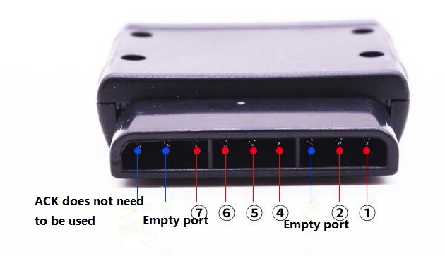
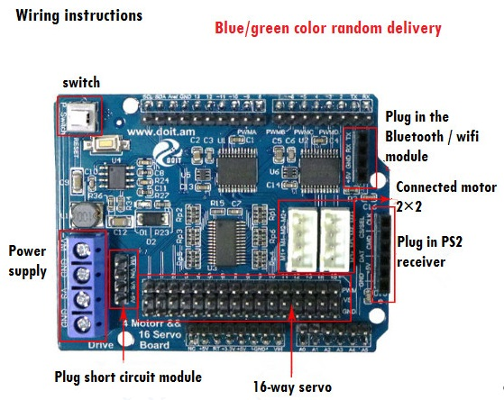
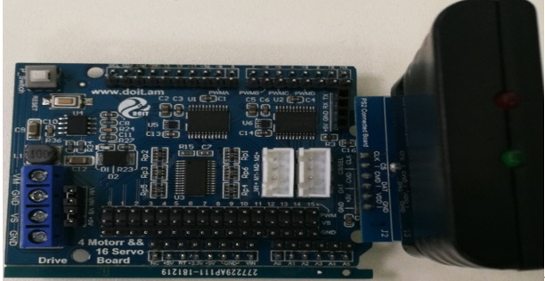
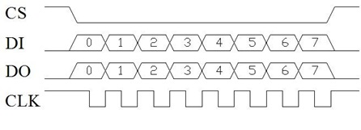
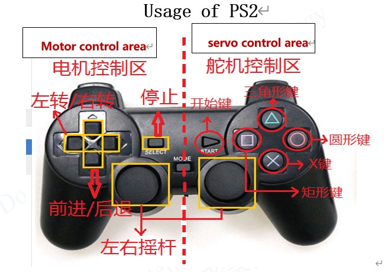
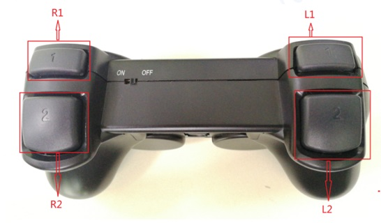

<center> <font size=10> User Manual for UNO Motor Shiled with PS2 </font></center>

<center> from SZDOIT </center>


## Description

Receiver pin description, wireless handle communication requires a total of 6 pins

①DI/DAT: Signal flow, from the handle to the host, this signal is an 8-bit serial data that is synchronously transmitted on the falling edge of the clock. The reading of the signal is done during the course of the clock from high to low.

②DO/CMD: Signal flow direction, from the host to the handle. This signal is opposite to DI. The signal is an 8-bit serial data that is synchronously transmitted on the falling edge of the clock.

④GND: Power ground.

⑤VDD: Receiver working power supply, power supply range: 3-5v

⑥CS/SEL: Used to provide the handle trigger signal. It is at a low level during communication.

⑦CLK: Clock signal, issued by the host to keep the data synchronized.



## Use with Arduino and UNO Shield

- The power indicator of the handle and receiver should be lit to ensure sufficient power supply;
- When the pairing is unsuccessful, the signal light flashes, and the signal light does not flash after being connected;
- The motor can be controlled by pressing the four buttons on the left side of the handle.
- If the pairing is not successful, try pressing the start button on the handle.
- Pay attention to the positive and negative poles of the handle, do not insert it. It is easy to burn out the receiver.


The following Arduino code can be referred. 

**Note that**, maybe be put the head file "PS2X_lib.h" (click [here](https://github.com/SmartArduino/DOITWiKi/blob/master/PS2X_lib.h) to download this file )to your local Arduino library.

```c
#include <PS2X_lib.h>  //for v1.6

//PS2手柄引脚；
#define PS2_DAT        13      
#define PS2_CMD        11  
#define PS2_SEL        10  
#define PS2_CLK        12  

// 电机控制引脚；
#define DIRA 8
#define DIRB 7
#define PWMA  9
#define PWMB  6


/******************************************************************
 * select modes of PS2 controller:
 *   - pressures = analog reading of push-butttons 
 *   - rumble    = motor rumbling
 * uncomment 1 of the lines for each mode selection
 ******************************************************************/
#define pressures   true
//#define pressures   false
#define rumble      true
//#define rumble      false

PS2X ps2x; // create PS2 Controller Class

//right now, the library does NOT support hot pluggable controllers, meaning 
//you must always either restart your Arduino after you connect the controller, 
//or call config_gamepad(pins) again after connecting the controller.

int error = 0;
byte type = 0;
byte vibrate = 0;
int speed;//小车速度

void (* resetFunc) (void) = 0;

/******初始化******/
 void setup(){
   pinMode(DIRA, OUTPUT);
   pinMode(DIRB, OUTPUT);
   pinMode(PWMA, OUTPUT);
   pinMode(PWMB, OUTPUT);
   Serial.begin(57600);
   delay(300) ; //added delay to give wireless ps2 module some time to startup, before configuring it
   //CHANGES for v1.6 HERE!!! **************PAY ATTENTION*************

  //setup pins and settings: GamePad(clock, command, attention, data, Pressures?, Rumble?) check for error
  error = ps2x.config_gamepad(PS2_CLK, PS2_CMD, PS2_SEL, PS2_DAT, pressures, rumble);

  if(error == 0){
    Serial.print("Found Controller, configured successful ");
    Serial.print("pressures = ");
  if (pressures)
    Serial.println("true ");
  else
    Serial.println("false");
  Serial.print("rumble = ");
  if (rumble)
    Serial.println("true)");
  else
    Serial.println("false");
    Serial.println("Try out all the buttons, X will vibrate the controller, faster as you press harder;");
    Serial.println("holding L1 or R1 will print out the analog stick values.");
    Serial.println("Note: Go to www.billporter.info for updates and to report bugs.");
  }  
  else if(error == 1){
    Serial.println("No controller found, check wiring, see readme.txt to enable debug. visit www.billporter.info for troubleshooting tips");
    resetFunc();
  }
  else if(error == 2){
    Serial.println("Controller found but not accepting commands. see readme.txt to enable debug. Visit www.billporter.info for troubleshooting tips");
  }

  else if(error == 3){
    Serial.println("Controller refusing to enter Pressures mode, may not support it. ");
  }

 //  Serial.print(ps2x.Analog(1), HEX);

  type = ps2x.readType(); 
  switch(type) {
    case 0:
      Serial.print("Unknown Controller type found ");
      break;
    case 1:
      Serial.print("DualShock Controller found ");
      break;
    case 2:
      Serial.print("GuitarHero Controller found ");
      break;
  case 3:
      Serial.print("Wireless Sony DualShock Controller found ");
      break;
   }
}

//定义小车运动方式

 void turnLeft(int speed)//左转
{
   digitalWrite(DIRA,HIGH);
   digitalWrite(DIRB,HIGH);
   analogWrite(PWMA, speed);
   analogWrite(PWMB, speed);
}

 void turnRight(int speed)//右转
{
   digitalWrite(DIRA,LOW);
   digitalWrite(DIRB,LOW);
   analogWrite(PWMA, speed);
   analogWrite(PWMB, speed);
}

 void forward(int speed)//前进
{
   digitalWrite(DIRA,LOW);
   digitalWrite(DIRB,HIGH);
   analogWrite(PWMA, speed);
   analogWrite(PWMB, speed);  
}

 void back(int speed)//后退
{
   digitalWrite(DIRA,HIGH);
   digitalWrite(DIRB,LOW);
   analogWrite(PWMA, speed);
   analogWrite(PWMB, speed);
}

void stop() // 停止；
 {
  digitalWrite(DIRA,LOW);
  digitalWrite(DIRB,LOW);
  analogWrite(PWMA, 0);
  analogWrite(PWMB, 0);
  delay(20);
}
 void loop(){
   /* You must Read Gamepad to get new values and set vibration values
     ps2x.read_gamepad(small motor on/off, larger motor strenght from 0-255)
     if you don't enable the rumble, use ps2x.read_gamepad(); with no values
     You should call this at least once a second
   */  
  if(error == 1) //skip loop if no controller found
    return; 

  if(type == 2) {//Guitar Hero Controller
  return;
  }
  else  { //DualShock Controller
    ps2x.read_gamepad(false, vibrate); //read controller and set large motor to spin at 'vibrate' speed


//start 开始运行，电机初PWM为100；
    if(ps2x.Button(PSB_START))  {
       Serial.println("Start is being held");
       speed = 100;
       forward(speed);
       
                       
    }
// 电机正转；
    if(ps2x.Button(PSB_PAD_UP)){
      Serial.println("Up held this hard: ");
      speed= 200;
      forward(speed);
    }

// 电机反转；
    if(ps2x.Button(PSB_PAD_DOWN)){
      Serial.print("Down held this hard: ");
      speed= 150;
      back(speed); 
    }

 //左转；   
    if(ps2x.Button(PSB_PAD_LEFT)){
       Serial.println("turn left ");
       speed=100;
       turnLeft(speed);         
    }

//右转；
   if(ps2x.Button(PSB_PAD_RIGHT)){
    Serial.println("turn right");
    speed=100;
     turnRight(speed);
   }
// Stop
   if(ps2x.Button(PSB_SELECT)){
   Serial.println("stop");
   stop();
   }
   delay(20);

  }
   if(ps2x.Button(PSB_L1) || ps2x.Button(PSB_R1)) { //print stick values if either is TRUE(摇杆)
           Serial.print("Stick Values:");
           Serial.print(ps2x.Analog(PSS_LY), DEC); //Left stick, Y axis. Other options: LX, RY, RX
           Serial.print(",");
           Serial.print(ps2x.Analog(PSS_LX), DEC);
           Serial.print(",");
           Serial.print(ps2x.Analog(PSS_RY), DEC);
           Serial.print(",");
           Serial.println(ps2x.Analog(PSS_RX), DEC);

             int LY=ps2x.Analog(PSS_LY);
             int LX=ps2x.Analog(PSS_LX);
             int RY=ps2x.Analog(PSS_RY);
             int RX=ps2x.Analog(PSS_RX);

             if (LY<125)  //前进
             {
                  speed = 2*(127-LY);
                  forward(speed);       
                  delay(20);  
             }
             
             if (LY>128)//后退
             {
                   speed=2*(LY-128);
                   back(speed);
                   delay(20);  
             }
             
             if (LX<125)//左转
             {
                   speed = 2*(127-LX);
                   turnLeft(speed);
                   delay(20);  
             }
             
             if (LX>128)//右转
             {
                   speed=2*(LX -128);
                   turnRight(speed);
                   delay(20);  
             }
             
             if (LY>=125 && LY<=128 && LX>=125 && LX<=128)//如果摇杆居中
             {
                  stop();
                  delay(20);  
             }
  
    }
}

```

## Application for Remote Control Robot Car Chassis

The PS2 controller is a remote controller for PlayStation2 game console. Sony's PSX series game consoles are very popular worldwide. I don't know when someone will pick up the idea of the PS2 controller and break the communication protocol, so that the controller can be connected to other devices for remote control, such as remote control of our familiar robot. The outstanding feature is that this handle is extremely cost-effective, and the buttons are rich, which can be easily extended to other applications.






| 1      | 2      | 3    | 4    | 5    | 6      | 7    | 8    | 9    |
| ------ | ------ | ---- | ---- | ---- | ------ | ---- | ---- | ---- |
| DI/DAT | DO/CMD | NC   | GND  | VDD  | CS/SEL | CLK  | NC   | ACK  |

**Note, the connection interface is very important.**

DI / DAT: signal flow, from the handle to the host, this signal is an 8-bit serial data, which is transmitted synchronously on the falling edge of the clock. The reading of the signal is completed during the high to low change of the clock.
 DO / CMD: signal flow, from the host to the handle. This signal is opposite to DI. The signal is an 8-bit serial data, which is transmitted synchronously on the falling edge of the clock.
 NC: empty port;
 GND: power ground;
 VDD: working power of receiver, power supply range 3 ~ 5V;
 CS / SEL: Used to provide a handle trigger signal. Low level during communication;
 CLK: clock signal, sent by the host, used to maintain data synchronization;
 NC: empty port;
 ACK: the response signal from the handle to the host. This signal goes low in the last cycle of each 8-bit data transmission and CS remains low. If the CS signal does not go low, about 60 microseconds. The PS host will try another peripheral. The ACK port is not used during programming.



 

 

 

|      | DO   | DI   | Bit0、Bit1、Bit2、Bit3、Bit4、Bit5、Bit6、Bit7、 |
| ---- | ---- | ---- | ------------------------------------------------ |
| 0    | 0X01 | idle |                                                  |
| 1    | 0x42 | ID   |                                                  |
| 2    | idle | 0x5A |                                                  |
| 3    | WW   | data | SELECT、L3、R3、START、UP、RIGHT、DOWN、LEFT     |
| 4    | YY   | data | L2、R2、L1、R1、△、○、╳、□                       |
| 5    | idle | data | PSS_RX（0x00=left、0xFF=right）                  |
| 6    | idle | data | PSS_RY（0x00=up、0xFF=down）                     |
| 7    | idle | data | PSS_LX（0x00=left、0xFF=right）                  |
| 8    | idle | data | PSS_LY（0x00=up、0xFF=down）                     |

When a key is pressed, the corresponding bit is "0" and the other bits are "1". For example, when the key "SELECT" is pressed, Data [3] = 11111110B.
 After setting the vibration mode, we can send WW, YY to control the vibration motor. WW is used to control the small vibration motor on the right, 0x00 is off, other values are on; YY is used to control the large vibration motor on the left, 0x40 ~ 0xFF motor is on, the larger the value, the faster the motor rotates, and the more obvious the vibration. See the program section below for specific settings.
 In red light mode: the left and right joysticks send analog values between 0x00 and 0xFF, and the key values L3 and R3 pressed by the joystick are valid; in green light mode: the left and right joystick analog values are invalid. When pushed to the limit, the corresponding send UP, RIGHT, DOWN, LEFT, △, ○, ╳, □, keys L3 and R3 are invalid.

##  Instructions for using and connecting the handle

The handle requires two No. 7 1.5V batteries for power supply. The receiver and the microcontroller share the same power supply. The power supply range is 3 ~ 5V. It cannot be reversed. Overvoltage, overvoltage and reverse connection will burn the receiver.
 There is a power switch on the handle, ON ON / OFF. Turn the handle switch to ON. When the receiver is not found, the handle light will flash continuously. Within a certain time, the receiver has not been found. , The handle will enter the standby mode, and the light of the handle will go out. At this time, the handle can only be awakened by the "START" key.
 The receiver is powered and flashes green when it is not paired.
 The handle is turned on and the receiver is powered. The handle and receiver will automatically pair. At this time, the light is always on and the handle is paired successfully. button
 Some users report that the handset and receiver do not pair properly! Most of the problems are incorrect wiring of the receiver or a problem with the program.
 Solution: The receiver is only connected to the power supply (the power cord must be connected correctly), and not connected to any data line and clock line. Generally, the handle can be paired successfully. After the pairing is successful, the light is always on, indicating that the handle is good. At this time, check whether the wiring is correct and whether there is a problem with the program migration.

Hardware connection method

Connection method of receiver and arduino UNO:

CLK->12；   DO ->11;

DI ->13;      CS ->10. 





  

| Name             | Description       | Function                                     |
| ---------------- | ----------------- | -------------------------------------------- |
| Start key        | Switch to  PWM0   | Control  Servo 1                             |
| Triangle  key    | Switch to  PWM1   | Control  Servo 2                             |
| Rectangular  key | Switch to  PWM2   | Control  Servo 3                             |
| Round key        | Switch to  PWM3   | Control  Servo 4                             |
| X key            | Switch to  PWM4   | Control  Servo 5                             |
| L2 key           | Switch to  PWM5   | Control  Servo 6                             |
| R2 key           | Switch to  PWM6   | Control  Servo 7                             |
| L1 key           | --                | Enter                                        |
| R1 key           | --                | Enter                                        |
| Joystick         | Switch  direction | Controlling  the direction of servo movement |

**Servo control button introduction:**

After the circuit is connected, use the buttons in the servo control area plus the R1, R2, L1, and L2 buttons to control the robotic arm. First, press the servo button you want to control, and then use the joystick to control the direction of servo movement Finally press the OK key.
 Note: Only one servo can be controlled at the same time

**Suppose you want to control servo 1,the operation flow is:**

1. Press the start key;
2. Press and hold the right stick in a certain direction;
3. Press and hold R1 or L1 at the same time until the servo reaches your expected position.
    The operation of other roads is similar.

**Controlling a car with a robotic arm:****
 According to your own needs, use the keys in the motor control area and the steering gear control area together until the purpose is achieved.


## Contact Us

- E-mails: [yichone@doit.am](mailto:yichone@doit.am), [yichoneyi@163.com](mailto:yichoneyi@163.com)
- Skype: yichone
- WhatsApp:+86-18676662425
- Wechat: 18676662425