
 ViVi Humanoid Robot User Manual 

 From SZDOIT

## 【Basic articles】

### 1 Mobile APP introduction and control

Android version：

Download link 1：http://www.doit.am/ViVi_1.1.0.apk

Download link 2：https://www.pgyer.com/qIYq

IOS version：

Download link：https://itunes.apple.com/us/app/vivi-robot/id1255421040?l=zh&ls=1&mt=81. Install

Or search for "ViViRobot" in the Apple App Store and download and install；

The following document uses the Android version of the app as an introduction.；

The ViVi humanoid robot APP has two functions of controlling the robot to perform a single action demonstration and editing into a complete set of continuous actions; among them, there is a debug mode in the "developer mode", which can calibrate the joints (rudders) of the robot (details See the document A-Assemble & Debugging section. The following is a graphic introduction to the APP function.

First turn on the power switch of the robot, then turn on the WiFi function of the phone, and operate in the following order;

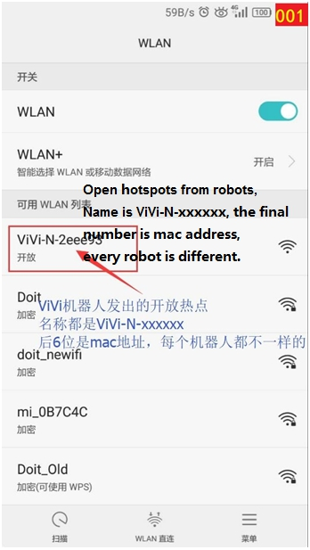 

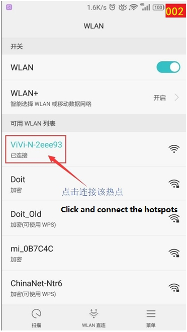 

 

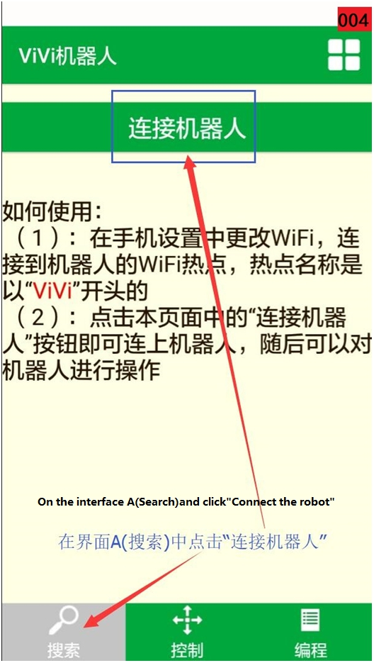 

 

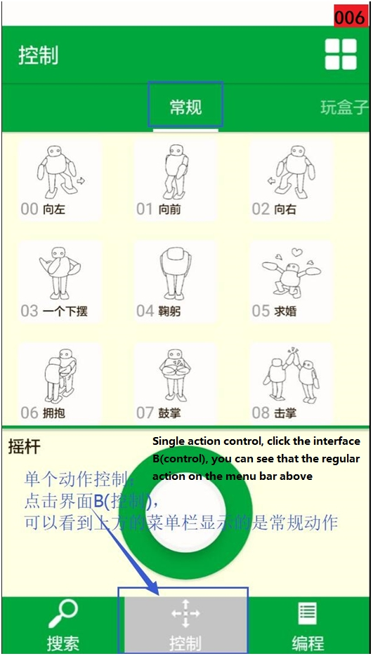 

 

 

 

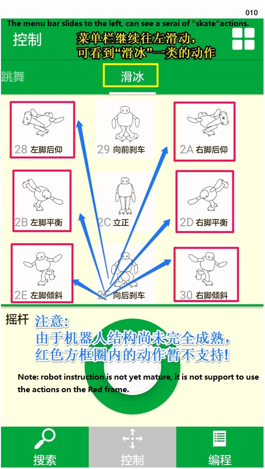 

 

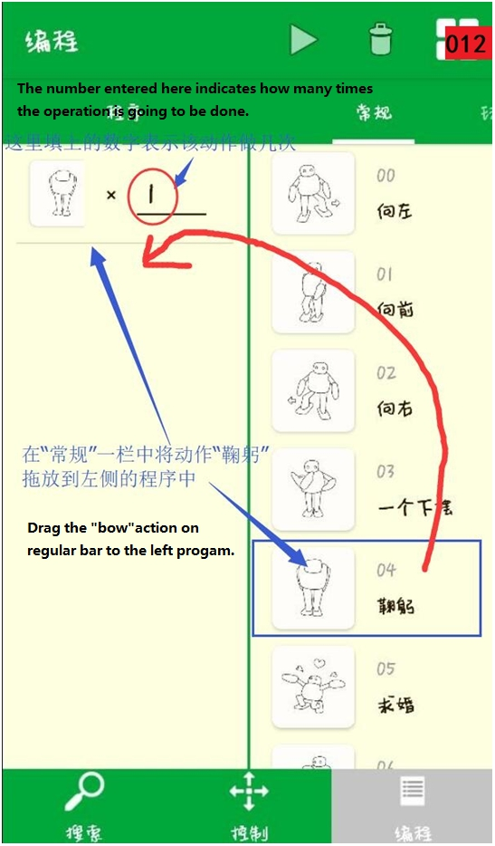 

 

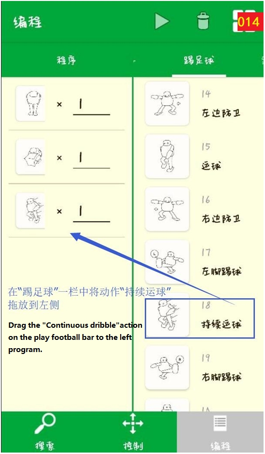 

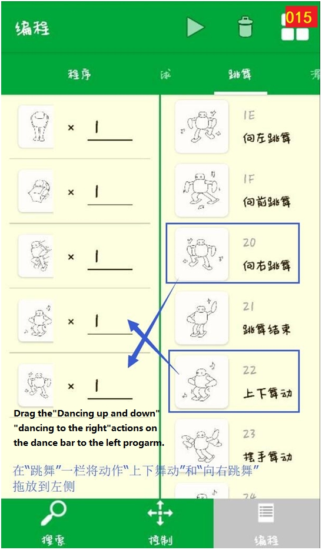 

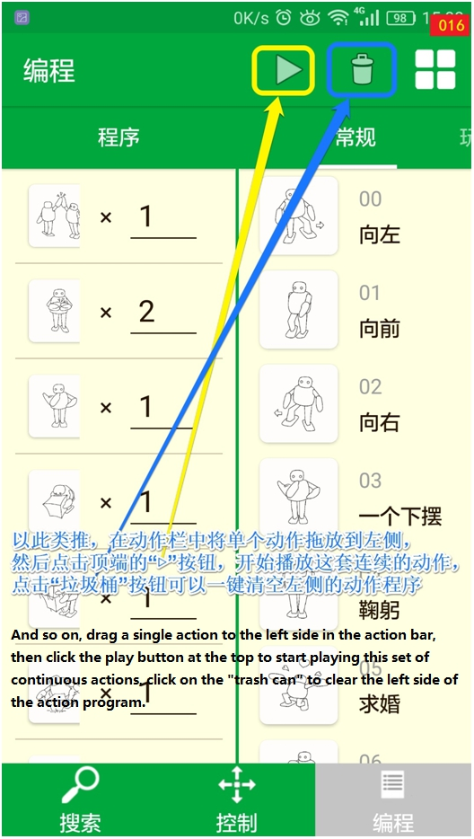 

### 2 Charging instructions

The power supply of the ViVi humanoid robot is a 4.8V battery, which needs to be charged with a dedicated charger. Under normal circumstances, it takes 2 hours to fully charge the battery. The power supply at full power can be used for 30 minutes for the robot to work continuously.

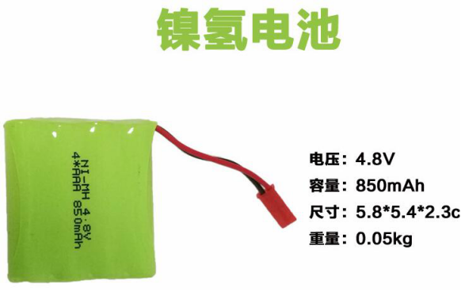 

 

When charging the robot, please follow the instructions below:

 

 

 

 

 

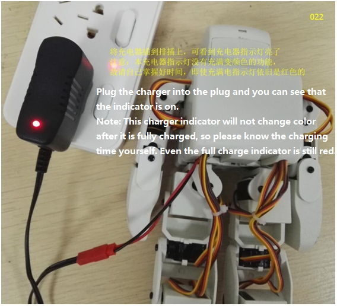 

### 3 Firmware downloading process

Hardware material：

Robot control board1、FT232 usb to serial port tool 1 and F-F dupont line4；

Software material：

firmware1“ViViRobot_7_19.bin”、firmware2“vivi_firmware.ino.nodemcu.bin”and download software“ESPFlashDownloadTool_v3.4.9.2”；

Please download the firmware to the development board in the order shown.：

 

 

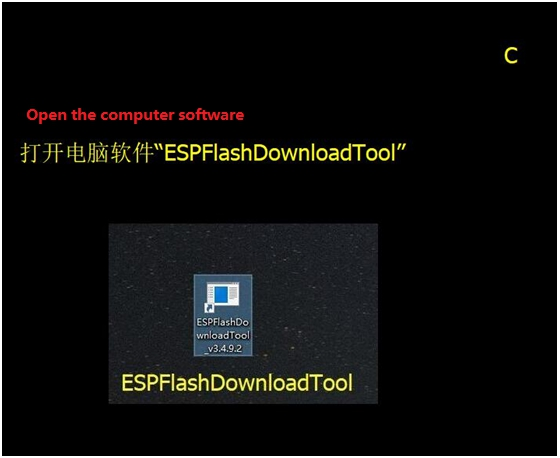 

 

 

 

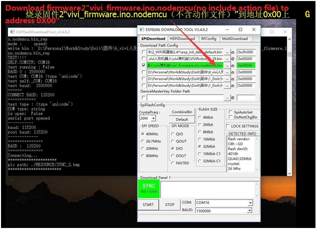 

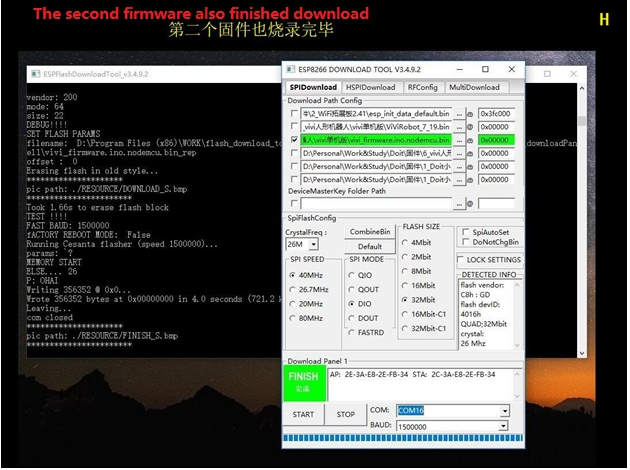 

### 4 Precautions

①When the vivi robot suddenly loses power, the hands and feet will be irregularly twisted and twisted due to the characteristics of the steering gear. This is a normal phenomenon. It is necessary to turn off the power immediately, and then rotate the hands and feet back to the original position according to the original position. The state, especially the arms, must not be rotated to the normal state according to the steering line of the steering gear. This will result in inaccurate steering angle of the steering wheel at the next startup, which will affect the next use. In severe cases, it will even cause permanent use of the steering gear. damage!

②When charging, please make sure that the positive and negative terminals of the battery are not connected correctly and let them charge for a long time to avoid burning the control board due to short circuit and even other unpredictable consequences!

### 5 Mesh networking function introduction (Appendix)

The upgraded version of ViVi humanoid robot comes with WiFi Mesh self-organizing network function. It can automatically identify or create WiFi networking after power-on. In theory, no matter how many robots can realize networking function, N sets with the same self-organizing network function. After the robot is turned on, the mobile phone is connected to one of the created hotspots "ViVi_Mesh", the password is 123456789, and then the APP is opened according to the operation method of Chapter 1, and the N robots that have formed the network can be simultaneously controlled to perform the action demonstration. .

 

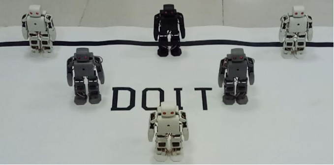 

Without further ado, here's a link to the video:

http://v.youku.com/v_show/id_XMjk5NjQyMTY1Ng==.html?spm=a2h3j.8428770.3416059.1

Note: ViVi robot comes with a stand-alone version of the program. The Mesh networking function is only introduced here, not provided by default.

## 【Advanced article】

### 6The main program is uploaded to the development board

The code is uploaded to the development board for two webpage uploading and serial port tools. The premise of webpage uploading is that the control panel has uploaded the code and can open the wifi hotspot or connect to the router. If you upload the program to the development board for the first time, you need to upload the code with the serial port tool.

#### 6.1 Serial port upload firmware

Open a dedicated serial port tool

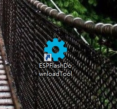 

1.Main program upload software icon

After selecting ESP8266 DownloadTool, the ESP8266 program upload interface is displayed.

 

2.Chip selection

The download steps are as follows：

1)Select the uploaded BIN file。

2)Confirm upload (default 0x00000) address and upload file。

3)Select serial port。

4)Select the baud rate (recommended selection 115200, more stable)。

5)Click the program to upload the Start button to enter the sync mode.。

6)Enter the code upload mode, press and hold the flash button on the control panel and then press the Reset button, then release the Reset button and then release the flash button to put the control panel into the download mode. If successful, the ESP8266 Download starts to program the program to the development board. .

7)After the upload is complete, open the serial debugging assistant test program to complete the upload. If it appears as shown in the serial port debugging diagram, the program upload is successful (smartconfig mode is configured). Note: If the action file is not uploaded.

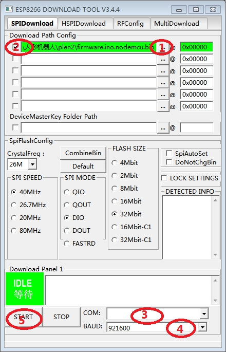 

3.ESP8266DownloadTool设置ESP8266DownloadTool settings

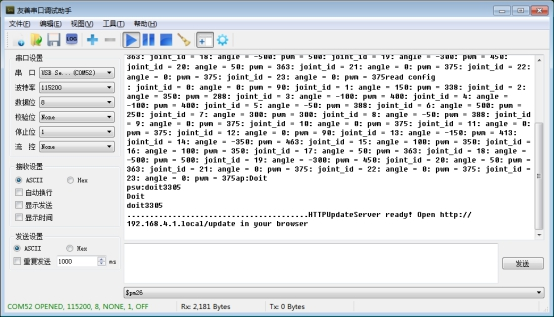 

4.串口调试（已配置smartconfig）Serial port debugging (smartconfig is configured)

 

5.Serial port debugging (smartconfig not configured)

 

#### 6.2 Web page upload firmware (AP mode)

##### 6.2.1 AP mode

The AP mode is configured by connecting to the wifi hotspot of the control panel. After connecting the control panel wifi hotspot, enter 192.168.4.1/update in the browser to enter the download page, and select the BIN file to be uploaded and click Upload. There is a program upload progress in the lower left corner of the page.

 

6. Page upload page

 

7.Upload progress display

 

### 7 Upload the action file to the development board

The uploading of the action file of the humanoid robot requires a special file uploading tool, MotionInstaller.exe, to upload the code through the serial port tool. The serial port must be uploaded with the PL2303 serial port tool, otherwise the uploading is unsuccessful. Note: When burning the action file, you need to upload 00_Lstep.json together to determine the starting address position of the action file.

Code upload steps:：

Open the MotionInstaller software, the serial port number will be displayed in the COM Port List. If it is not displayed, the serial port is incorrect. 1.Transfer methods select USB->2. Click Serial->3. Click LoadMotion to select the action file (the action file is in Install Motionmotions, the first download is recommended to download one for testing and can be uploaded successfully. This tutorial downloads 26_Twist_Dance as Example)->4. After the selection is completed, click Install to download to the control panel.

 

8. Action file upload step

 

9. ction file document

 

10. File upload status

After the download is complete, open the serial port assistant and restart the control board. Test whether the action file is successfully downloaded through the serial port assistant.

Send the $PM26 command to the control panel ($PM is the execution action command, and 26 is the front mark of the action number, ie the 26_Twist_Dance name. The relevant protocol can be referred to http://plen.jp/playground/wiki/specifications/protocol）

 

11. Serial port display after the control board is restarted (smartconfig is not configured)

If the serial port outputs the following information, the action file is successfully downloaded. After that, all the action files can be burned into the control panel. When selecting the action file, select all.

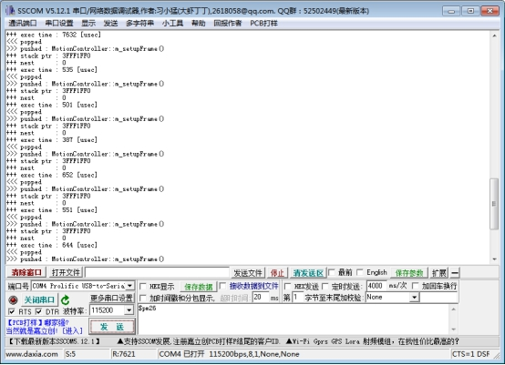 

12. Action uploaded successfully

### 8 Graphical editing action

If the user wants to design the humanoid robot's action, it can be developed by the motion_editor.exe graphical editing software. The motion_editor function is very powerful, not only can edit the movement of the humanoid robot or online simulation, real-time control and so on.

#### 8.1 Software icon

 

15.motion_editor icon

#### 8.2 Software function explanation

（1）Open the action folder

（2）Save current action

（3）New action

（4）Default setting (not tested)

（5）Connecting robot

（6）Download the action program to the control panel

（7）Simulated robot action

（8）Stop the simulation

（9）Select the last action frame

（10）Select the next action frame

（11）Action frame display area, click on the blank space on the right to add an action

（12）The header of the action file (decimal number)

（13）The current action on the left is swapped with the current action on the right

（14）Left symmetrical, subject to the left half

（15）Right symmetrical, subject to the right half of the action

（16）The graphical interface returns to the initial position

（17）Action design interface, mouse click and hold drag the axis you want to move

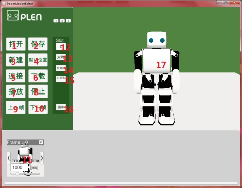 

16.Graphic editing interface

Note: Because there is a bug in the graphics editor when saving the Slot, it cannot be saved to the file, so you need to modify it inside the file. Find the file you just saved and open it with the code reading tool (recommended notepad++). You can see the following in the header of the code. The code shown in the figure changes the value of "slot": the following value to the desired value. Note: The value is a decimal value, and the action code generated by TCP or serial port debugging, such as 26 in the action upload, is a hexadecimal value in the $PM26, that is, the execution action command entered during serial port or TCP debugging. It should be $PM50 (the hexadecimal number 50 is 80 in decimal).

 

17.Action file code

After the modification is completed, upload it to the control panel through the MotionInstaller software. At the same time, there is one point to note that the value of the modified Slot cannot be greater than 91. There are some empty files in the default action file that users can use. As shown below.

 

18.Action file empty file

### 9 Code compilation tool

arduino-1.6.8_SDK_1.5.4。The core of the control board is ESP8266, and its compiler is the secondary development of ArduinoIDE. The tool name is arduino-1.6.8_SDK_1.5.4.

 

19. Code compilation tool icon

Open the software and click on the file to enter the main program folder. Select the file ending with ino, ie the main program entry file (eg firmware.ino). And the tools in the main interface select the corresponding parameters (default) as well as the serial port. The icons in the main interface of the code compilation tool are compiled verification, code upload, new document, file open, and file save. After the user clicks on the compilation and verification, a BIN file will be generated. The location is defaulted to D:bilud2 (the BIN file save location can be modified by referring to the Bin path modification txt file under the file). The BIN file can be uploaded to the control board by referring to the first section, or the user can directly upload it to the development board through the code upload button in the code compilation tool. Note: When uploading the code, you need to let the development board enter the code upload mode. For details, refer to 1.1 Serial Port Upload Code.

 

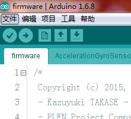 

19. Code compilation tool main interface

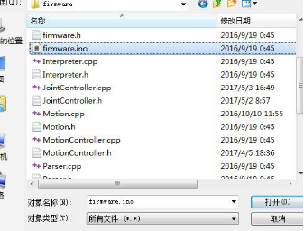 

20.Select the file

### 10 Program related material link

Users can refer to the website if they need to develop or modify the internal code by themselves:

1.[ http://plen.jp/playground/wiki/specifications/protocol  Robot communication protocol

2.[http://plenprojectcompany.github.io/plen-Firmware_Arduino/class_p_l_e_n2_1_1_motion_1_1_frame.html#details ](#details )

Robot code download and interpretation

If you need to develop or modify the internal code yourself, you can refer to the website:

1. http://plen.jp/playground/wiki/specifications/protocol robot communication protocol

2.http://plenprojectcompany.github.io/plen-Firmware_Arduino/class_p_l_e_n2_1_1_motion_1_1_frame.html#details

Robot code download and explanation

## Contact Us

- E-mails: [yichone@doit.am](mailto:yichone@doit.am), [yichoneyi@163.com](mailto:yichoneyi@163.com)
- Skype: yichone
- WhatsApp:+86-18676662425
- Wechat: 18676662425