
 miniT100 Tank Chassis Installation Instruction 

 From SZDOIT
 

Part of the installation:

wheel：
metal bearing wheel:https://gitnova.com/#/Robot/FrameChassis/Wheel/MetalBearingWheel/MetalBearingWheel

track: https://gitnova.com/#/Robot/FrameChassis/track/track

metal driving wheel: https://gitnova.com/#/Robot/FrameChassis/Wheel/MetaDrivingWheel/metaldrivingwheel

DC motor: https://gitnova.com/#/Robot/Engine/9vMotor/9vmotor

Controller：
Arduino UNO:https://gitnova.com/#/Robot/Controller/ps2/4motor16servo

ESPDuino:https://gitnova.com/#/Robot/Controller/controller/espduinoController

App：

https://gitnova.com/#/Robot/Controller/app/AppforSmartCar

# 1. Material

Material list:

 

Note: The actual materials in the figure above are a driving wheel, a driving wheel, a motor, a beam, a side bracket, a track, a set of wrench tools and the corresponding screw and copper column. The actual amount of material needed for the Mini T100 is the sum of the individual Numbers in the figure. For example, the total number of motors in the car is 2 as indicated in the figure.

# 2. Installation Steps

## 2.1 Install load bearing wheel

 

Install the load bearing wheel in the yellow circular hole

 

Lock the copper column of the bearing wheel with M3x8 hexagon socket screws on both sides

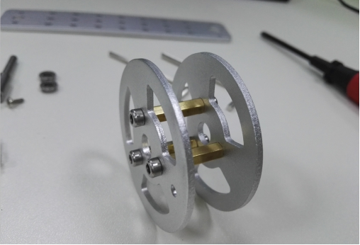 

Fixed bearing wheel copper column on both sides

 

The central holes on both sides of the bearing wheel are put into the bearing

 

Lock the connector through the bearings on both sides with M2 screw, note the connector to the top and bottom

 

Mark the circle where the load-bearing wheel A is mounted on the bracket

 

Place the gasket on top of the connector and pass the short M4 hex socket screw through the other side of the bracket

 

The M4 screws lock the connector and fix the load bearing wheel

## 2.2 Install drive wheel

 

Install a drive wheel material list. Note that the two central holes of each drive wheel are not the same

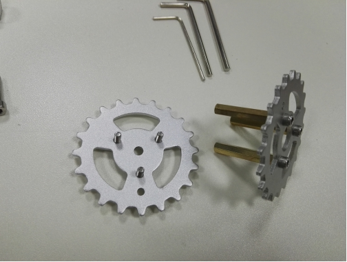 

As with the load bearing wheel, first pass the M3x8 hexagon socket screw on each drive wheel to lock the copper column of the drive wheel

 

Lock the copper column with M3 hex socket screws on both sides. Make sure that the positioning holes of the two pieces are matched, otherwise the gears on both sides will be out of order

 

Pass the coupling through the large side of the central hole of the drive wheel piece, insert the other piece into the long M4 inner hexangular screw and lock it

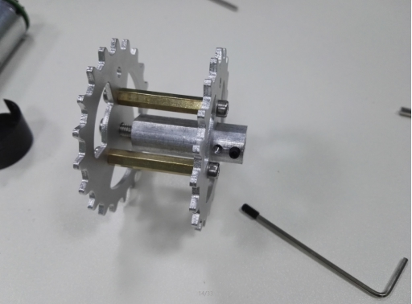 

Use a small spanner to temporarily fix the top wire to the small round hole of the coupling. Note that it is only a small part of the screw

## 2.3 Attach the drive wheel to the motor

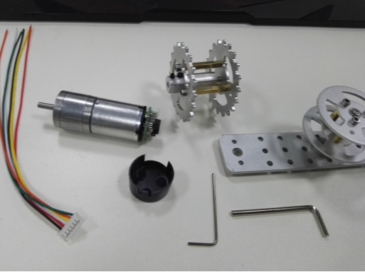 

List of installation materials of motor

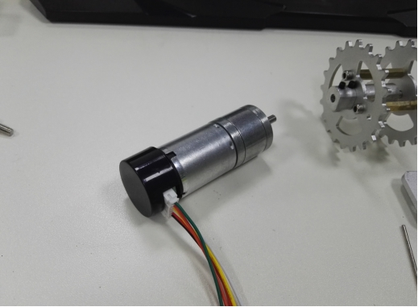 

Install the motor cap on the motor and plug in the motor wire accordingly

 

Pass the motor shaft through the round hole at one end of the bracket (the smaller one)

 

Lock the motor with 2pcs M3 flat head screws

 

Install the coupling of the driving wheel on the motor shaft, adjust the position of the screw hole to the flat mouth of the shaft, and tighten the screw

## 2.4 Install another load bearing wheel

 

Two gaskets are needed for bearing wheel B

 

Place 1 gasket on the connector and pass the short M4 hex socket screw through the other gasket

 

The short M4 screw locks the connector through the center of the round hole at one end of the bracket (the larger one)

## 2.5 Install the beam

 

List of materials for installation of 1 beam

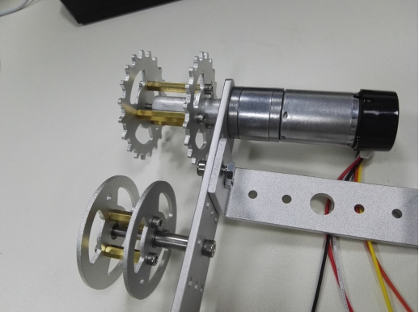 

Pass two short M4 hexagon socket screws through the round holes of the bracket and the round holes of the beam respectively, and then lock them with M4 nuts

 

Lock in the corresponding hole of the renderings

## 2.6 Install the crawler

 

A summary of side track installation materials and corresponding tools

 

After marking out the length of one wheel on the broken track sleeve, insert the meter into the position you want to cut off

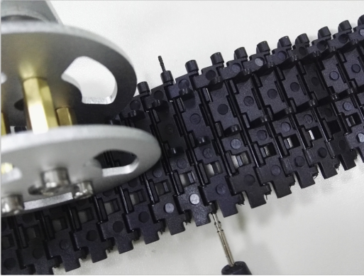 

Lift the caterpillar pin out from the concave end with the electric watch pen to cut the caterpillar band

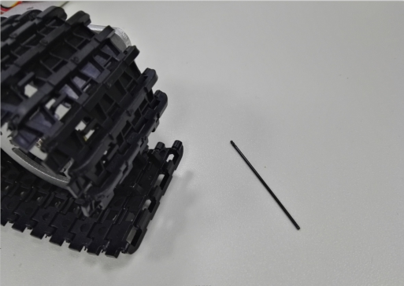 

Cut off after the track and track needle

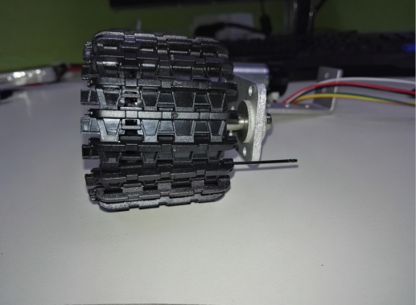 

Cover the track, then insert the track needle into the hole through the protruding end. Note that the rough end of the track needle remains outside

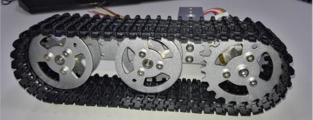 

Align the holes in the track, insert the track needle from one end until the whole thing is inside, and finally bang it

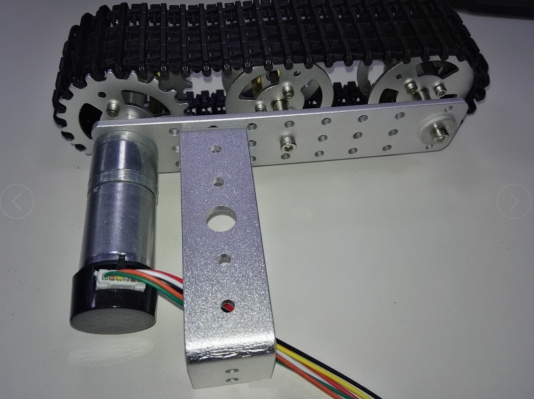 

## 2.7 Install the other half of the car

The installation of the other half is the same as above. Note that the two are centrally symmetric, that is, the left and right motors are oblique symmetric, as shown in the figure below

 

# 3.  Reminder

Video of installation:

http://v.youku.com/v_show/id_XMjg0MDkyMzkxNg==.html?spm=a2hzp.8253869.0.0

# Contact Us

- E-mails: [yichone@doit.am](mailto:yichone@doit.am), [yichoneyi@163.com](mailto:yichoneyi@163.com)
- Skype: yichone
- WhatsApp:+86-18676662425
- Wechat: 18676662425