
  G6 metal gripper/claw installation 

 from SZDOIT 

# 1. Introduction

This manual is for the installation for G6 gripper

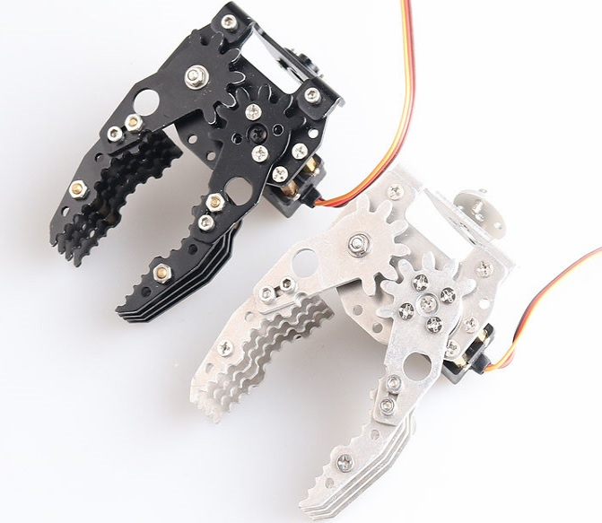

**Single mechanical gripper parameter:**

- Material: hard aluminum alloy
- Weight: about 40g (without servo)
- Maximum angular separation: 86mm
- Overall length: 83mm (the overall longest length when the paw is closed)
- Overall width ①:150mm (maximum overall width when the paw is open)
- Overall width ②:55mm (maximum overall width when the paw is closed)
- Overall thickness: 54mm (maximum overall thickness with servo paws)

# 2. Materials

| Name                        | Qty  |
| --------------------------- | :--: |
| Claw                        |  1   |
| MG995  servo                |  1   |
| 25T servo horn              |  1   |
| M3*8  hexagon screws        |  7   |
| M3  nut                     |  13  |
| 10mm  single-pass couplings |  4   |
| M3*6  flat head scews平     |  10  |
| M3  gasket                  |  16  |
| M3*12  screws               |  1   |
| bearing                     |  1   |
| 6mm  single-pass couplings  |  12  |
| M3 hexagon wrench           |  1   |

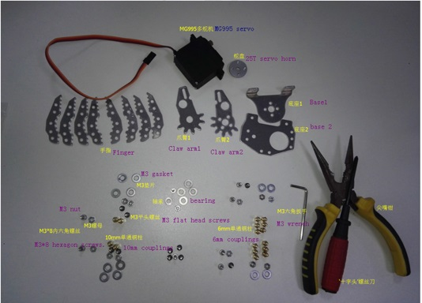

Note: shipping list is not including the tools.

# 3. Installation Steps

Prepare the above components, hardware screw fittings and tools, and enter the installation process.

## 3.1 Install the base of the claw

Materials: base 1, base 2, M3*8 hexagon screws, M3 nut

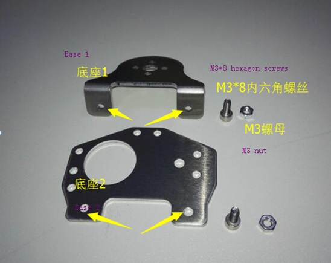

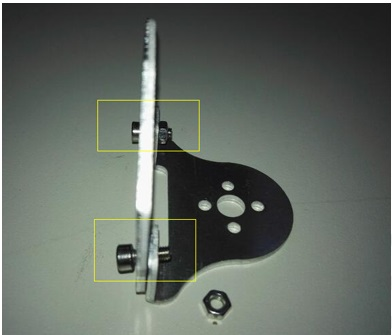

## 3.2 Install the servo

  Materials: MG995 servo, 10mm single-pass couplings, M3*6 flat head screws, M3 gasket, M3 nut.

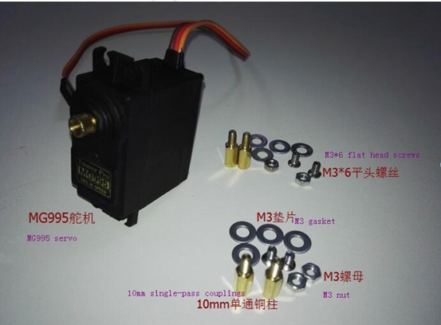

Installation：

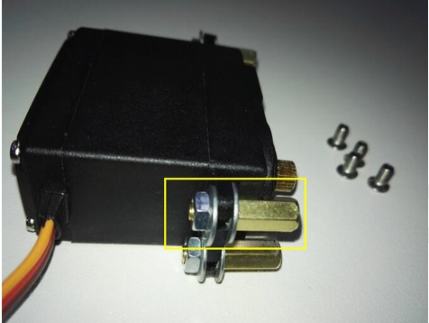

## 3.3 Connection of the base to the claw arm 1

Materials: base, claw arm 1, bearing, M3*12 screws, M3 gasket, M3 nut.

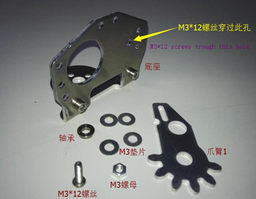

Installation：

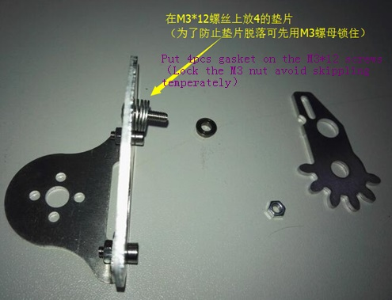

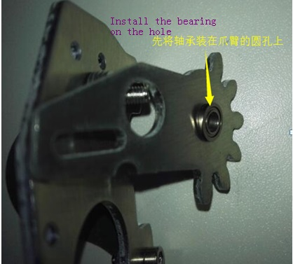

**Note that** when installing, after the M3*12 screw passes through the base hole, put 4 washers and temporarily lock with the M3 nut. Wait until the “Step 5” is performed to fix the servo to the base and then remove the M3 nut and then M3 *12 screw through the hole of the claw arm 1 and then fixed with the M3 nut, see step 5;

## 3.4 Install the claw arm 2

Materials：claw arm2, 25T servo horn, M3*6 flat head screws, M3*8 hexagon screws.

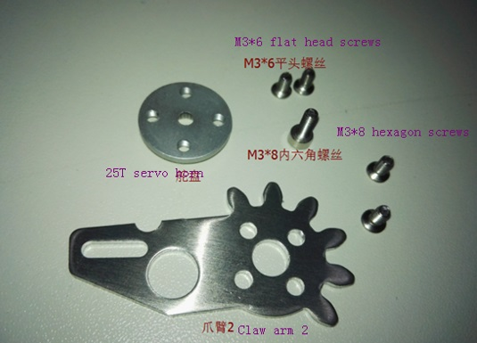

Installation：

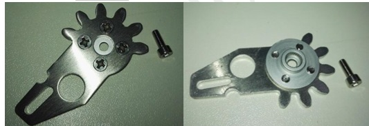

## 3.5 Connection of the base to the servo

Materials: servo, base, claw arm1, M3 flat head screws, M3 nut.

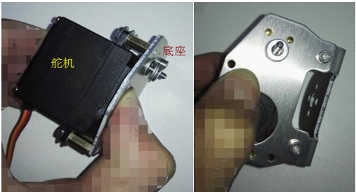

Installation：

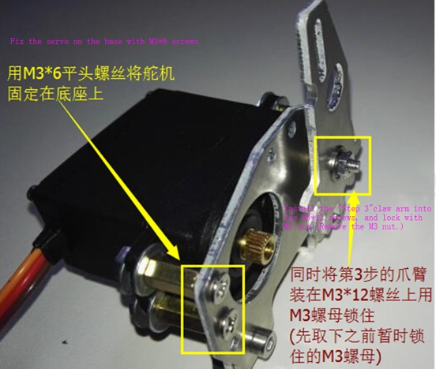

## 3.6 Install the claw arm2 into the servo

Materials: claw arm2, servo with base, M3*8 hexagon screws.

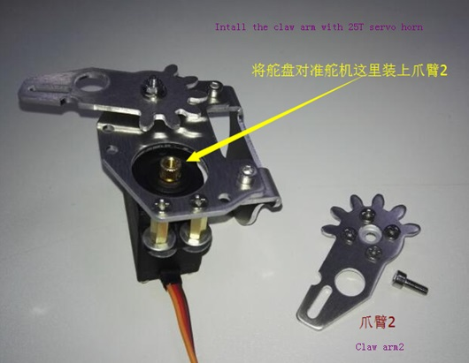

Installation：

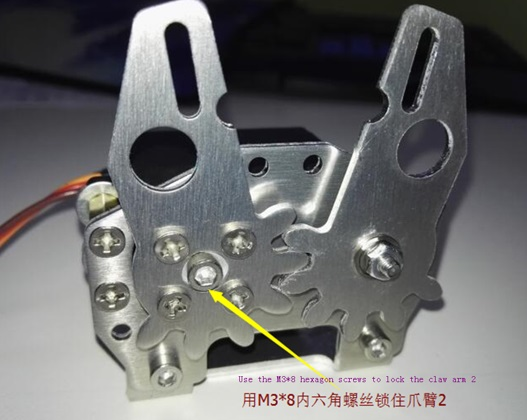

## 3.7 Install the finger

Materials: finger, 6mm single-pass couplings, M3 nut, M3 gasket, M3 flat head screws.

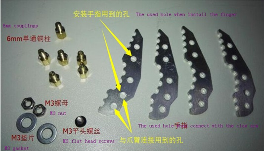

Installation：

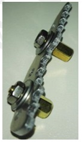

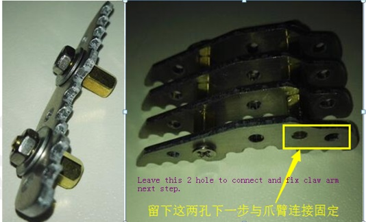

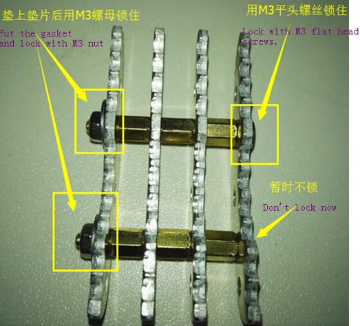

## 3.8 Install the finger on the claw arm

Materials: servo with claw arm and base, finger, M3 nut, M3*8 hexagon screws.

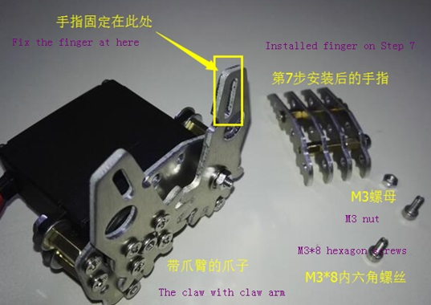

Installation

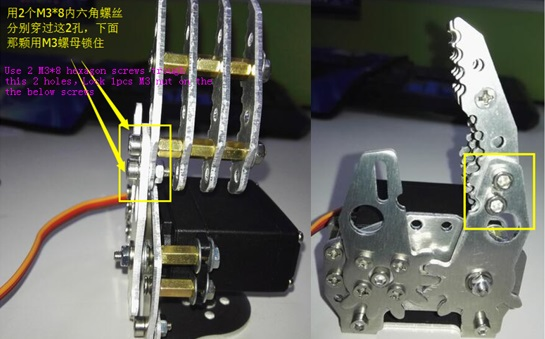

**Note: Follow the steps 7 and 8 to install the other finger and install it on the other side of the claw arm!**

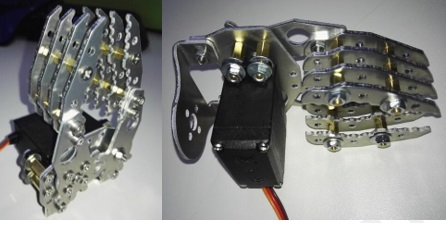

# 4. Warm Tips

-   There is a certain correlation between step 3 and step 5. When step 3 is performed, do not install the claw arm on the base, so as not to interfere with the installation of the servo of step 5. When step 5 is performed, After the servo is fixed to the base, remove the M3 nut that was temporarily locked. After the claw arm 1 is installed, it is completely fixed with the M3 nut.
-   The principle of the claw is that the servo drives the claw arm 2 to rotate through the gear between the two claw arms to drive the claw arm 2 to rotate. Therefore, when installing the claw arm, pay attention to the rotation of the servo to avoid stuck.

# Contact Us

- E-mails: [yichone@doit.am](mailto:yichone@doit.am), [yichoneyi@163.com](mailto:yichoneyi@163.com)
- Skype: yichone
- WhatsApp:+86-18676662425
- Wechat: 18676662425