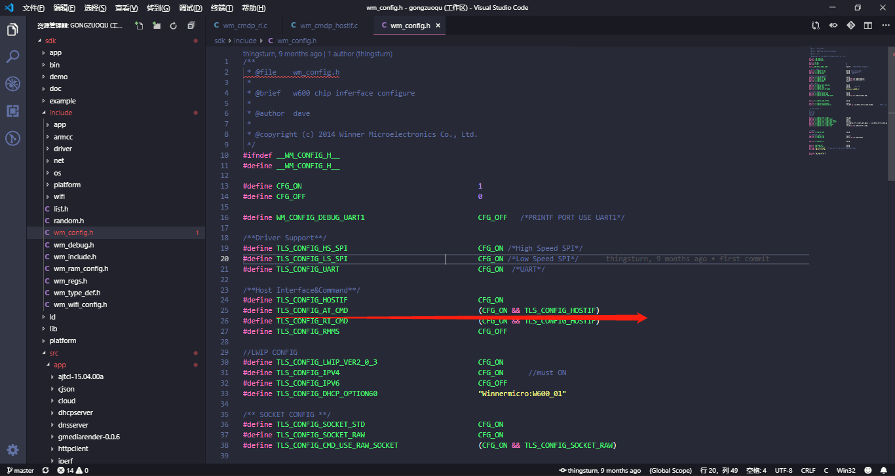
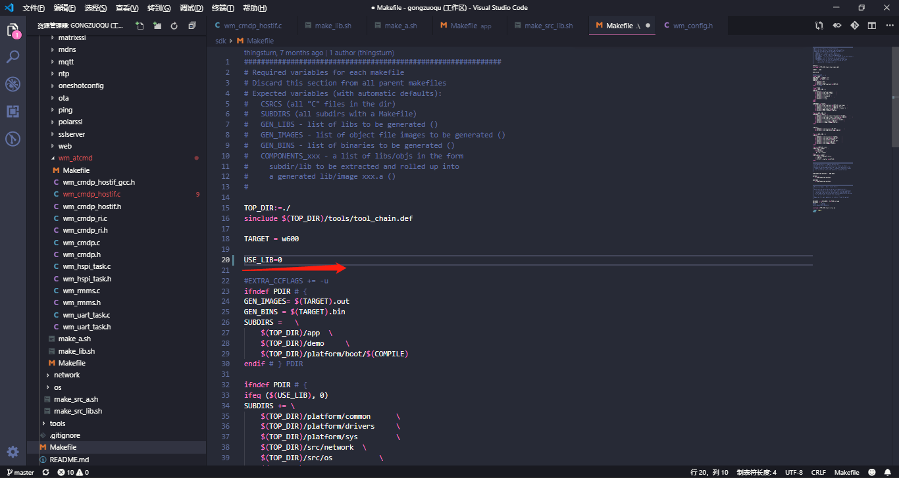
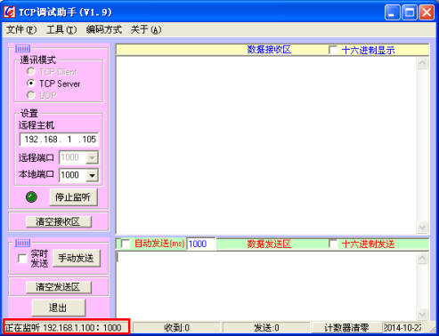
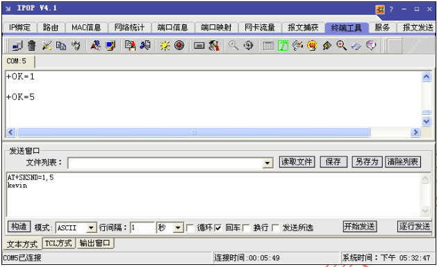
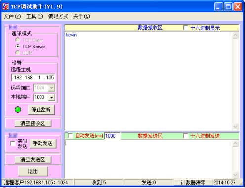
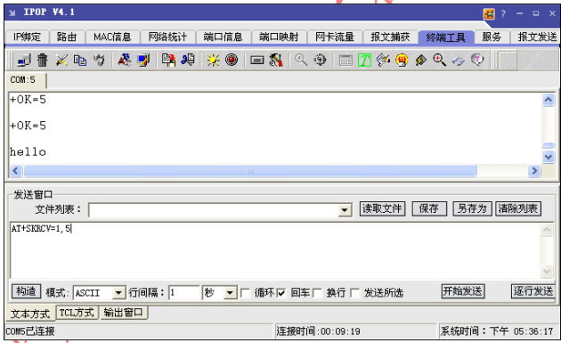
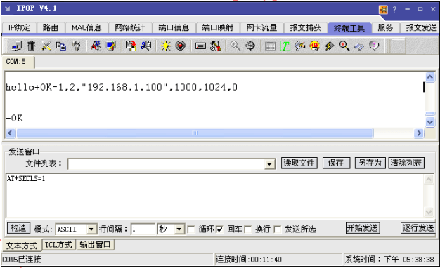

 Lianshengde AT command 

 From SZDOIT

Note: This article aims to guide customers to use W600 series products to compile, download and debug the AT firmware of Lianshengde, including hardware environment, software environment, download firmware, modulation and other steps。

## 1. Introduction

This version is the AT firmware implemented by Lianshengde. It should be noted that the commands are different from the compatible version. The firmware compiled by the sdk has the AT function enabled by default. Users can turn on and off the AT command function.

## 2. Preparation

- Computer: firmware download currently only supports Windows operating system
- Software: [Serial debugging assistant](https://download.w600.fun/tool/%E6%98%9F%E9%80%9A%E6%99%BA%E8%81%94%E4%B8%B2 %E5%8F%A3%E8%B0%83%E8%AF%95%E4%B8%8B%E8%BD%BD%E5%8A%A9%E6%89%8B.7z)
- Firmware: [Lianshengde AT Firmware](https://download.w600.fun/firmware/at.fls)
- Hardware: TB-01 development board or W600 series module, development board hardware: TB-01 development board or W600 series module, development board ([purchase link](http://shop.thingsturn.com))
- Micro USB cable
- Document: [WM_AT instruction set manual](https://download.w600.fun/document/W60X_SDK_AT%E6%8C%87%E4%BB%A4%E7%94%A8%E6%88%B7%E6%89 %8B%E5%86%8C.pdf)

## 3. Steps

- The AT command implementation code in the SDK is all open source, and users can also develop their own AT commands based on their needs
- The AT command function can be enabled by modifying the macro definition under sdk->include->wm_config.h

- The AT code implementation is located in the sdk->src->app->wm_atcmd directory

## 4. FAQ

- The module will burn the compatible version AT firmware by default. If you need to use the Lianshengde version AT firmware and modify it yourself, you can also burn the Lianshengde version AT firmware.
- If you have modified part of the source code of the AT command, please compile the source code directly or recompile the source code to regenerate the library file. You can directly compile the source code to generate the firmware by modifying the USE_LIB=0 under the Makefile.

## 5. Reference example

- Establish a TCP server on the PC terminal, such as using TCP debugging assistant, the TCP server address is 192.168.1.100, and the listening port is 1000

  

  Create Socket： 

  TX: AT+SKCT=0,0,192.168.1.100,1000,1000
  RX: +OK=1 ---> 1 is the socket number

  

  Send data： 

  TX: AT+SKSND=1,5
  kevin
  RX： +OK=5 

  

  The interface of TCP server receiving data is： 

  Receive data： 

  

  Enter the sending data hello on the TCP debugging assistant interface and click Send. 

  TX： AT+SKRCV=1,5
  RX： +OK=5
  hello 

  

  Query Socket status：
  TX： AT+SKSTT=1
  RX： +OK=1,2,"192.168.1.100",1000,1024,0 

  

  Close Socket connection
  TX： AT+SKCLS=1
  RX： +OK  

  

   

- How STA disconnect the connected AP

  The AT command to disconnect the AP from the wireless network card is：AT+WLEAV

  

- How STA check current status

  The AT command for the wireless network card to view the status of the current network card is：AT+LKSTT

  

- Create AP process

  WPRT	Set the working mode of the wireless network card to AP

  AT+WPRT = 2

  SSID	Set the wireless network card to the STA network name MyAp

  AT+APSSID=MyAp

  ENCRY	Set the wireless network card security mode to WEP64

  AT+ENCRY=1

  Parameters：open：0，WEP64：1，WEP128：2

  KEY		Set the wireless network card key 12345678

  AT+APKEY=1,1,12345678

  Parameter 1: Key format, 0 means HEX, 1 means ASCII

  Parameter 2: index: key index number, 1~4 are used for WEP encryption key, other encryption methods are fixed to 0

  Parameter 3: Wireless key. For example: 1234678

  APNIP		Set ip address and subnet mask

  AT+APNIP=1,192.168.1.1,255.255.255.0,192.168.1.1,192.168.1.1

  Parameter 1: Address type, 0 means dynamic allocation using DHCP, 1 means static address

  Parameter 2: IP: 192.168.1.1

  Parameter 3: netmask: 255.255.255.0

  Parameter 4: gateway: 192.168.1.1

  Parameter 5: dns: 192.168.1.1

  PMTF	Save parameters to spi flash

  AT+PMTF

  Z		Reset the wireless network card

  AT+Z

  1 second delay

  WJOIN	Create a wireless network My'A'p

  AT+WJOIN

  

- Create APSTA process

  WPRT	Set the working mode to APSTA

  AT+WPRT=3

  SSID	Set the name of the AP that needs to be added, such as WinnerMicro

  AT+SSID=WinnerMicro

  KEY		Set the wireless key of the AP that needs to join 12345678

  AT+KEY=1，0，12345678

  Parameter 1: Key format, 0 means HEX, 1 means ASCII

  Parameter 2: index, key index number, 1~4 are used for WEP encryption key, other encryption methods are fixed to 0

  Parameter 3: Wireless key. For example: 12345678

  SSID2	Set the network name of the created SOFTAP

  AT+APSSID="MYSoftAP"

  NIP		Start DHCP

  AT+APNIP=0

  PMTF	Save parameters to spi flash

  AT+PMFT

  Z		Reset the wireless network card to enable the configuration to take effect

  AT+Z

  1 second delay

  WJOIN	Join the wireless network WinnerMicro

  AT+WJOIN

  

  

  ### 6. Download[Lianshengde AT Firmware](https://download.w600.fun/firmware/at.fls)

  

