
 W600 Chip Product Specification 

 From SZDOIT

# 1.Overview

W600 is an embedded WiFi chip independently developed and designed by Beijing Lianshengde. This series of modules supports the standard 802.11 b/g/n protocol with a built-in complete TCP/IP protocol stack.

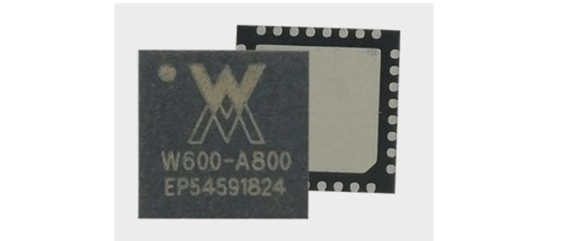

W600\_SoC chip integrates Cortex-M3 core, built-in Flash, integrated radio frequency transceiver front-end RFTransceiver, CMOS PA power amplifier, baseband processor/media access control, supports SDIO, SPI, UART, GPIO, I²C, PWM, I²S, 7816 and other interfaces , Support multiple encryption and decryption protocols, such as PRNG (Pseudo random Number Generator)/ SHA1/ MD5/ RC4/DES/ 3DES/ AES/ CRC, etc.

W600 is a SoC chip that supports multi-interface, multi-protocol wireless LAN IEEE802.11n (1T1R). Suitable for smart home
Internet of Things application fields such as electricity, smart home, wireless audio and video, smart toys, medical monitoring, industrial control, etc.

# 2. Features

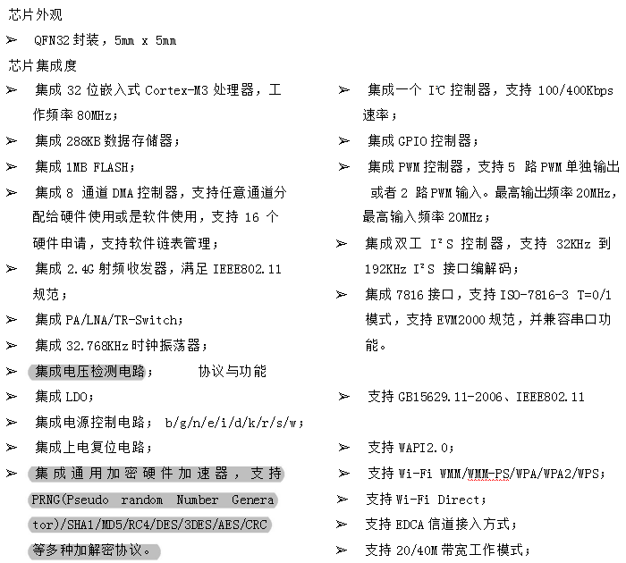

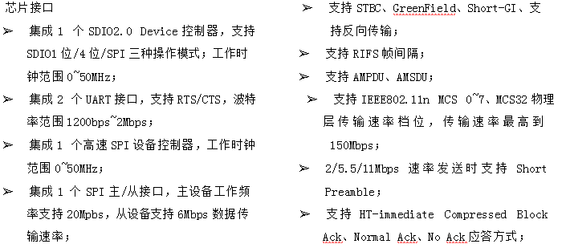

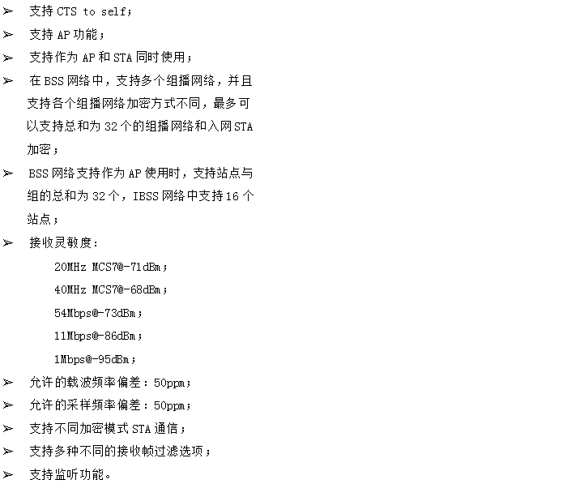

# 3. Chip Features

The SoC chip integrates Cortex-M3 core, built-in Flash, integrated radio frequency transceiver front-end RF Transceiver, CMOS PA power amplifier, baseband processor/media access control, supports SDIO, SPI, UART, GPIO, I²C, PWM, I²S, 7816 and other interfaces , Support multiple encryption and decryption protocols, such as PRNG (Pseudo random Number Generator)/ SHA1/ MD5/ RC4/ DES/ 3DES/AES/ CRC, etc.

# 4. Chip structure

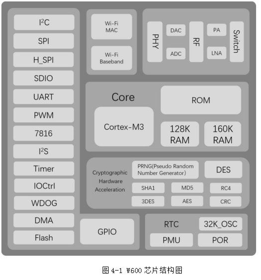

# 5. Address space division

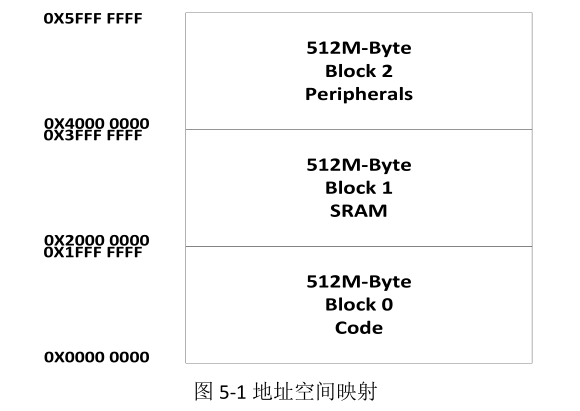

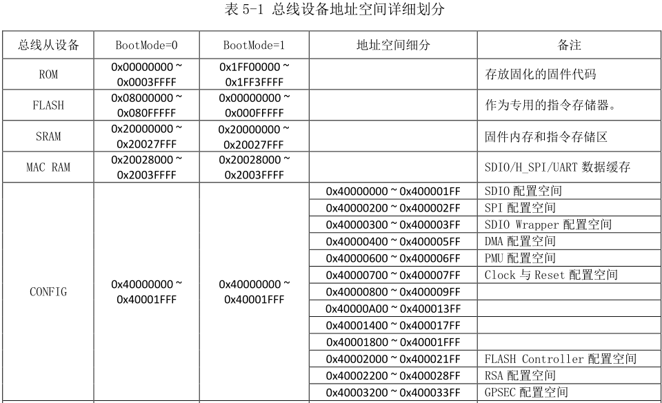

# 6. Function description

## 6.1 SDIO Device Controller

The SDIO2.0 device-side interface completes the data interaction with the host. Internally integrated 1024Byte asynchronous FIFO, complete the host and chip
Data interaction.

- -Compatible with SDIO card specification 2.0
- -Support host speed 0~50MHz
- -Supports blocks up to 1024 bytes
- -Support soft reset function
- -Supports SPI, 1-bit SD and 4-bit SD modes

## 6.2 High-speed SPI device controller

Compatible with the general SPI physical layer protocol, through the agreement of the data format for interaction with the host, the host can access the device at a high speed, and the highest support work
The frequency is 50Mbps.

- -Compatible with general SPI protocol;
- -Optional level interrupt signal;
- -Supports up to 50Mbps rate;
- -Simple frame format, full hardware analysis and DMA;

## 6.3 DMA controller

Supports up to 8 channels, 16 DMA request sources, and supports linked list structure and register control.

- -Amba2.0 standard bus interface, 8 DMA channels;
- -Support DMA operation based on the memory link list structure;
- -Software configuration 16 hardware request sources;
- -Support 1,4-burst operation mode;
- -Support byte, half-word, word operations;
- -The source and destination addresses remain unchanged or increase sequentially, configurable or cyclically operate within a predefined address range;
- -Synchronize DMA request and DMA response hardware interface timing;

## 6.4 Clock and reset

Support chip clock and reset system control, clock control includes clock frequency conversion, clock shutdown and adaptive gating; reset control includes
Soft reset control of the system and sub-modules.

## 6.5 Memory Manager

It supports the configuration of sending and receiving buffer size, and control information such as the base address of the MAC access buffer, the number of buffers, and the upper limit of frame aggregation.

## 6.6 Digital baseband

Support IEEE802.11a/b/g/e/n (1T1R) transmitter and receiver algorithm implementation, main parameters:

- -Data rate: 1~54Mpbs (802.11a/b/g), 6.5~150Mbps (802.11n);
- -MCS format: MCS0~MCS7, MCS32 (40MHz HT Duplicate mode);
- -Support 40MHz bandwidth non-HT Duplicate mode, 6M～54M;
- -Signal bandwidth: 20MHz, 40MHz;
- -Modulation method: DSSS (DBPSK, DQPSK, CCK) and OFDM (BPSK, QPSK, 16QAM, 64QAM);
- -Realize 1T1R MIMO-OFDM spatial multiplexing;
- -Support Short GI mode;
- -Support legacy mode and Mixed mode;
- -Support the transmission and reception of 20M upper and lower sideband signals under 40MHz bandwidth;
- -Support STBC reception of MCS0～7, 32;
- -Support Green Field mode;

## 6.7 MAC controller

Support IEEE802.11a/b/g/e/n MAC sublayer protocol control, the specific specifications include:

- -Support EDCA channel access mode;
- -Support CSMA/CA, NAV and TXOP protection mechanisms;
- -Beacon, Mng, VO, VI, BE, BK five-way sending queue and QoS;
- -Support single and wide wave frame receiving and sending;
- -Support RTS/CTS, CTS2SELF, Normal ACK, No ACK frame sequence;
- -Support retransmission mechanism and retransmission rate and power control;
- -Support MPDU hardware aggregation and de-aggregation and Immediate BlockAck mode;
- -Support RIFS, SIFS, AIFS;
- -Support reverse transmission mechanism;
- -Support TSF timing, and software can be configured;
- -Support MIB statistical information;

## 6.8 Security system

It supports the security algorithms specified in the IEEE802.11a/b/g/e/n protocol, and cooperates to complete the encryption and decryption of the transmitted and received data frames.

- -Meet the encryption and decryption throughput rate greater than 150Mbps;
- -Amba2.0 standard bus interface;
- -Support WAPI security mode 2.0;
- -Support WEP security mode-64-bit encryption;
- -Support WEP security mode-128-bit encryption;
- -Support TKIP security mode;
- -Support CCMP security mode;

## 6.9 FLASH Controller

- -Provide bus access FLASH interface;
- -Provide system bus and data bus access arbitration;
- -Implement the CACHE cache system to improve the access speed of the FLASH interface;
- -Provide compatibility with different QFlash;

## 6.10 RSA encryption module

RSA computing hardware coprocessor, providing Montgomery (FIOS algorithm) modular multiplication function. Cooperate with RSA software library to realize RSA algorithm. Supports 128-bit to 2048-bit modular multiplication.

## 6.11 General hardware encryption module

The encryption module automatically completes the encryption of the source address space data of the specified length, and automatically writes the encrypted data back to the specified destination address after completion
Space; support PRNG (Pseudo random Number Generator)/SHA1/MD5/RC4/DES/3DES/AES/CRC.

## 6.12 I 2 C Controller

APB bus protocol standard interface, only supports the main device controller, I²C working frequency supports configurable, 100K-400K.

## 6.13 Master/Slave SPI Controller

Support synchronous SPI master-slave function. Its working clock is the internal bus clock of the system. Its characteristics are as follows:

- -The transmit and receive channels each have 8 word deep FIFO;
- -The master supports 4 formats of Motorola SPI (CPOL, CPHA), TI timing and macrowire timing;
- -The slave supports 4 formats (CPOL, CPHA) of Motorola SPI;
- -Support full duplex and half duplex;
- -The master device supports bit transmission, up to 65535bit transmission;
- -The slave device supports transmission modes of various length bytes;
- -The maximum clock frequency of SPI_Clk input from the device is 1/6 of the system clock;

## 6.14 UART controller

- -The equipment end conforms to the APB bus interface protocol;
- -Support interrupt or polling work mode;
- -Supports DMA transfer mode, 32-byte FIFO exists for each transmission and reception;
- -Programmable baud rate;
- -5-8bit data length, and parity polarity can be configured;
- -1 or 2 stop bits can be configured;
- -Support RTS/CTS flow control;
- -Support Break frame sending and receiving;
- -Overrun, parity error, frame error, rx break frame interrupt indication;
- -Maximum 16-burst byte DMA operation;

## 6.15 GPIO controller

48-bit configurable GPIO, software controlled input and output, hardware controlled input and output, configurable interrupt mode.
GPIOA and GPIOB register start addresses are different, but their functions are the same.

## 6.16 Timer

Microsecond and millisecond timing (the number is counted according to the clock frequency configuration), to achieve six configurable 32-bit counters, when the corresponding calculator is configured
When the count is completed, a corresponding interrupt is generated.

## 6.17 Watchdog Controller

Support "Watchdog" function. Observe the correctness of the software's behavior and allow a global reset after the system crashes. The "watchdog" generates a periodic interrupt. The system software must respond to this interrupt and clear the interrupt flag; if the interrupt flag is not cleared for a long time due to a system crash, a hard reset is generated to perform a global reset of the system.

## 6.18 RF Configurator

A synchronized SPI master function is realized. Its working clock is the internal bus clock of the system. Its characteristics are as follows:

- -The transmit and receive channels each have a word-depth FIFO;

## 6.19 RF transceiver

- -The RF transceiver part includes modules including power amplifier, transmit path, receive path, phase-locked loop, and SPI. Through adjustment control ports SHDN, RXEN and TXEN to change the working status of the chip;
- -The receiving channel adopts a zero-IF structure, which directly converts the RF signal into baseband I and Q outputs. The RF front-end works at 2.4GHz and includes a low-noise amplifier and a quadrature mixer; the baseband is composed of a low-pass filter and a variable gain amplifier to achieve channel filtering and gain control; the drive amplifier provides different DC outputs for the ADC interface;
- -Transmission path includes: programmable control filter, up-conversion mixer, variable gain amplifier and power amplifier, transmission path also uses direct connect frequency conversion structure. The output signal of the DAC passes through a low-pass filter to filter out the image frequency and out-of-band noise. PA output is a differential output driver.
- -External antenna

## 6.20 PWM controller

- -5-channel PWM signal generation function;
- -2-channel input signal capture function (two channels of PWM0 and PWM4);
- -Frequency range: 3Hz~160KHz;;
- -The maximum precision of the duty cycle: 1/256, the width of the counter inserted into the dead zone: 8bit;

## 6.21 I²S controller

- -Support AMBA APB bus interface, 32bit single read and write operations;
- -Support master and slave mode, can work in duplex mode;
- -Support 8/16/24/32 bit width, the highest sampling frequency is 128KHz;
- -Support mono and stereo modes;
- -Compatible with I²S and MSB justified data formats, compatible with PCM A/B format;
- -Support DMA request read and write operations. Only support word operation, not block operation

## 6.22 7816/UART controller

- -The equipment end conforms to the APB bus interface protocol;
- -Support interrupt or polling work mode;
- -Supports DMA transfer mode, 32-byte FIFO exists for each transmission and reception;
- -DMA can only be operated by byte, and the maximum is 16-burst byte DMA operation;

Compatible with UART and 7816 interface functions:
Serial port function:

- -Programmable baud rate;
- -5-8bit data length, and parity polarity can be configured;
- -1 or 2 stop bits can be configured;
- -Support RTS/CTS flow control;
- -Support Break frame sending and receiving;
- -Overrun, parity error, frame error, rx break frame interrupt indication;

7816 interface function:

- -Compatible with ISO-7816-3 T=0.T=1 mode;
- -Compatible with EVM2000 protocol;
- -Configurable guard time (11 ETU-267 ETU);
- -Forward/reverse agreement can be configured by software;
- -Support send/receive parity check and retransmission function;
- -Support 0.5 and 1.5 stop bit configuration;

# 7. Pin definition

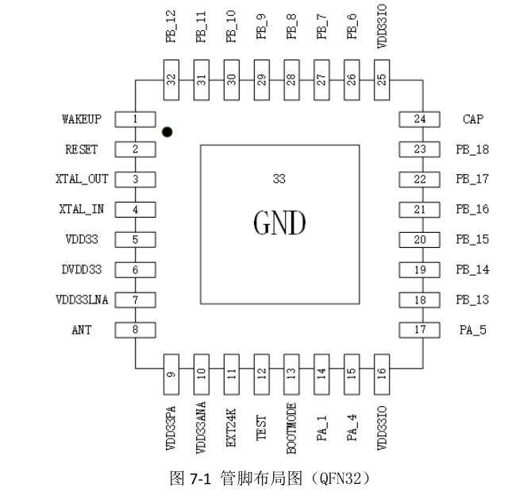

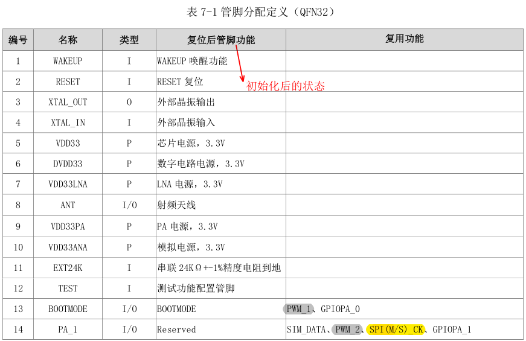
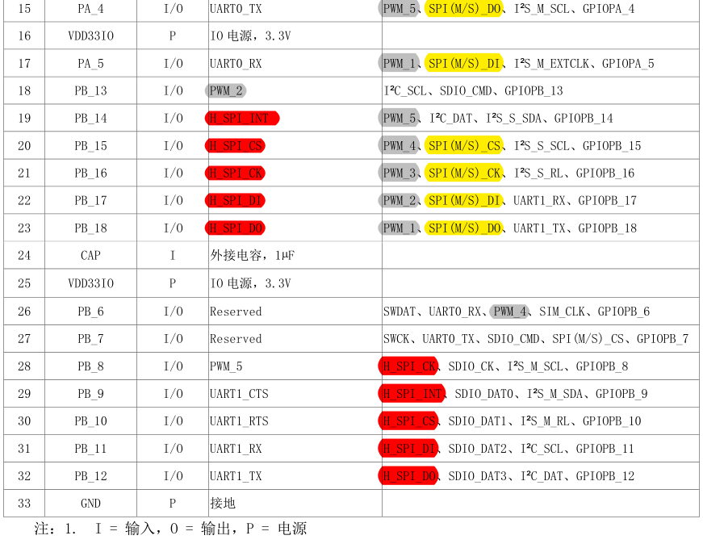

# 8. Electrical characteristics

## 8.1 Limit parameters

| Parameter                     | Name | Minimum | Typical value | Maximum | Unit |
| :---------------------------- | :--: | :-----: | :-----------: | :-----: | :--: |
| Supply voltage                | VDD  |   3.0   |      3.3      |   3.6   |  V   |
| Input logic level is low      | Vil  |  -0.3   |               |   0.8   |  V   |
| Input logic level is high     | Vih  |   2.0   |               | VDD+0.3 |  V   |
| Input pin capacitance         | Cpad |         |               |    2    |  pF  |
| Output logic level is low     | Vol  |         |               |   0.4   |  V   |
| Output logic level is high    | Voh  |   2.4   |               |         |  V   |
| Maximum output drive capacity | Imax |         |               |   24    |  mA  |
| Storage temperature range     | Tstr |  -40℃   |               |  +125℃  |  ℃   |
| Range of working temperature  | Topr |  -40℃   |               |  +85℃   |  ℃   |

## 8.2 RF power consumption parameters

## 8.3 Wi-Fi radio

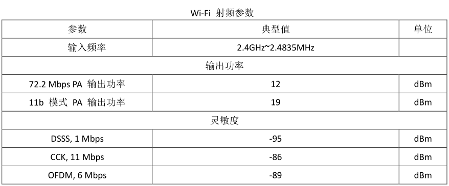
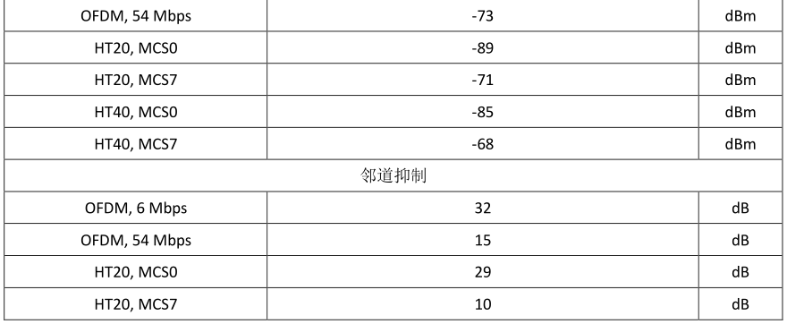

# 9. Packaging Information

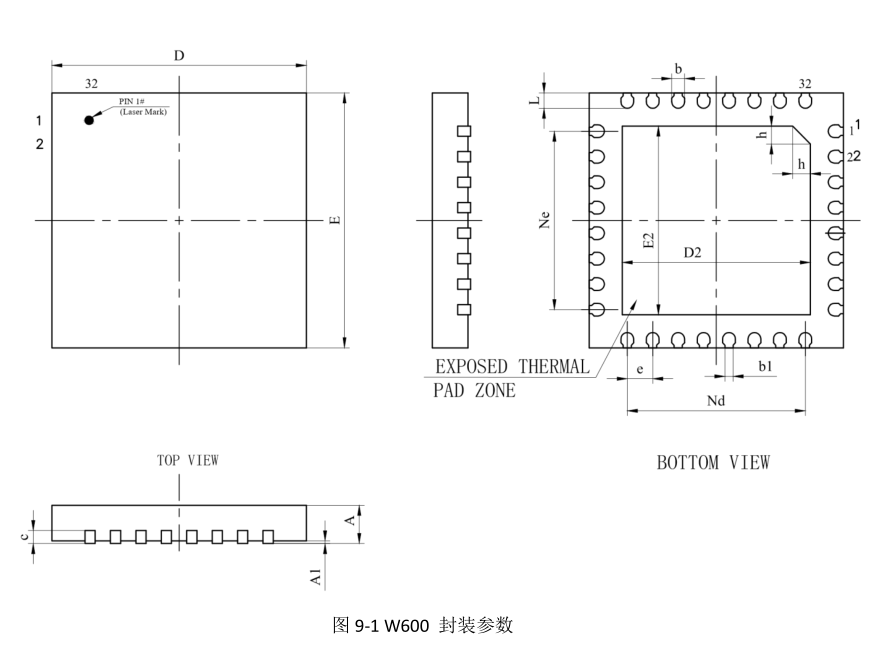

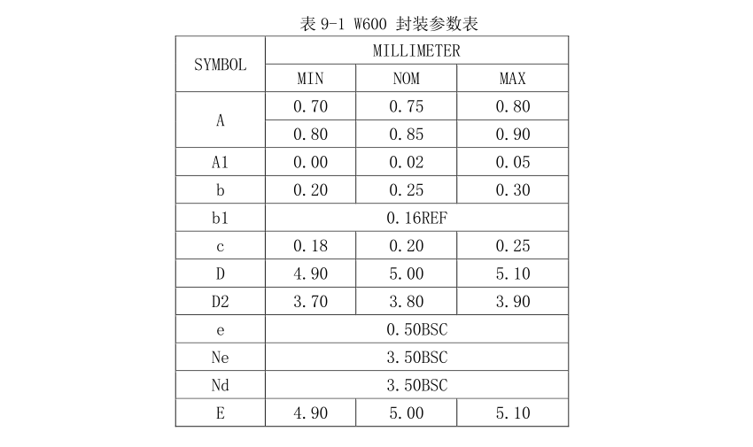

# 10. Product model definition

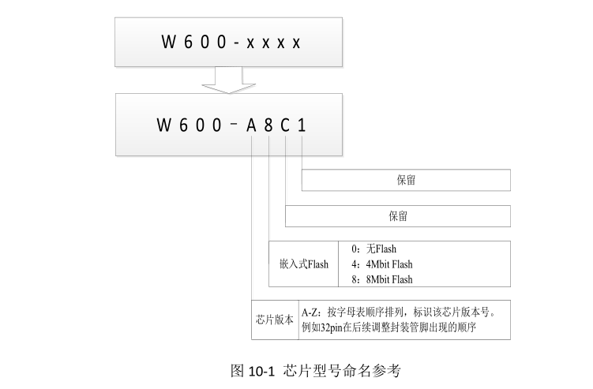

# Disclaimer and copyright notice

The information in this article, including the URL address for reference, is subject to change without notice.

The document is provided "as is" and does not bear any guarantee responsibility, including any guarantee for marketability, suitability for a specific purpose, or non-infringement, and any guarantee mentioned elsewhere in any proposal, specification or sample. This document does not take any responsibility, including the responsibility for infringement of any patent rights caused by using the information in this document. This document does not grant any license for the use of intellectual property rights in estoppel or other ways, whether express or implied.

The Wi-Fi Alliance member logo is owned by the Wi-Fi Alliance.

All brand names, trademarks and registered trademarks mentioned in this article are the property of their respective owners, and it is hereby declared.

# Note

Due to product upgrades or other reasons, the contents of this manual may be changed. Shenzhen Sibo Zhilian Technology Co., Ltd. reserves the right to modify the contents of this manual without any notice or prompt. This manual is only used as a guide. Shenzhen Sibo Zhilian Technology Co., Ltd. does its best to provide accurate information in this manual, but it does not ensure that the content of the manual is completely free of errors. All statements, information and suggestions in this manual do not constitute any explicit indications. Or implied guarantee.