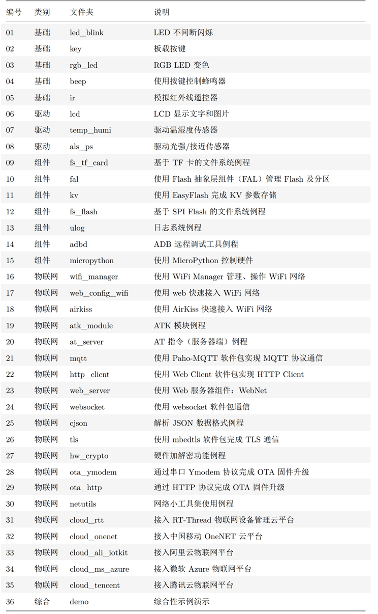
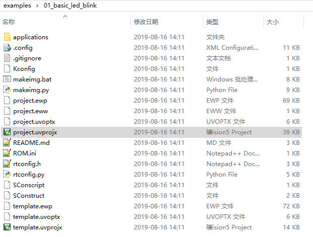
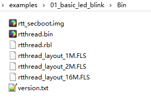

W60x RT-Thread Getting Started Guide

 From SZDOIT

# 1. Introduction to RT-Thread

[RT-Thread](http://www.rt-thread.org/) is an open source IoT operating system from China, which has very strong scalability: from one that can run on the ARM Cortex-M0 chip The very small cores, to the medium ARM Cortex-M3/4/7 system, even running on MIPS32, ARM Cortex-A series processors. The source code of the RT-Thread project is hosted on [GitHub repo](https://github.com/rt-thread).

# 2. Preparation

-   -W60x\_RT-Thread source code: (please use the GitHub version <https://github.com/RT-Thread/W601_IoT_Board>)
-   -RT-Thread env tool: https://github.com/RT-Thread/env
-   -Serial download tool: 
-   -Punctual Atom W601 full-featured development board

# 3. Environment setup

## 3.1 Build a compilation environment

The SDK can be directly compiled by Keil. For details, please refer to [W600 Development Environment Construction Guide](../app/ide)

## 3.2 Project directory introduction

There are reference documents related to W600\_RTT in the docs folder. It is recommended to read `UM3103-RT-Thread-W60X-SDK Quick Start.pdf` and `UM3101-RT-Thread-W60X-SDK Development Manual.pdf`

# 4. Compile and burn

## 4.1 Compile

W600\_RT-Thread\_SDK provides a total of 35 examples

Enter any example, double-click the `project.uvprojx` project file and compile directly (note that the Keil environment must be set up first).

The firmware is generated in the Bin folder of the directory where the current example is located.

## 4.2 Burning

Precautions:

1. A 16Mbyte FLash is attached to the punctual atom w601 development board, so you can burn `rtthread_layout_16M.FLS`
2. Except for special instructions, both W600 and W601 are 1M versions, corresponding to `rtthread_layout_1M.FLS`;
3. 2M version of the chip/module/development board, corresponding to `rtthread_layout_2M.FLS`;
4. The rbl suffix file is the file required by OTA, and it can also be downloaded and updated directly, similar to the img file of the original W600 SDK;
5. rtt_secboot.img is the RT-Thread customized version of secboot, which is not common with the original secboot.img. FLS files need to be burned when switching the version. Try to check the erasing to avoid errors.
6. For other programming issues, please refer to: [W600 Firmware Programming Guide] 

